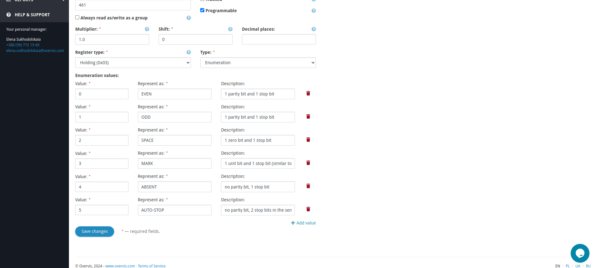
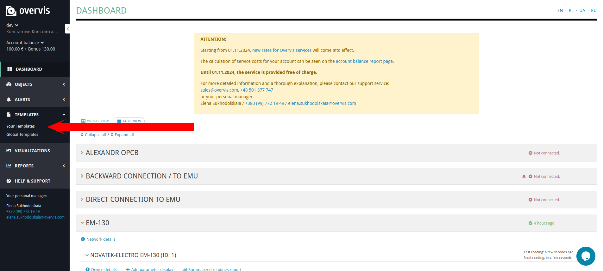

# Overvis Enumeration Parameter Value Type

_Overvis is a monitoring and control system for industrial MODBUS-based equipment. You can find
more information and create a free account on our site: https://www.overvis.com/_

## Overview

This feature allows you to create device parameters with an enumeration value type. It is useful
when you want to replace the display of raw numeric values, which represent a state machine, with
more human-readable values on your dashboard and device details pages. You can create a list of
possible values for the parameter and map them to the corresponding raw numeric values.

## Applications

The enumeration parameter value type can be used in various scenarios, such as:

- Displaying the status of a machine (e.g., `Running`, `Stopped`, `Error`).
- Indicating the level of a tank (e.g., `Empty`, `Half Full`, `Full`).
- Showing the mode of operation of a device (e.g., `Auto`, `Manual`, `Semi-Auto`).
- Representing the state of a process (e.g., `Idle`, `Working`, `Paused`).

And more.

## How it works

During the creation of an enumeration parameter, you specify a list of possible values and map them
to the corresponding raw numeric values. When the device sends a raw numeric value to the Overvis
platform, it is displayed as the associated human-readable value on the dashboard and device
details pages. Additionally, the interface for editing the parameter value is replaced with a
dropdown list of possible values.

## Example

Let’s look at an example. Consider a Novatek-Electro EM-483 MODBUS controller. This device has a
parameter called `Byte format in RS-485` for setting the byte format in the RS-485 interface, which
can be one of the following values:

- `Even`
- `Odd`
- `Space`
- `Mark`
- `Absent`
- `Automatic Stop`

As you can see in the image below, the parameter value is currently displayed as a raw numeric
value. Each time you want to change the value, you need to look up the possible values in the
parameter description and then manually enter the correct value in the input field.


Let's proceed to the parameter settings by clicking on the gear icon near its value and reconfigure
it to use the enumeration value type. This will make the interface more user-friendly.


Now, locate the dropdown menu with parameter value type options and select the `Enumeration`
option.


After changing the parameter value type to `Enumeration`, a new submenu will appear.


Here, we can specify the possible values for the parameter and map them to the raw numeric values.
Each enumeration value consists of:

- `Value` (required): The raw numeric value that will be sent to the device.
- `Represent As` (required): The human-readable value that will be displayed on the dashboard and
  device details pages.
- `Description` (optional): A description of the enumeration value.

Now, let's fill in the enumeration values for the Byte format in RS-485 parameter.



Finally, after saving the changes, the parameter value will be displayed as a human-readable value
on the device details pages.


Also, note that the interface for editing the parameter values is replaced with a dropdown list of
possible options.


## Device templates

The enumeration parameter value type can be used in device templates. If you are unfamiliar with
device templates, this is a feature on the Overvis platform that allows you to create a Microsoft
Excel file containing the entire device configuration and parameters list, upload it to the
templates library, and initialize new devices with it to reduce the time spent when connecting
multiple identical devices.

Let's take a template for the previously used Novatek-Electro EM-483 controller and change the
value type of the `Byte format in RS-485` parameter to `Enumeration` in this template as an
example.

[Novatek-Electro EM-483 controller template](/_media/enums-guide/em-483.xlsx ":ignore")

Let's open the template file. There are three different worksheets: `Info`, `Params`, and
`Visualizations`. We need to go to the `Params` worksheet and find the row with the
`Byte format in RS-485` parameter.


In order to change the value type of the parameter to `Enumeration`, we need to find the `Type`
column and change its value from `u16-be` to `enum`. Then, we have to fill the `Represent As`
column with all possible values using specific syntax. Here is a simple example of it:

```
Value;RepresentAs;Description
Value;RepresentAs;Description
Value;RepresentAs
```

As you can see in the example, each row represents one enumeration value and consists of the
required value, the representation, and an optional description, which can be omitted. The
important thing is that the `Represent As` column should contain exactly the same number of lines
as the number of possible values for the parameter.

Let's fill the `Represent As` column with the possible values for the `Byte format in RS-485`
parameter using the previously defined syntax.

```
0;EVEN;1 parity bit and 1 stop bit
1;ODD;1 parity bit and 1 stop bit
2;SPACE;1 zero bit and 1 stop bit
3;MARK;1 unit bit and 1 stop bit (similar to mode with two stop-bits)
4;ABSENt;no parity bit, 1 stop bit
5;AUTO-STOP;no parity bit, 2 stop bits in the sent bytes, 1 stop bit in the received bytes (in such a case, devices with one and two stop bits may be connected simultaneously)
```


There is also the ability to add translations for the enumeration values into the device template.
Besides the `Represent As` column, you can manually add up to three columns in the following
format: `Represent As ${language}`. Currently, we support the following languages:

- `PL` - Polish
- `UA` - Ukrainian
- `RU` - Russian

Note that fields with translations in other languages must contain the same enumeration values;
otherwise, the template will be considered invalid.


Here you can download the device template with all the changes mentioned above applied:

[Edited device template](/_media/enums-guide/em-483-edited.xlsx ":ignore")

After saving the changes, you can upload the updated template to the Overvis platform. To upload
the template, log in to your account and go to the `Templates => Your templates` section.



Then, click on the `Upload template` button in the upper-right corner.


On the following page, you need to select the device template file from your computer and click on
the `Upload file` button.


If the template is valid, you will see a success message, and the template will appear in the
`Your templates` list.


Now you can use this template to initialize new devices or apply it to existing ones by following
the actions below.


Note that the device template can include translations in different languages for the enumeration
values. However, when you apply the template to the device, the language of the enumeration values
will be selected based on the user's language settings.

## Support

If you have any questions or need assistance with the enumeration parameter value type, please
contact our support team at [support@overvis.com](mailto:support@overvis.com).
