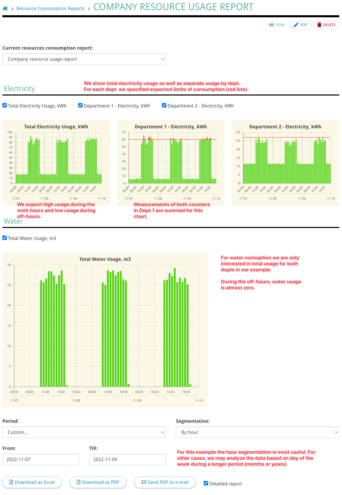
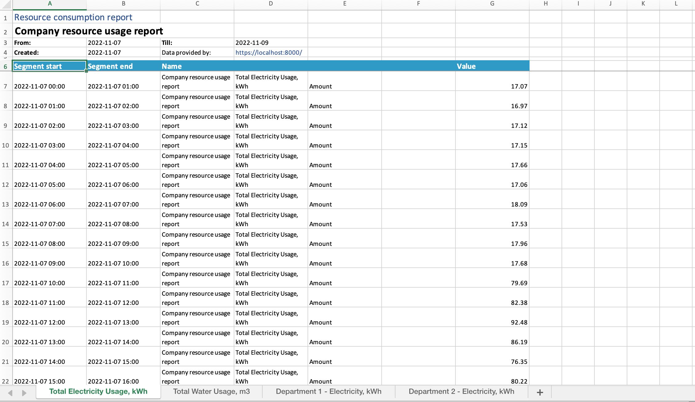

# Overvis Resource Consumption Report

_Overvis is a monitoring and control system for industrial MODBUS-based equipment. You can find
more information and create a free account on our site: https://www.overvis.com/_

**Overvis Resource Consumption Report is used for analyzing the accumulated counters and meters
data. It shows the growth of the value over the selected time period. The report segments the
growth by the time of day or day of the week.**

## Applications

This report can be used to analyze the readings of any parameter that represents the usage of any
kind of resource. For example,

- Energy meters
- Water meters
- Gas meters

etc.

In short, if the value of some parameter is constantly growing, this report can be used to analyze
its growth by the time of day or day of the week.

## How it works

During the construction of the report, the user specifies a tree-like structure that defines the
categories of the resources. Each branch in the report contains one or several parameters. The
report calculates the value for each branch and shows the delta of this value for each time
segment, i.e. how much this value has changed between the beginning and the end of the segment.

The value of the parent branch is the sum of all child branches. The time segments are half-hour,
hour, or day.

## Example

Consider the following network structure in Overvis:

- Network: **Department 1**
  - Device: **Energy Meter 1**
    - Parameter: **E11** - Energy consumption, kWh
  - Device: Energy Meter 2
    - Parameter: **E12** - Energy consumption, kWh
  - Device: Water Meter 1
    - Parameter: **W11** - Water consumption, m3
- Network: Department 2
  - Device: **Energy Meter 3**
    - Parameter: **E21** - Energy consumption, kWh
  - Device: **Water Meter 2**
    - Parameter: **W21** - Water consumption, m3


This report can be used to analyze the usage of the electricity and water resources by the
department as well as the overall usage in the company.

The resulting report may look like this:



This is how the report above was constructed:


The report can be downloaded in a detailed form or a short form.

The detailed form shows data from all child branches:


[Download example XLSX](/_media/resource-consumption-report-guide/example-report-detailed.xlsx ":ignore")


[Download example PDF](/_media/resource-consumption-report-guide/example-report-detailed.pdf ":ignore")

The short form only shows data from the main (first-level) branches:



[Download example XLSX](/_media/resource-consumption-report-guide/example-report-short.xlsx ":ignore")


[Download example PDF](/_media/resource-consumption-report-guide/example-report-short.pdf ":ignore")

## Report constructor

The creation and editing of the consumption report are done through the web interface constructor.
Here user defines the tree-like structure of nodes. Each node can be of one of the following kinds:

- `Branch`. Contains child nodes inside. The value of the branch is the sum of all children's
  values. Only the main (top-level) branches are displayed as charts. The detailed report
  (XLSX/PDF) contains information from all branches. Branches can contain leaf nodes or other
  branches (up to 5 levels).
- `Value`. The value of one parameter.
- `Calculate`. Calculate the value based on the formula that can reference parameters by their
  system ID. See below for details.
- `Link`. A link to an already created branch in this or some other report. Only main (top-level)
  branches can be linked to.

### Main branches

The top-level branches are denoted as the "main" branches of the report. The main branches are
displayed on the report page as charts. The downloaded report (Excel/PDF) is split into sheets, one
for each main branch.

Main branches can be assigned a category for grouping in the report viewing interface.

Each main branch can also be assigned up to 4 level markers with different colors. Levels can be
used to visually highlight on the chart the unexpected excess of resource usage.

Categories and levels are not used in the Excel/PDF versions of the report.

### Using formulas

Formulas are useful in cases where the value of a parameter is not relevant without modification,
or when you need to take into account the values of several parameters at once.

Example formula:

```
(#561 + 10) / 2 + #558
```

This formula references parameters with IDs `561` and `562`. The formula is evaluated for each time
segment.

The device parameter is referenced by its identifier in the system. You can find the parameter ID
on the device page by hovering over the parameter you are interested in.


The names of the parameters used in the formula are displayed below the input field. If the
parameter is missing from the list, the ID is probably incorrect.


To evaluate the formulas Overvis uses a JavaScript library
[math-expression-evaluator](https://github.com/bugwheels94/math-expression-evaluator). Below you
can see a list of the most common operations:

| Symbol  |                Explanation                 |
| :-----: | :----------------------------------------: |
|  **+**  |    Addition Operator eg. 2+3 results 5     |
|  **-**  |  Subtraction Operator eg. 2-3 results -1   |
|  **/**  |    Division operator eg 3/2 results 1.5    |
| **\***  | Multiplication Operator eg. 2\*3 results 6 |
| **Mod** |   Modulus Operator eg. 3 Mod 2 results 1   |
|  **(**  |            Opening Parenthesis             |
|  **)**  |            Closing Parenthesis             |
|  **^**  |      power operator eg. 2^3 returns 8      |
