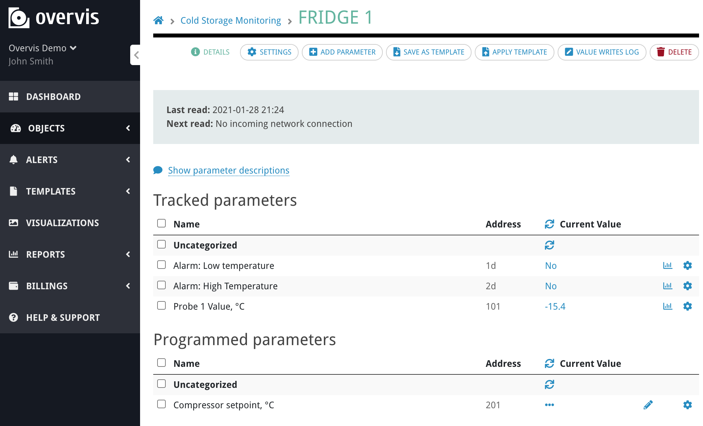

# Displaying parameter values as a text

[< Return to the table of contents](../../README.md)

Let's start with the values of probe temperatures on the fridge boxes. The fridge controller device
parameters in our example are:



We want to display the **"Probe 1 Value, °C"** (address 101) inside each fridge box in the graphic.
To do so, we open the SVG source and find the tag that contains the first fridge box value (-12.3).
Here it is:


_How do we know that it's the correct tag? During the graphic design we gave the fridge box layer
name `fridge 1`. And temperature text group has a name `temp value`. We can see, that `id`
attributes in the tags preserve that naming._

Now, let's modify this `text` tag as following:

```xml
<text x="75.403px" y="102.037px" style="font-family:'DroidSans', 'Droid Sans', sans-serif;font-size:30px;fill:rgb(0,197,255);" param-value="11-22-33-44-55-66>1>101:r">-</text>
```

First, we removed the content of the tag (`-12.3`) and replaced it with the dash symbol. This
symbol will be displayed until the data will be loaded into the visualization. You can use any
other placeholder value.

We also added the data binding itself. It is a special attribute:
`param-value="11-22-33-44-55-66>1>101:r"`. It says: replace the content of this tag with the value
of the parameter that has the address **101 (holding)** of the device with the address **1** in the
network with the MAC address **11-22-33-44-55-66**. The `:r` at the end also says that this value
should be read from the device on-line and not taken from the database of recent readings.

There are several ways to access networks/devices/parameters and also some additional options
available for this attribute. You can find the list in the
[reference section](/Overvis/References/Visualizations.md).

We do similar code modifications for the rest of the fridge boxes. Afterward, we update the code of
the visualization in Overvis to check the result:


The data displayed inside the boxes was read directly from the controllers. It is automatically
updated every 10 seconds. User can also click on the "refresh" icon in the top-left corner to
update immediately.

Next: [Giving the ability to edit a device parameter value](../02-edit-value/README.md)
