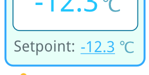
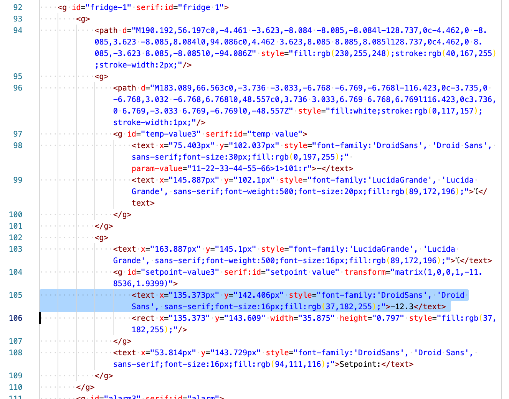
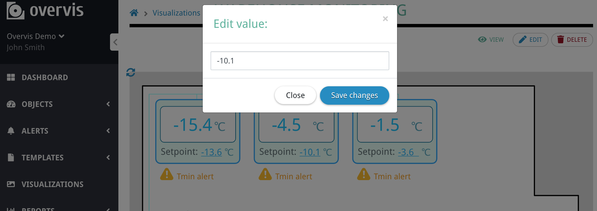

# Giving the ability to edit a device parameter value

[< Return to the table of contents](../../README.md)

Our visualization has the "setpoint" control for each fridge. It should allow us to modify the
setpoint setting on the fridge controller devices.



Here is the setpoint value for the first fridge in the SVG code:



We want to give the ability to change the setpoint by clicking on this value. To do so, we modify
the `text` tag as following:

```xml
<text x="135.373px" y="142.406px" style="font-family:'DroidSans', 'Droid Sans', sans-serif;font-size:16px;fill:rgb(37,182,255);cursor:pointer;" param-value="11-22-33-44-55-66>1>201:r" on-click="edit-param:11-22-33-44-55-66>1>201">-</text>
```

Again, we removed the placeholder value and replaced it with the dash symbol.

The `param-value="11-22-33-44-55-66>1>201:r"` attribute works the same as previously, it just
displays the current value that was read directly from the device.

More importantly, we have added a new attribute: `on-click="edit-param:11-22-33-44-55-66>1>201"`.
It says: if user clicks on this element, open the edit dialog window. It should request a new value
for the parameter with the address **201 (holding)** of the device with the address **1** in the
network with MAC address **11-22-33-44-55-66**. When user enters the value and saves it, Overvis
will send that value to the device parameter and update the visualization afterward.

Now clicking on the setpoint value opens the "Edit value" window:



`on-click` attribute can do several other things, like sending a user to another visualization,
increment the parameters, toggle the parameter between two values, etc. We will use some of these
features later in the tutorial. For a full list, please see
[the reference section.](/OCP/References/Visualizations.md)

As a final change, we have also added `cursor:pointer;` into the content of the `style` attribute.
It just changes the mouse cursor to the "finger" pointer when a user hovers over the setpoint
value.

Next: [Showing/hiding elements depending on the parameter value](../03-show-hide/README.md)
