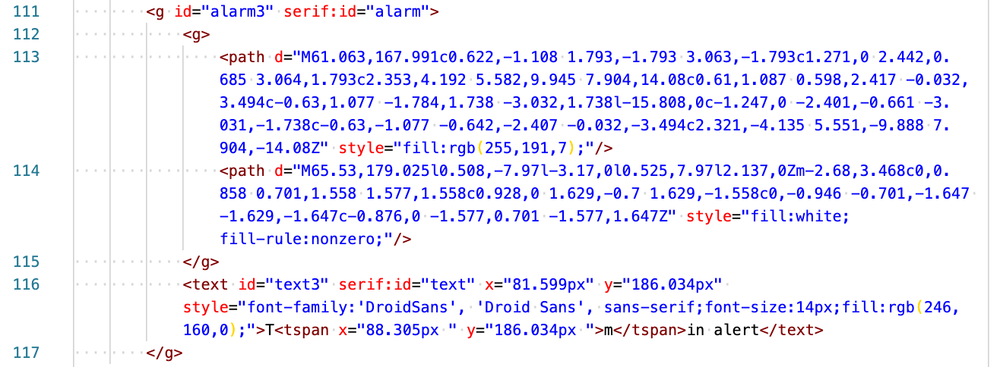

# Showing/hiding elements depending on the parameter value

[< Return to the table of contents](../../README.md)


The idea with the alert indicators is to show them only when the alert is triggered. In [the example fridge controller device,](../01-param-value/README.md) we have two alert parameters: **1 (discrete)** and **2 (discrete)**. Let's find an alert indicator of the first fridge in SVG source of our visualization:



Let's look only at the first line. It's the `g` tag that contains everything else:

```xml
<g id="alarm3" serif:id="alarm">
```

We will change it as follows:

```xml
<g id="alarm3" serif:id="alarm" on-param-value="11-22-33-44-55-66>1>1d:=1:display:block:none:r" style="display:none;">
```

`on-param-value` attibute here says the following:
1. Check parameter with the address **1 (discrete)** of the device with the address **1** in the network with MAC address **11-22-33-44-55-66**. This parameter is our `Tmin` alert.
2. If the parameter value equals **1**, change the `display` style of this element to `block`. Otherwise, change it to `none`.

We have set the default `display` style to `none`, which means this element (alarm indicator) won't be visible initially. If the alarm register will contain 1 when the data will be read from the device, Overvis will change the `display` style to `block` and make this indicator visible.

What about the `Tmax` alarm? We will use the fact that both `Tmin` and `Tmax` should be never active at the same time. We can just copy the alarm indicator, change the text and the register address in the condition. If register 1 is on, the first alarm will be shown. If register 2 is on, the second one will be displayed, while the first one is hidden.

```xml
<g id="alarm3" serif:id="alarm tmin" on-param-value="11-22-33-44-55-66>1>1d:=1:display:block:none:r" style="display:none;">
    <g>
        <path d="M61.063,167.991c0.622,-1.108 1.793,-1.793 3.063,-1.793c1.271,0 2.442,0.685 3.064,1.793c2.353,4.192 5.582,9.945 7.904,14.08c0.61,1.087 0.598,2.417 -0.032,3.494c-0.63,1.077 -1.784,1.738 -3.032,1.738l-15.808,0c-1.247,0 -2.401,-0.661 -3.031,-1.738c-0.63,-1.077 -0.642,-2.407 -0.032,-3.494c2.321,-4.135 5.551,-9.888 7.904,-14.08Z" style="fill:rgb(255,191,7);"/>
        <path d="M65.53,179.025l0.508,-7.97l-3.17,0l0.525,7.97l2.137,0Zm-2.68,3.468c0,0.858 0.701,1.558 1.577,1.558c0.928,0 1.629,-0.7 1.629,-1.558c0,-0.946 -0.701,-1.647 -1.629,-1.647c-0.876,0 -1.577,0.701 -1.577,1.647Z" style="fill:white;fill-rule:nonzero;"/>
    </g>
    <text x="81.599px" y="186.034px" style="font-family:'DroidSans', 'Droid Sans', sans-serif;font-size:14px;fill:rgb(246,160,0);">Tmin alert</text>
</g>
<g id="alarm3-1" serif:id="alarm tmax" on-param-value="11-22-33-44-55-66>1>2d:=1:display:block:none:r" style="display:none;">
    <g>
        <path d="M61.063,167.991c0.622,-1.108 1.793,-1.793 3.063,-1.793c1.271,0 2.442,0.685 3.064,1.793c2.353,4.192 5.582,9.945 7.904,14.08c0.61,1.087 0.598,2.417 -0.032,3.494c-0.63,1.077 -1.784,1.738 -3.032,1.738l-15.808,0c-1.247,0 -2.401,-0.661 -3.031,-1.738c-0.63,-1.077 -0.642,-2.407 -0.032,-3.494c2.321,-4.135 5.551,-9.888 7.904,-14.08Z" style="fill:rgb(255,191,7);"/>
        <path d="M65.53,179.025l0.508,-7.97l-3.17,0l0.525,7.97l2.137,0Zm-2.68,3.468c0,0.858 0.701,1.558 1.577,1.558c0.928,0 1.629,-0.7 1.629,-1.558c0,-0.946 -0.701,-1.647 -1.629,-1.647c-0.876,0 -1.577,0.701 -1.577,1.647Z" style="fill:white;fill-rule:nonzero;"/>
    </g>
    <text x="81.599px" y="186.034px" style="font-family:'DroidSans', 'Droid Sans', sans-serif;font-size:14px;fill:rgb(246,160,0);">Tmax alert</text>
</g>
```

One note: when copying tags, if there is an `id` attribute, it needs to be changed in the copy. All `id` attributes in the source should be unique.

In the result, we see that only fridge 1 triggers `Tmin` and only fridge 3 triggers `Tmax` currently:


_What if we would require to display several alarms at once? Then we would have to design and position each alarm indicator separately and use `on-param-value` for each of them. Or design some smart JavaScript code to dynamically position indicators. This is an information representation design problem and it may require a more complicated approach in some cases. Especially when the density of the information displayed is getting higher._

Next: [Changing the color of an element depending on the parameter value](../04-change-color/README.md)
