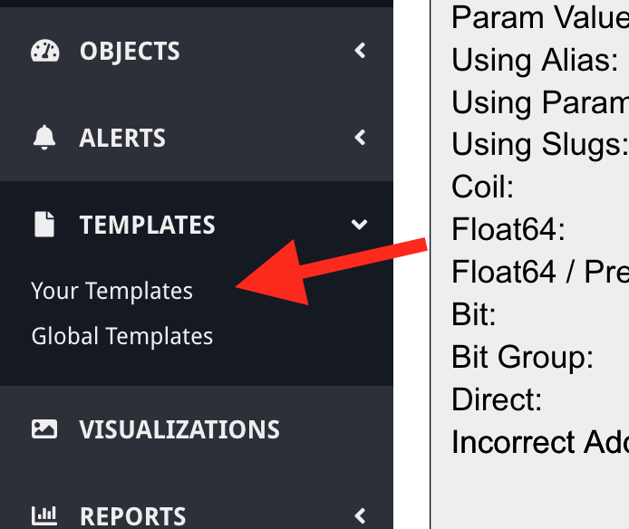
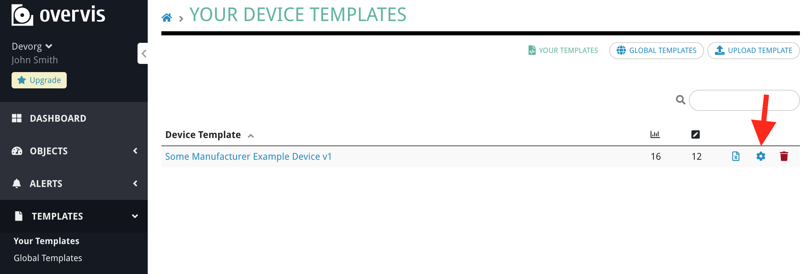
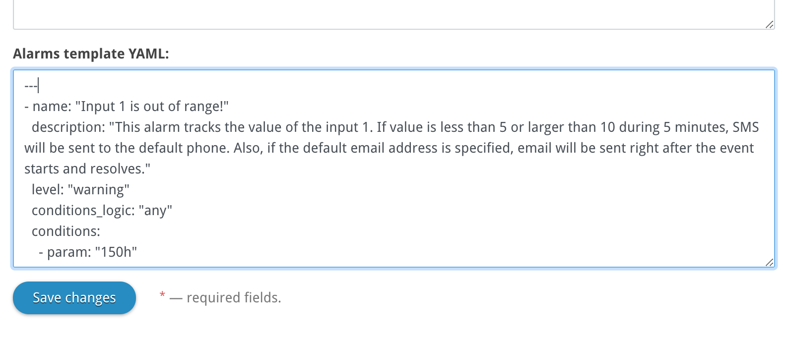

# Overvis Alert Templates

## Introduction

Device templates in Overvis provide a quick way to add devices to the system. Instead of creating a list of register addresses for each newly created device, the user can simply select the device from the list of templates. All registers and settings for a particular device model will be added automatically.

Users can create device templates themselves, or choose one from the global library. 

Overvis also supports templates for the alerts. An alert template is attached to the device template. When the device is created using the template, Overvis automatically creates alerts based on the connected alerts template. After that, the user is free to customize the created device and alerts.

If the device template is applied to an already existing device, templated alerts are ignored to avoid unexpected behavior (like changing customized alerts).

## How to add alert template to the device template

_Documentation bellow assumes that you are changing one of the templates owned by your organization. If you want to modify the global template, accessible to all Overvis users, you have to copy it under your account. To do this, just download the template as an Excel file and upload it to your templates._

Manually created templates can be found in the local device template library. To access it, click on the "Your templates" link under the "Templates" section in the navigation.



Find the device template you want to modify and click the gear icon on the left to access the template settings.



On the settings page, scroll down until you find the "Alarms template YAML" textbox. Put the template code inside that box. The structure of this YAML is described in a later section of this document.



Save the changes. If the alerts template interpreter will encounter any errors it will report the details below the field.

## Alerts template syntax reference

Alerts template conform to YAML syntax (https://en.wikipedia.org/wiki/YAML). 

Basic example of the template:

```yaml
---
- name: "Input 1 is out of range!"
  description: "This alert tracks the value of the input 1. If value is less than 5 or larger than 10 during 5 minutes, SMS will be sent to the default phone. Also, if the default email address is specified, email will be sent right after the event starts and resolves."
  level: "warning"
  conditions_logic: "any"
  conditions:
    - param: "150h"
      condition: "<"
      value: "5.0"
    - param: "150h"
      condition: ">"
      value: "10.0"
  actions:
    - kind: "sms"
      recipient: "-"
      stage: "init"
      timeout_minutes: 5
    - kind: "email"
      recipient: "-"
      stage: "init"
    - kind: "email"
      recipient: "-"
      stage: "resolved"
- name: "No connection!"
  description: "This alert checks connection to the network by verifying if the tracked firmware version parameter is reading correctly. If there was no reading during 5 minutes, Voice message will be sent to the default phone number."
  level: "failure"
  conditions:
    - param: "1h"
      condition: "err"
  actions:
    - kind: "call"
      recipient: "-"
      stage: "init"
      timeout_minutes: 5
```

### Events

Top level should contain a list of event objects. Each event object should contain following fields:

Name               | Required | Type   | Description
-------------------|----------|--------|------------
`name`             | yes      | string | Name of the event. Max 50 chars. Unicode allowed.
`description`      | no       | string | Description of the event. Unicode allowed.
`level`            | yes      | string | How this event should be logged by the system. Allowed values: `none`, `info`, `warning`, `failure`, `critical`.
`conditions_logic` | no       | string | Allowed values: `all` - all conditions are required to trigger this alert. `any` - any one condition is sufficient to trigger this alert. Default: `all`.
`conditions`       | yes      | array  | List of the condition objects (see below).
`actions`          | yes      | array  | List of the event action objects (see below).

### Conditions

Each event should contain one or more conditions (specified in the “conditions” field). Conditions determine when this event starts and resolves. Each condition is described as an object with following fields:

Name        | Required | Type   | Description
------------|----------|--------|------------
`param`     | yes      | string | Parameter address this condition will check. Syntax is described below. Parameter with this address should be listed in the template. Also, parameter should be tracked for this condition to work.
`condition` | yes      | string | Logical operator that will compare parameter reading and the condition value specified in the “value” field. Allowed operators: `>`, `>=`, `<`, `<=`, `=`, `!=`, `err`. `err` checks for reading errors and doesn’t require “value” to compare to.
`value`     | yes (if condition is not `err`) | string/number | Value to compare parameter reading to.

`param` is a string in one of the following formats: 
```
<register address><register kind>
<register address><register kind>.<bit address>
<register address><register kind>.<high bit>-<low bit>
```

Where “register kind” is one of:
* `h` - holding register
* `i` - input register
* `d` - discrete input
* `c` - coil

Examples of the condition objects:

YAML | Condition will be enabled if...
-----|--------------------------------
`{param: “123h”, condition: “>=”, value: “10.5”}` | Value of the parameter with the holding register address 123 is larger or equal 10.5 (comparison takes in account parameter multiplier and parameter type transformation).
`{param: “123.5i”, condition: “=”, value: 1}` | Value of the parameter that corresponds to the bit #5 of the input register address 123 is equal to 1.
`{param: “123.5-10h”, condition: “!=”, value: 12}` | Value of the parameter that corresponds to the bits #5 to #10 of the holding register address 123 is not equal to 12.
`{param: “1c”, condition: “err”}` | Reading of a parameter with the coil address 1 resulted in an error (either no connection, or MODBUS exception during parameter reading).

### Actions

Each event should have one or more actions (specified in the “actions” field). Actions determine how the system should behave during each stage of the event. Each action corresponds to the one of the four “stages”:

* `init` - event just started and is active.
* `not_confirmed` - event was not confirmed during specified period of time. Confirmation period is specified in the action’s `timeout` field.
* `confirmed` - event was confirmed by user (by SMS or clicking on the link in the notification email).
* `resolved` - event resolved and is not active anymore.

Each action is described as an object with the following fields:

Name | Required | Type | Description
-----|----------|------|------------
`kind` | yes | string | Kind of the action. Valid values: `sms`, `email`, `call`.
`recipient` | yes | string | Recipient email address or phone number (depends on the action kind). `-` value (minus sign) corresponds to the default email or phone.
`stage` | yes | string/number | Stage of the event when this action will be executed. Allowed values: `init`, `not_confirmed`, `confirmed`, `resolved` (see above).
`timeout_minutes` | no | string/number | Timeout in minutes before executing this action (positive integer). If an event leaves the appropriate stage during this timeout (for example “not confirmed” event resolves or being confirmed), action is never executed.

