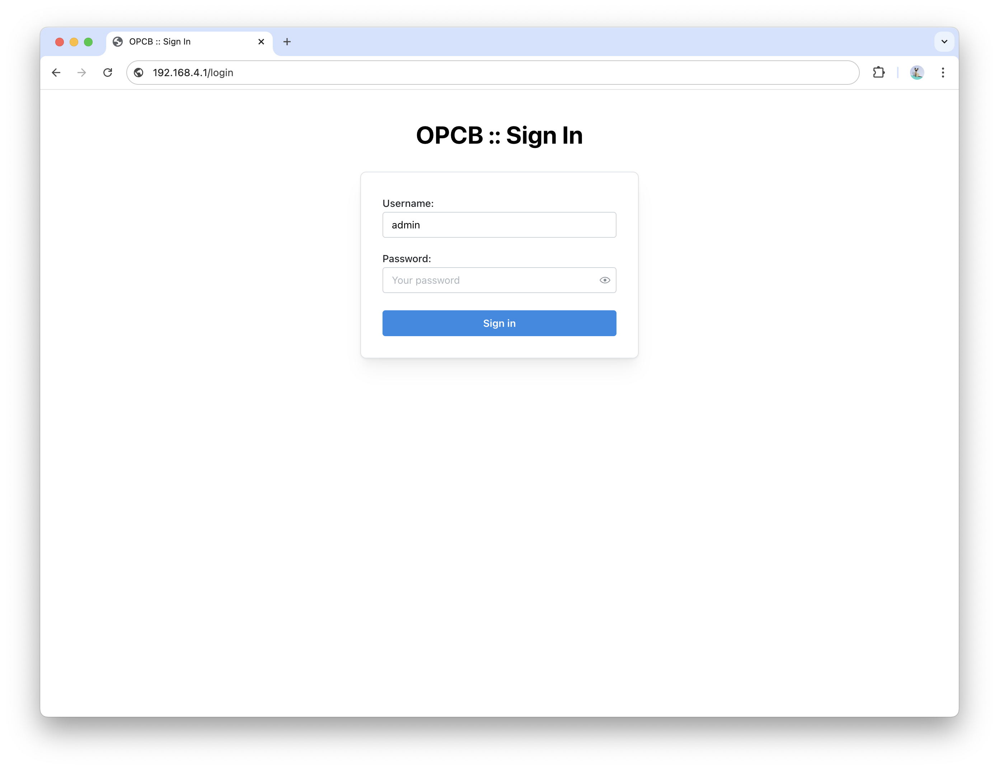

# Overvis & Novatek-Electro OPCB-221B Operating Manual

The Quality Management System of the device designing and production complies with the requirements
of ISO 9001:2015.

## Purpose

The Controller OPCB-221B (hereinafter referred to as the "Controller", "Product", "Device", or
"OPCB-221B") provides MODBUS communication between clients and servers in TCP networks (Internet)
and between devices in the RS-485 interface.

OPCB-221B is used to remotely monitor and control the operation of:

- Refrigeration controllers,
- HVAC systems controllers,
- Agricultural smart devices,
- Power network relays, meters, and other electrical equipment,
- Industrial IoT devices,
- Industrial sensors and meters,
- Other MODBUS-compatible electronics.

### OPCB-221B Features

- MODBUS RTU/TCP converter.
- Built-in Overvis cloud support (www.overvis.com).
- Serves as TCP server or client, MODBUS RTU master or slave.
- RS-485 network extension.
- MODBUS ASCII mode support.
- Supports LAN and/or Wi-Fi connection.
- Optional 3G/LTE connection using an external USB modem.
- Wi-Fi Access Point mode.
- Web interface, accessible from the local network, via Wi-Fi Access Point, or using Overvis cloud
  connection.
- Remote configuration (using MODBUS or web interface).
- RS-485 network settings: baud rate, parity, response timeout.
- Supports multiple RS-485 networks.
- MODBUS request debugging tools.
- Automatic or manual firmware updates.
- HTTP API.

## Terms and Abbreviations

- **Wi-Fi station**: A device connected to another device through Wi-Fi (access point).
- **Wi-Fi access point**: A device enabling connection to it through Wi-Fi.
- **DHCP**: A protocol enabling the network units to automatically obtain TCP/IP parameters (IP
  address).
- **HTTP**: The transmission protocol for web pages and other data using client-server technology.
- **IP (address)**: The address of the unit, which is unique within one network that is operated
  according to IP protocol.
- **IPv4**: A four-byte IP address.
- **MAC (address)**: The address used in network transmissions for device identification. It is
  typically globally unique.
- **MAC-48**: A six-byte MAC address.
- **MODBUS**: The standard packet communication protocol based on the client-server technology
  intended for industrial electronic devices.
- **MODBUS RTU**: The devices linking protocol, where the packet is transmitted byte by byte.
- **MODBUS ASCII**: The devices linking protocol, where the packet is transmitted in ASCII
  characters.
- **MODBUS TCP**: MODBUS packet transmission protocol according to TCP/IP standard.
- **WEB**: The server documents access system used on the Internet.
- **Wi-Fi**: A family of standards for data transmission via radio channels.

## Complete Set

**Table 1** – Product Set

| Name                                                                                             | Quantity (pcs.) |
| ------------------------------------------------------------------------------------------------ | --------------- |
| 1. Controller OPCB-221B (with installed MicroSD memory card and integrated Wi-Fi antenna, 3 dbm) | 1               |
| 2. USB/RS-485 extension module (supporting up to 32 connected RS-485 devices)                    | 1               |
| 3. Power supply with USB Type-A output and DC Plug cable                                         | 1               |
| 4. Ethernet cable                                                                                | 1               |
| 5. Operation manual with Cloud Registration sticker                                              | 1               |

## Overall Mounting Dimensions and Controls

**Figure 1** – OPCB-221B Overall and Mounting Dimensions

1. **"EXT1"** connectors: 2 USB Type-A connectors for connecting additional modules (e.g., RS-485 /
   RS-232 serial interface converters).
2. **"ETH"** connector: 8P8C/RJ45 for wired connection to the local Ethernet network.
3. **"EXT2"** connector: USB Type-A connector for connecting additional modules (e.g., RS-485 /
   RS-232 serial interface converters).
4. **"PWR"** connector: DC Plug for connecting a 5V DC power source with a power of at least 9W.
5. **"HDMI"** connector: HDMI output (not used).
6. **"AUX"** connector: Audio output (not used).
7. **"MEM"** slot: MicroSD card slot for accessing the pre-installed memory card.

## Technical Specifications

**Table 2** – OPCB-221B Controller Main Technical Specifications

| Name                                                                                            | Value                                  |
| :---------------------------------------------------------------------------------------------- | -------------------------------------- |
| Power supply voltage DC, V                                                                      | 5.0                                    |
| Motherboard                                                                                     | Orange Pi PC Plus 1G RAM               |
| TCP networks link interface                                                                     | Ethernet, Wi-Fi                        |
| Ethernet communication interface                                                                | 10BASE-T/100BASE-T (twisted pair)      |
| Wi-Fi frequency, GHz                                                                            | 2.4                                    |
| Supported Wi-Fi standards                                                                       | IEEE 802.11 b/g/n                      |
| Supported TCP/IP protocols                                                                      | MODBUS TCP, HTTP, DNS, DHCP, WireGuard |
| Maximum number of incoming connections via MODBUS TCP protocol                                  | 4                                      |
| Maximum number of outgoing connections via MODBUS TCP protocol                                  | 4                                      |
| Maximum number of serial interfaces                                                             | 3 (through individual USB ports)       |
| Supported serial interface protocols                                                            | MODBUS RTU, MODBUS ASCII               |
| Supported serial MODBUS modes                                                                   | Master, Slave                          |
| Maximum number of connected MODBUS devices                                                      | 255                                    |
| Built-in servers                                                                                | MODBUS TCP, HTTP                       |
| Ready time at power up, s, no more than                                                         | 60                                     |
| Current consumption, mA, max                                                                    | 2000                                   |
| Weight, kg, no more than                                                                        | 0.200                                  |
| Overall dimensions HxBxL, mm, no more than                                                      | 99 х 82 х 36                           |
| Product designation                                                                             | Switchgear and control equipment       |
| Rated operating condition                                                                       | Continuous                             |
| Degree of protection                                                                            | ІР30                                   |
| Electric shock protection class                                                                 | III                                    |
| Climatic design version                                                                         | NF 3.1                                 |
| Permissible contamination level                                                                 | II                                     |
| Galvanic insulation, kV<ul><li>Power connector</li><li>Ethernet connector</li><li>USB</li></ul> |  – 1.5 –                      |
| Installation (mounting)                                                                         | Panel                                  |

- The product meets the requirements of the following standards: EN 60947-1; EN 60947-6-2; EN
  55011; EN 61000-4-2.
- The product retains its functionality in any position in space.
- Case material: Aluminum.
- Harmful substances in amounts exceeding maximum permissible concentrations are absent.

**Table 3** – USB-RS485 Extension Module Technical Specifications

| Name                                        | Value                                                                            |
| :------------------------------------------ | -------------------------------------------------------------------------------- |
| Communication speed, bps                    | 300-921600                                                                       |
| Direction control                           | Hardware automatically determines and controls data transmission direction       |
| Transmission distance (at low speed),       | About 1200 meters                                                                |
| Transmission mode                           | Up to 32 nodes in point pairs (repeaters are recommended for more than 16 nodes) |
| Balance resistance                          | Onboard 120 Ohm, jumper-connectable                                              |
| Current consumption, mA, max                | 50                                                                               |
| Interface protection                        | Provides 600W lightning protection, surge and 15kV static protection             |
| Galvanic insulation                         | Present                                                                          |
| Weight, kg, no more than                    | 0.010                                                                            |
| Overall dimensions HxBxL, mm, no more than  | 15x18x63                                                                         |
| Cross-section of wires to be connected, mm2 | 0.13 – 0.82                                                                      |
| Tightening torque of terminal screws, N\*m  | 0.3                                                                              |
| Degree of protection                        | ІР20                                                                             |

**Table 4** – Power Adapter Technical Specifications

| Name                                       | Value                                                   |
| :----------------------------------------- | ------------------------------------------------------- |
| Input AC voltage range, V                  | 100-240                                                 |
| Input AC current, mA                       | 500                                                     |
| Input AC frequency range, Hz               | 50/60                                                   |
| Output voltage DC, V                       | 5.0                                                     |
| Output current DC, mA, max                 | 3000                                                    |
| AC inlet                                   | EU 2 pin plug                                           |
| DC connector                               | USB Type-A                                              |
| Weight, kg, no more than                   | 0.065                                                   |
| Overall dimensions HxBxL, mm, no more than | 80x30x75                                                |
| Degree of protection                       | IP20                                                    |
| Electric shock protection class            | II                                                      |
| Insulation voltage                         | Input/Output to outer case, 500VDC, greater than 10MOhm |
| Input to output withstand voltage          | AC 3kV / 10mA, 3s                                       |

## Operation Conditions

The product is intended for operation under the following conditions:

- Ambient temperature: -10 to +55 °C.
- Atmospheric pressure: 84 to 106.7 kPa.
- Relative humidity (at +25 °С): 30 to 80%.

**Attention! The product is not intended to be used in the following conditions:**

- Significant vibrations and shock.
- High humidity.
- An aggressive environment containing acids, alkalis, etc., as well as strong contaminants
  (grease, oil, dust, etc.).

## General Instructions

**ATTENTION! ALL CONNECTIONS MUST BE MADE WITH THE PRODUCT DE-ENERGIZED.**

**Errors during installation may damage the product and connected devices.**

When connecting to the RS-485 bus, use a twisted pair cable, cat. 1 or higher. Strip the ends of
insulation by 4±0.5 mm and tighten with bushing tips. A shielded grounded cable is recommended.

**DO NOT LEAVE ANY BARE WIRE PROTRUDING BEYOND THE TERMINAL BLOCK.**

**For reliable contact, tighten the terminal screws with the force indicated in the technical
characteristics table.**

When connecting to Ethernet, use the supplied cable, or a twisted pair cable of cat. 5e with an
8P8C (RJ45) plug.

When fixing the wires, avoid mechanical damage, twisting, or wearing down the insulation of wires.

## Connection

Before starting:

- Unpack and inspect the product for damage after transportation. If any damage is found, contact
  the supplier or the manufacturer.
- Before connecting to the power supply, keep the product under operating conditions for two hours
  (in case of possible condensation on the elements).
- Carefully study the operating manual.
- If you have any questions about the installation of the product, please contact technical support
  using the phone number at the end of the operating manual.

**Figure 2** – Product Connection Diagram

Connect OPCB-221B according to Figure 2, in the following order:

1. Using a twisted-pair cable of category 1 or higher, connect the terminal block of the RS-485
   module to the serial interface bus (or directly to a device with this interface). **Note:**
   Contact "A" is for the non-inverted signal (D+), and contact "B" is for the inverted signal
   (D-).
2. If the product should have access to the Internet or LAN, use the Ethernet connection cable
   (included in the package) or a twisted pair cable of cat. 5e with an 8P8C (RJ45) plug to connect
   the **"ETH"** connector (8P8C/RJ45) to the local network or computer.
3. Ensure the memory card is present in the **"MEM"** slot (installed by the manufacturer).
4. Connect the RS-485 module to one of the **"EXT1"** or **"EXT2"** (USB Type-A) connectors.
5. Connect the power unit (included) to the **"PWR"** (DC Plug) connector.
6. Optionally: Secure the USB connections with plastic cable ties to avoid accidental
   disconnection.
7. Connect the power unit to the power supply network (220-240VAC, 50Hz).

## OPCB-221B Operation

### General Information

OPCB-221B has a 32-bit processor running a POSIX-compliant OS (Armbian). It routes traffic between
the USB extension modules, such as serial RS-485 / RS-232 interfaces (MODBUS RTU/ASCII protocols),
and Ethernet/Wi-Fi LAN interfaces (MODBUS TCP protocol), possibly routed further to the Internet.

OPCB-221B has a built-in web interface that can be used for configuration.

OPCB-221B can connect to a cloud server for remote monitoring and configuration of the product and
connected devices.

OPCB-221B provides a Wi-Fi Access Point (hotspot) to simplify the initial setup. Wi-Fi Access Point
can be disabled in the settings.

**OPCB-221B stores the operating system and data on the pre-installed microSD memory card. Removing
or replacing the memory card will render the product inoperable.**

### Power Up and Reboot Sequence

After powering up, OPCB-221B loads the operating system and sets up the communication interfaces.
This process usually takes up to 1 minute.

With an internet connection provided, OPCB-221B automatically connects to the cloud server if
allowed in the settings. By default, unconfigured OPCB-221B creates a Wi-Fi access point with SSID
"OPCB_XXXXXX" (where XXXXXX are the last 6 characters of the device's MAC) and a password specified
on the Registration sticker (attached to this manual).

To perform a soft reboot of the OPCB-221B, use the web interface by pressing the "Reboot device"
button on the "Control" page. This will finish all ongoing operations, store the data, and reboot
the device within 1 minute.

To perform a hard reboot, turn off the power by unplugging the device, wait 5 seconds, and then
turn the power back on.

### Operation via HTTP

OPCB-221B provides an HTTP web interface and HTTP REST API for web applications. OPCB-221B accepts
HTTP connections via Ethernet or Wi-Fi interfaces on TCP port 80.

To access the HTTP web interface:

1. Connect to the OPCB-221B Wi-Fi access point with a PC or mobile device and open the following
   URL in the browser: `http://192.168.4.1/`.
2. Alternatively, using any PC or mobile device in the local network, open the IP address of the
   OPCB-221B in the browser. The OPCB-221B IP address can usually be found by accessing the local
   network router interface. Additionally, the IP address can be retrieved from OPCB by using the
   control file (see Appendix F).

The default username for the web interface is "admin" with the password specified on the
Registration sticker (attached to this manual).

For general information about the web interface usage, see Appendix B.

### OPCB-221B Operation via MODBUS (TCP/RTU/ASCII)

OPCB-221B receives MODBUS TCP requests via Ethernet or Wi-Fi interfaces and transmits them in
MODBUS RTU or MODBUS ASCII format over the serial interface. Responses are converted to MODBUS TCP
and sent back to the requesting side.

OPCB-221B can also be configured to receive MODBUS RTU or MODBUS ASCII requests via the serial
interface and transmit them in MODBUS TCP format to specified IP addresses via Ethernet or Wi-Fi
interfaces. In this case, the responses (converted to the request protocol) are sent back to the
serial line. See Appendix A for the main principles of OPCB operation.

Connections from a PC or mobile device can be made using any software MODBUS TCP clients.

MODBUS registers of the OPCB-221B are not described in this manual because they are configurable in
the web interface on the "Connections" page in the section "OPCB Modbus access."

MODBUS routing between the connected devices is configured in the web interface on the
"Connections" page in the section "Routing."

### OPCB-221B Operation Using the Overvis Cloud Server

OPCB-221B can establish connections to the Overvis cloud server using any interface with Internet
access. OPCB-221B communicates with the Overvis cloud using an Overvis VPN connection, which
provides full encryption of traffic between the device and the Overvis cloud server.

Overvis VPN cloud connection is enabled by default and can be disabled in the settings.

The cloud operation can be configured and managed by creating an account on the Overvis cloud:
https://www.overvis.com/

The OPCB-221B product set includes an Overvis Cloud registration sticker. Sticker information
includes:

- **Model** of the device (OPCB-221B).
- **MAC** address of the LAN interface.
- **Private key**: The unique private key of the device for Overvis VPN access, also used as a
  unique registration code for the Overvis cloud. This key is needed to restore the device license
  in case of firmware reflashing.
- **PIN** code: The unique PIN code for quick identification of the device on the Overvis cloud.
- **Wi-Fi SSID** and **password** for the initial connection to the Wi-Fi Access Point.
- Default **username** and **password** for web interface access.
- **Quick setup link** (with QR-code) for easy connection to the Overvis cloud.

Access the link on the sticker and follow the instructions on the Overvis website to set up the
device cloud operation and access the OPCB-221B interface through the Overvis cloud.

### Factory Reset

A partial factory reset can be performed in one of the following ways:

- **Using a control key USB flash drive**: Write an empty file or an empty folder named
  `"RESET_CONF"` to a USB flash drive, then connect it to one of the **"EXT1"** or **"EXT2"** slots
  to reset the settings to the factory defaults. The reset may take up to 30 seconds; the USB flash
  drive can be disconnected afterward.
- **Through the web interface** on the "Control" page.

### Firmware Update

Device firmware is updated continuously by the manufacturer. By default, the new version is
installed automatically after the device is powered on or within 24 hours of operation. Automatic
updates guarantee the backward compatibility of all OPCB-221B functions. Releases without backward
compatibility require manual installation.

The currently installed version is displayed in the OPCB-221B web interface. The changelog for each
version is available here: https://github.com/overvis/opcb-release/blob/opcb/CHANGELOG.md

### Manual Firmware Update and Full Factory Reset

A manual update requires a full factory reset by uploading a new firmware image to the SD memory
card. All current firmware images can be found on the release page:
https://github.com/overvis/opcb-release/releases

The full factory reset procedure is described in Appendix D.

## Initial Setup

The device can be configured via the web interface. Configuration parameters are stored in a file
on the SD memory card.

**Note: Some settings require a soft reboot. Clients may lose the connection and have to
reconnect.**

1. After the device is plugged in and operational, access the web interface by connecting to the
   Wi-Fi Access Point or using the local network.

   By default, an unconfigured OPCB-221B creates a Wi-Fi access point with SSID "OPCB_XXXXXX"
   (where XXXXXX are the last 6 characters of the device's MAC) and a password specified on the
   Registration sticker (attached to this manual).

   Connect to the OPCB-221B Wi-Fi access point with a PC or mobile device and open the following
   URL in the browser: `http://192.168.4.1/`.

2. Log in to the web interface using the default username "admin" and the password specified on the
   Registration sticker (attached to this manual).

   

3. After logging in, the quick setup page will be displayed. If the device was configured
   previously and reconfiguration is needed, the quick setup page can be accessed from the
   drop-down drawer in the header under the logo.

   

4. After the initial setup, the device will connect to the internet using the specified settings
   and will be available in the Overvis cloud.

   Access the link on the sticker and follow the instructions on the Overvis website to set up the
   device cloud operation and access the OPCB-221B interface through the Overvis cloud.

**ATTENTION! Ensure the Internet connection is correctly configured before disabling the Wi-Fi
access point. Otherwise, an incorrect configuration may prevent any communication with the device,
which can only be fixed with a factory reset.**

## Safety Precautions

To ensure the product's safe operation, it is strictly forbidden to:

- Carry out installation works and maintenance without disconnecting the product from the mains.
- Open and repair the product without professional help.
- Operate the product with mechanical damages to the housing.

Water penetration on terminals and internal elements of the product is not allowed.

During operation and maintenance, the regulatory document requirements must be met, namely:

- Regulations for Operation of Consumer Electrical Installations.
- Safety Rules for Operation of Consumer Electrical Installations.
- Occupational Safety in Operation of Electrical Installations.

**LIQUID INGRESS ON TERMINALS AND INTERNAL ELEMENTS OF THE DEVICE IS UNACCEPTABLE.**

## Maintenance

**WHEN MAINTAINING, THE PRODUCT AND DEVICES CONNECTED TO IT MUST BE DISCONNECTED FROM THE POWER
SUPPLY.**

Maintenance of the product should be performed by **qualified technicians**.

Recommended frequency of maintenance is every six months.

Procedure:

1. Check the reliability of wire connections; tighten if necessary.
2. Check the reliability of USB connections; fix them with plastic clamps if needed.
3. Visually inspect the integrity of the housing. In case of damage, take the product out of
   service and send it for repair.
4. If needed, clean the housing of the product with a dry cloth.

**Do not use abrasives or solvents for cleaning.**

## Service Life and Manufacturer Warranty

The service lifetime of the product is 10 years. At the end of its service life, please contact the
manufacturer.

Shelf life is 3 years.

The warranty period of the product is 3 years from the date of sale.

During the warranty period (in case of failure), the manufacturer repairs the product free of
charge.

**ATTENTION! IF THE PRODUCT HAS NOT BEEN USED IN ACCORDANCE WITH THE REQUIREMENTS OF THIS OPERATION
MANUAL, THE USER WILL LOSE THE RIGHT TO WARRANTY SERVICE.**

Warranty service is performed at the place of purchase or by the manufacturer.

Post-warranty maintenance of the product is performed by the manufacturer at current rates.

Before sending the product for repair, it must be packed in the factory or other packaging that
prevents mechanical damage.

**If returning the product or submitting it for warranty (post-warranty) service, please state in
detail the reason for return in the complaint information field.**

## Transportation and Storage

The product in its original packaging is permitted to be transported and stored at temperatures
ranging from -45 to +60 °C and with relative humidity of no more than 80%. During transportation,
the product should be protected from mechanical damage.

## Acceptance Certificate

The product is manufactured and accepted in accordance with the requirements of the current
technical documentation and classified as fit for operation.

Head of QCD:

Date of Manufacture:

## Complaint Information

**The company is grateful for your feedback about the quality of the product and suggestions for
its operation.**

If you have any questions, please contact the manufacturer: NOVATEK-ELECTRO LTD. Ukraine, 65007,
Odessa, Admirala Lazareva str. 59

tel. +38(048)738-00-28

tel/fax +38(048)234-36-73.

http://www.novatek-electro.com

Warranty Service Department: +38(067) 557-12-49

Technical Support Department: +38(067) 565-37-68

Date of Sale

VN221012

---

Appendix A. [Principles & Applications](/OPCB/User/Principles/)

Appendix B. [Web Interface Overview](/OPCB/User/Web_Interface/)

Appendix C. [Troubleshooting](/OPCB/User/Troubleshooting/)

Appendix D. [Reflashing / Manufacturing](/OPCB/User/Manufacturing/)

Appendix E. [HTTP API Reference](/OPCB/Reference/API/)

Appendix F. [Control Files Reference](/OPCB/Reference/Control_Files/)

Full online documentation is available at
[https://docs.overvis.com/#/OPCB/](https://docs.overvis.com/#/OPCB/)
