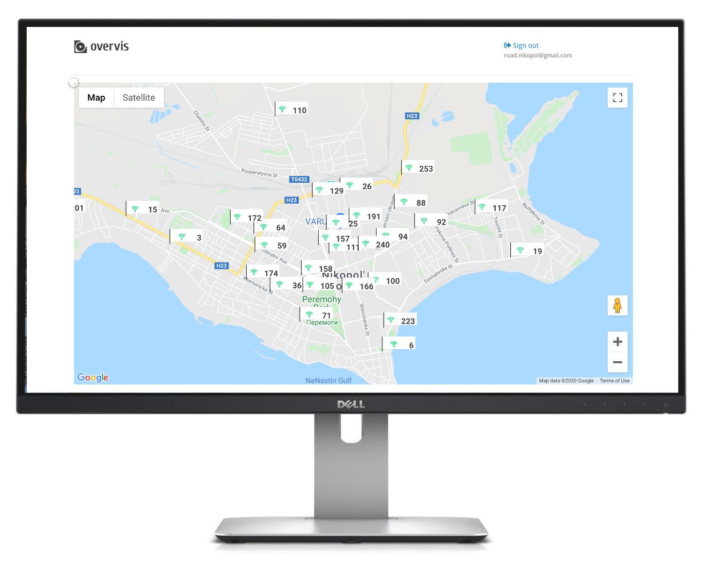

# Overvis OPCB Series Equipment

Overvis OPCB-221B is a communication controller device suitable for industrial applications.

Acquire here: https://www.overvis.com/

The main function of OPCB-221B controller is to connect MODBUS equipment with
[Overvis cloud monitoring system](https://www.overvis.com/) or other SCADA systems. OPCB-221B
operates as a MODBUS RTU<>TCP converter.

OPCB-221B is used to connect:

- Refrigeration controllers
- HVAC systems controllers
- Agricultural smart devices
- Power network relays, meters, and other electrical equipment
- Industrial IoT devices
- Industrial sensors and meters
- Any other MODBUS-compatible electronics

In conjunction with Overvis cloud monitoring, OPCB-221B devices provide:

**Data collection:**

- Gather operational data points (any numeric values) from your equipment.
- Store history of operational data, and get insights and analytics.
- Collected data is fully exportable (Excel, CSV).
- Hazard Analysis Critical Control Point (HACCP) reporting.

**SMS and email notifications:**

- Configure alarms for operational parameter thresholds or connection errors.
- Set up a “chain of responsibility” requiring alarm confirmations from personnel and escalating
  them in the absence of response.
- All alarm actions are logged and ready for review.

**Real-time monitoring and control:**

- Create dashboards with real-time information received from the equipment.
- Visualize the data using open SVG format.
- Use Google Maps API to display objects’ locations.
- Use JavaScript and Overvis API to set up quick action controls for operation personnel.

**And more:**

- Use templates to quickly create devices and alarms.
- Manage access levels for different accounts inside one organization.
- Works with dynamic IPs and bypasses firewalls.
- Optimized mobile access.
- Industry-standard encryption.
- Overvis API allows the automation of control and can be used to load data into other management
  systems.

## Feature list

- MODBUS RTU/TCP converter.
- Built-in Overvis cloud support (www.overvis.com).
- Serving as TCP server or client, MODBUS RTU master or slave.
- RS-485 network extension.
- MODBUS ASCII mode support.
- Supporting LAN and/or Wi-Fi connection.
- Optional 3G/LTE connection using an external USB modem.
- Wi-Fi Access Point mode.
- Web interface, accessible from the local network or via WiFi Access Point.
- Remote configuration (using MODBUS or web interface).
- RS-485 network settings: baud rate, parity, response timeout.
- Multiple RS-485 networks support.
- MODBUS requests debugging tools.
- Automatic or manual firmware update.
- HTTP API.
