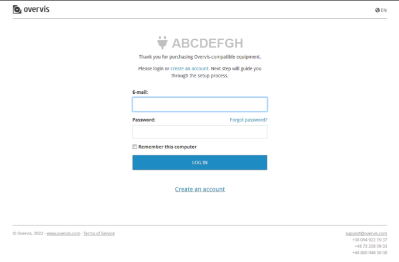

# Cloud Server Connection

To access the OPCB-221 via the cloud server, follow the link on the product label (or the QR code
on the label). If an Overvis account has not been logged in, the login page will open. If there is
no account, it is necessary to register a new one on this page. An example of the page is shown in
the figure.

After logging in, the page for adding a new network (with OPCB-221 as the access gateway) will open
with the fields filled in for communication with the product. An example of the page is shown in
the figure.

Enter the name of the network with the device in the "Name" field. If necessary, you can add the
Modbus devices connected to OPCB-221 to the "Connected devices" list, or you can do it later. Then
press the "Install" button to add the network with the product to the account.
