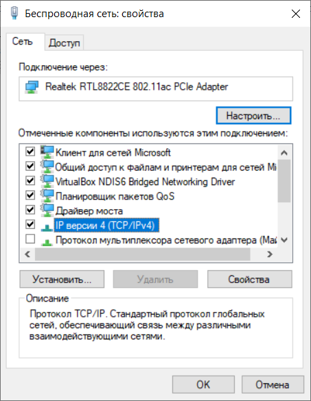
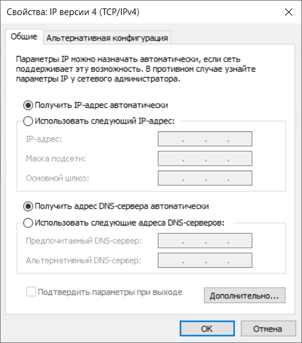

# Ethernet Connection

**WARNING! Connecting the product to an Ethernet network requires mutual negotiation between the
connected devices. Connecting an incorrectly configured device to the network may affect
communication, including other devices on the network. As a rule, all connections to a network of
more than 2 devices are performed by qualified personnel (network administrator).**

## IP address

When devices communicate over Ethernet network using TCP/IP protocol, each device uses a set of
IP-addressing settings to determine the sender and receiver of data. The device keeps in memory its
own, unique within one subnet IP address (four bytes, written as four integers in the range 0-255,
separated by dots), subnet mask, the same for all devices in the subnet (written similar to IP
address) and IP address of gateway, which is used to communicate with other networks. Several
conditions must be met for devices in a subnet to communicate properly:

1. The mask is the same for all devices on the same subnet. Typically, small local networks use a
   mask 255.255.255.0.
2. The mask starts with a group of bits set to 1, followed by a group of bits reset to 0.
3. In all IP addresses of devices within the single subnet, the bits that are set to 1 in the mask
   are the same and represent the subnet address. For the 255.255.255.255.0 mask in local networks,
   addresses beginning with 192.168 are most commonly used. The third byte can be used as the
   subnet number in a complex LAN. In small networks, the third byte is usually 0.
4. The set of bits in the device IP addresses that are reset to 0 in the mask is unique for each
   device within the single subnet.
5. In most cases, a device (such as a router) that communicates with other networks is included in
   the network. Often 192.168.0.1, or 192.168.0.100, or 192.168.0.101 are reserved for it. The
   other devices on the network are then given the IP address of the device as the gateway address.
   Specifying this address is not necessary for devices in a subnet to communicate with each other,
   and is only used to communicate a device in a single subnet with devices in other networks.

When the OPCB-221 is configured by default, the client device (and any other devices in the same
subnet) must use the OPCB-221 address given by the LAN router via DHCP to communicate with it. If
the connection is made within a network with DHCP or if the device requires a fixed address to
access OPCB-221, in order to avoid addressing conflicts it is recommended to temporarily disconnect
the device to be set up and communicate directly with OPCB-221. This will allow the device and
OPCB-221 to be configured for further operation on the network.

## Configuring the client device

The addressing of the device is set according to the documentation for this device and the software
used with it.

Below is an example of how to configure a personal computer (PC) running a Windows XP or Windows 7
operating system (OS) to communicate directly with a default OPCB-221.

To configure a network address on a Windows operating system (OS), open the OS network connection
list. To do this, depending on the OS version, follow the steps below.

For Windows 10/7:

1. Log in to the OS under an administrator account
2. Select "Start->Control Panel".
3. If the Control Panel items are divided into categories, select the "Network and Internet
   Connection" category.
4. Open the "Network and Sharing Control Panel" item.
5. In the task list (on the left panel) select "Change adapter settings".

For Windows XP:

1. Log in to the OS under an administrator account.
2. Select "Start->Control Panel".
3. If the Control Panel items are divided into categories, select the "Network and Internet
   Connection" category.
4. Open the "Network Connection" section.

Next, do the following steps:

1. In the connections window that will appear, select the required connection through the adapter
   whose address must be changed. Many computers have only one adapter and one connection, which
   will be displayed in this window. If the window shows several connections, select the required
   connection using the adapter name in the connection signature, or contact your system
   administrator.
2. Right-click on the icon of the selected connection, select "Properties" from the drop-down menu.
   The properties window opens, an example of the window is shown in Figure B.1.

3. In the window that appears, select "Internet Protocol (TCP/IP)" in the list of connection
   components. Make sure that the component is activated (marked with a flag in the list). Press
   the "Properties" button. The TCP/IP properties window opens, an example of the window is shown
   in Figure B.2.

4. Select the "Use the following IP address" option.
5. In the "IP address" field specify an address in the range 192.168.0.1-192.168.0.255 (except
   192.168.0.111, which will be used by the OPCB 221).
6. Enter "255.255.255.255.0" in the "Subnet Mask" field.
7. Leave the fields "Default Gateway", "Preferred DNS-server", "Alternative DNS-server" blank.
8. Click "OK" to close the protocol setup window.
9. Press "OK" to close the connection settings window.
10. If the OS asks you to restart the computer after closing the windows, when applying the
    parameters, select “yes”.

## Internet Connection

**WARNING! It is strongly recommended to connect the product to the Internet under the supervision
of the local network system administrator and/or the representative of the Internet service
provider.**

Use the following recommendations to connect to the Internet:

- a dedicated line must be obtained from your Internet Service Provider (if you want to access the
  product externally from the Internet, you must also order a static IP address service; a static
  address is not required to connect the product to a cloud server);
- use a network router or router to communicate with the provider and create a local network to
  which the product will be connected; in this case, the cable of the provider is connected to the
  router `Uplink` connector (usually highlighted in color and has no number, depending on the
  router manufacturer the designation may be different, for example, "WAN" or `Internet` - see the
  documentation to the router). Use an Ethernet Straight-through cable (included) to connect the
  product to the router. Using the router documentation, configure the router to connect to the
  Internet according to the provider's recommendations. Also, if you want to access the product
  externally from the Internet without a cloud server, you should enable redirection of incoming
  requests (to the static IP address given by the provider) to the IP address of OPCB-221 in the
  router settings (in this case, the product address should be fixed either in the router settings
  or in the OPCB 221 settings);
- make sure that the connection of the product to the Internet will be secured by standard means
  (see below);
- when accessing the product on the Internet, use the IP address provided by your ISP.

## Connection protection

- OPCB-221 has basic means of protection against unauthorized access over the network;
- device settings can be changed remotely only after entering a password (at least 5 characters).
  Repetition of incorrect passwords in order to find the correct value is blocked by the product;
- password entry makes settings available only for the given client via given protocol. If there
  are no requests from the client for a long time, the connection is stopped. **Note - If the
  password is entered correctly, the setting mode via Modbus opens in an unsecured connection. When
  it is necessary to change settings over the network (especially in networks where security is not
  ensured by other means), it is strongly recommended to configure the product using a browser via
  Web-interface or via a cloud server;**
- built-in access protections are not designed against network security attacks (especially attacks
  that aim to block access to the product instead of accessing it);
- in complex and branched networks (especially when providing access to OPCB-221 via Internet) it
  is recommended to keep the product from unsafe networks by means of standard protection tools
  (router, configured for transmission filtering, Firewall, etc.).
