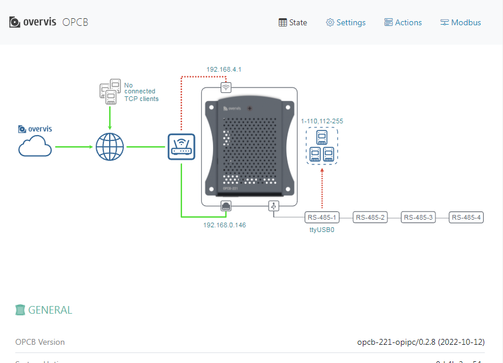
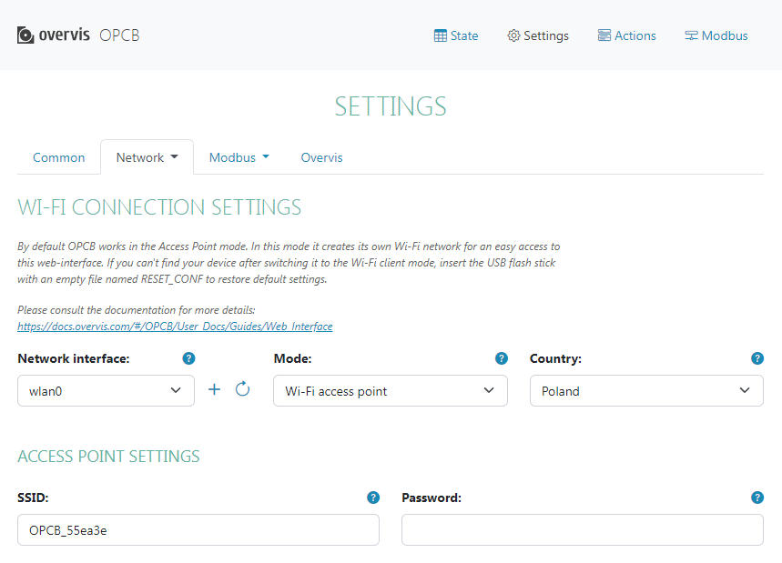
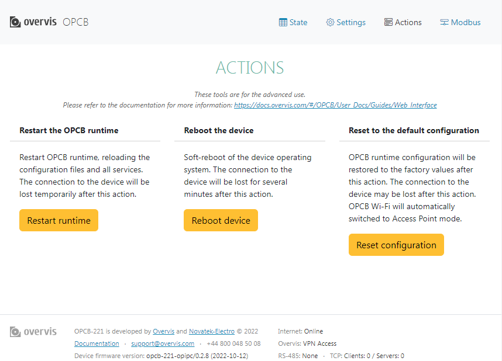
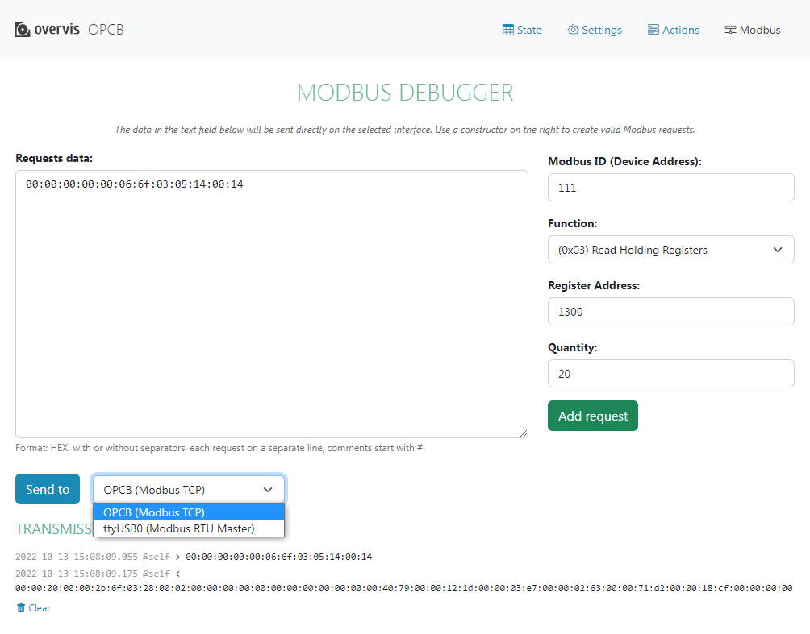

# Web Interface

To access the product Web interface via the Wi-Fi access point or hotspot (if it is enabled, e.g. during the initial setup), connect the browsing device (computer or telephone) to the hotspot, then enter the address `setup.overvis.com` (or `192.168.4.1`) in the browser.

To access the product Web interface via the LAN, connect the device (computer or telephone) to the
local network that the OPCB-221B is configured to work with. Then enter the address of the product
in the browser:

- fixed address assigned during OPCB-221B network configuration;
- or a temporary dynamic address, which can be obtained through the Web-interface of the LAN router
  (if there is access to it).

The state page will open, as shown in the figure below.

There are 4 main sections selectable from the menu in the top right corner.

## State

The connections and other state details can be viewed at this page. The diagram at the top of the page
shows the connection scheme according to network interfaces and MODBUS settings.

The colors in the scheme indicate the connections activity:
- serial MODBUS connections are shown in green for the successfully opened port (even if the remote devices are unavailable), red if the port is unavailable;
- client connections to the remote MODBUS servers lines are shown in green, with the remote server box color indicating the status, red for broken and blue for established connection;
- Wi-Fi connection to the router remains red in the Wi-Fi access point mode (because connection to the router is not intended);
- other connections lines indicate the status with their colors, red for broken link and green for established connection.

The tables below the scheme summarize the OPCB-221B and its interfaces state.

## Settings

The OPCB-221B can be configured by selecting the required tabs and setting the parameters.

_If the device is to work via a cloud server, you must configure one or more network interfaces in
the `Network` tabs, through which the OPCB-221 can access the Internet. Then on the `Overvis` tab,
if necessary, configure the cloud server host name. After correctly configuring the Internet
access and saving the settings, the connection to the cloud server will be established. Further
configuration can be done through the cloud server._

Some of the parameters (like the network interface list on the figure) provide a dynamic drop-down list selection.
If the necessary value is not on the list yet, use the circular refresh button to the right to update the drop-down list.

Use the `?` help button at the top right corner of the parameter to get its description.

When the configuration is completed, use the `Save settings` button to save and apply the settings.

## Actions

Advanced control actions are available:
- soft restart;
- hard restart (device reboot);
- partial factory reset (settings reset to factory defaults).

## MODBUS

MODBUS interfaces debug tests can be run at this page. First, the destination interface should be selected from the dropdown near the `Send to` button. Then one or more requests can be put on the list using the constructor on the right:
- select the destination device address;
- select the requested function and set its parameters (for multiple value write press `+ Add value field` as necessary);
- press the `Add request` button to put it on the list.

The list can also be edited manually. 

After preparing the requests, press the `Send to` button. The results of the MODBUS exchange would be shown in the `TRANSMISSION LOG` at the bottom of the page.
