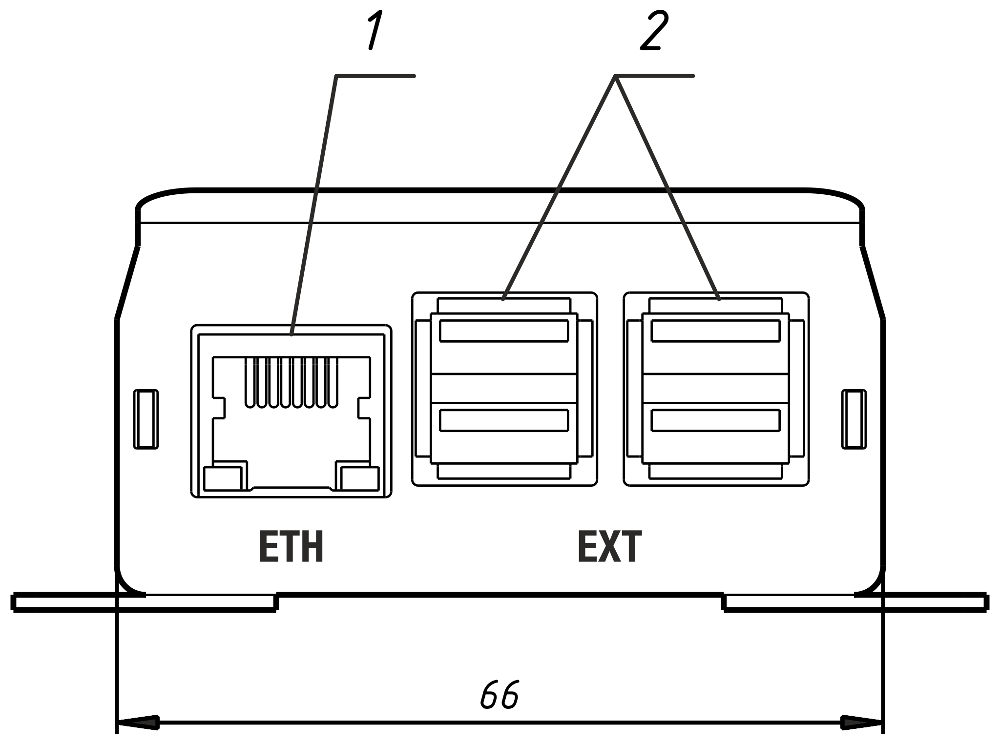
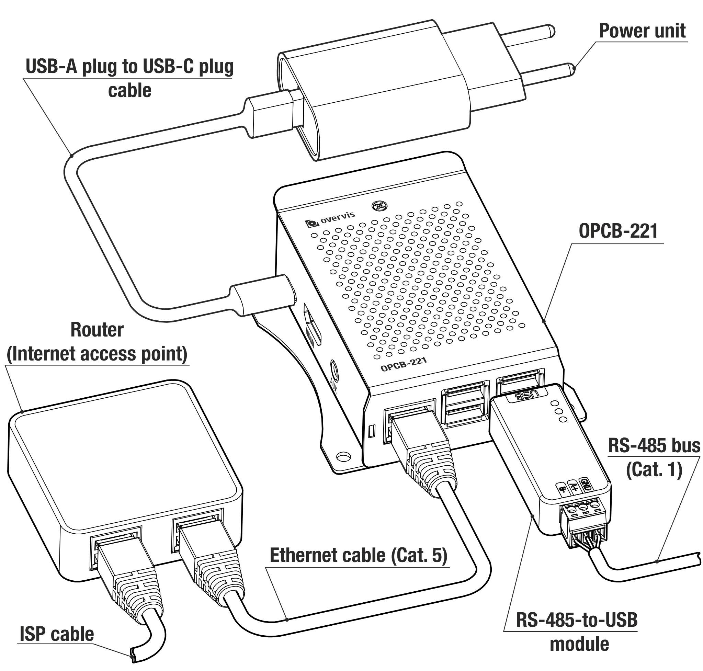

# OPCB-221 Operating Manual

<!-- TODO: correct picture -->

The Quality Management System of the device designing and production complies with the requirements
of ISO 9001:2015.

## Purpose

The Controller OPCB-221 (hereinafter referred to as the "Controller", "Product", "Device", or
"OPCB-221") provides MODBUS communication between clients and servers in TCP networks (Internet)
and between devices in the RS-485 interface.

OPCB-221 is used to remotely monitor and control the operation of:

- Refrigeration controllers,
- HVAC systems controllers,
- Agricultural smart devices,
- Power network relays, meters, other electrical equipment,
- Industrial IoT devices,
- Industrial sensors and meters,
- Other MODBUS-compatible electronics.

OPCB-221 feature list:

- MODBUS RTU/TCP converter.
- Built-in Overvis cloud support (www.overvis.com).
- Serving as TCP server or client, MODBUS RTU master or slave.
- RS-485 network extension.
- MODBUS ASCII mode support.
- Supporting LAN and/or Wi-Fi connection.
- Optional 3G/LTE connection using an external USB modem.
- Wi-Fi Access Point mode.
- Web interface, accessible from the local network or via Wi-Fi Access Point.
- Remote configuration (using MODBUS or web interface).
- RS-485 network settings: baud rate, parity, response timeout.
- Multiple RS-485 networks support.
- MODBUS requests debugging tools.
- Automatic or manual firmware update.
- HTTP API.

## Terms and abbreviations

**Wi-Fi station** - a device connected to another device through Wi-Fi (access point);

**Wi-Fi access point** - a device enabling connection to it through Wi-Fi;

**DHCP** – a Protocol enabling the network units to automatically obtain TCP/IP parameters (IP
address);

**HTTP** - the Transmission Protocol for Web pages and other data using client-server technology;

**IP (address)** – the address of the unit, which is unique within one network that is operated
according to IP Protocol;

**IPv4** - а four-byte IP address;

**MAC (address)** – the address used in network transmissions for device identification. As a rule,
it is globally unique;

**MAC-48** - a six-byte MAC address;

**MODBUS** - the standard Packet Communication Protocol based on the client-server technology
intended for industrial electronic devices;

**MODBUS RTU** - the Devices Linking Protocol, over which the packet is transmitted byte by byte;

**MODBUS ASCII** - the Devices Linking Protocol, over which the packet is transmitted in the form
of ASCII characters;

**MODBUS TCP** - MODBUS Packet Transmission Protocol according to TCP/IP standard;

**WEB** - the server documents access system used on the Internet;

**Wi-Fi** - a family of standards for data transmission via radio channels.

## Complete set

<!-- TODO: picture -->
<!-- TODO: warranty seals -->

**Table 1** – Product set

| Name                                                                                            | Quantity (pcs.) |
| ----------------------------------------------------------------------------------------------- | --------------- |
| 1. Controller OPCB-221 (with installed MicroSD memory card and integrated Wi-Fi antenna, 3 dbm) | 1               |
| 2. USB/RS-485 extension module (supporting up to 32 connected RS-485 devices)                   | 1               |
| 3. Power supply with USB Type-A output and USB Type-C cable                                     | 1               |
| 4. Ethernet cable                                                                               | 1               |
| 5. Operation manual                                                                             | 1               |

## Overall mounting dimensions and controls

**Figure 1** – OPCB-221 overall and mounting dimensions

1. **"ETH"** connector - 8P8C/RJ45 for wired connection to the local network Ethernet;
2. **"EXT"** connectors - 4 USB Type-A connectors for connecting additional modules (e.g., RS-485 /
   RS-232 serial interface converters).
3. **"PWR"** connector - USB Type-C for connecting a 5 V DC power source with a power of at least 9
   W.
4. **"HDMI"** connector - HDMI output (not used).
5. **"AUX"** connector - Audio output (not used).
6. **"MEM"** slot - MicroSD-card slot for internal memory card access.

## Technical specifications

<!--
TODO: check:
  - USB-RS485 characteristics (terminator, terminal characteristics, etc.) table;
  - Power supply characteristics table
  - Weight, kg, no more than, (measure)
  - Overall dimensions, mm, no more than (measure)
  - Insulation rated voltage, V, (power connector)
  - Galvanic insulation, kV (power)
  - Rated pulse withstand voltage, kV (power)
  - Electric shock protection class
  - The device meets the requirements of the following standards
-->

**Table 2** – OPCB-221 controller main technical specifications

| Name                                                                                            | Value                                  |
| :---------------------------------------------------------------------------------------------- | -------------------------------------- |
| Power supply voltage DC, V                                                                      | 5                                      |
| Motherboard                                                                                     | Banana Pi BPI-M4 with RT1395, 1G RAM   |
| TCP networks link interface                                                                     | Ethernet, Wi-Fi                        |
| Ethernet communication interface                                                                | 10BASE-T/100BASE-T (twisted pair)      |
| Wi-Fi frequency, GHz                                                                            | 2.4/5                                  |
| Supported Wi-Fi standards                                                                       | IEEE 802.11 b/g/n/ac                   |
| Supported TCP/IP protocols                                                                      | MODBUS TCP, HTTP, DNS, DHCP, WireGuard |
| Maximum number of incoming connections via MODBUS TCP protocol                                  | 4                                      |
| Maximum number of outgoing connections via MODBUS TCP protocol                                  | 4                                      |
| Maximum number of serial interfaces                                                             | 4 (through individual USB ports)       |
| Supported serial interface protocols                                                            | MODBUS RTU, MODBUS ASCII               |
| Maximum number of connected MODBUS devices                                                      | 255                                    |
| Built-in servers                                                                                | MODBUS RTU/TCP, HTTP                   |
| Ready time at power up, s, no more than                                                         | 60                                     |
| Current consumption, A, max                                                                     | 2                                      |
| Weight, kg, no more than                                                                        | 0,500                                  |
| Overall dimensions HxBxL, mm, no more than                                                      | 97 х 84 х 36                           |
| The Product designation                                                                         | Switchgear and control equipment       |
| Rated operating condition                                                                       | continuous                             |
| Degree of protection                                                                            | ІР30                                   |
| Electric shock protection class                                                                 | III                                    |
| Climatic design version                                                                         | NF 3.1                                 |
| Permissible contamination level                                                                 | II                                     |
| Galvanic insulation, kV<ul><li>power connector</li><li>Ethernet connector</li><li>USB</li></ul> | - 1,5 –                          |
| Installation (mounting)                                                                         | panel                                  |

- The product meets the requirements of the following: EN 60947-1; EN 60947-6-2; EN 55011; EN
  61000-4-2.
- The product retains its functionality in any position in space.
- Case material - aluminum.
- Harmful substances in amounts exceeding maximum permissible concentrations are absent.

**Table 3** – USB-RS485 extension module technical specifications

| Name                                        | Value                                                                                                 |
| :------------------------------------------ | ----------------------------------------------------------------------------------------------------- |
| Communication speed                         | 300-92160ps                                                                                           |
| Direction control                           | hardware automatically determines and controls data transmission direction                            |
| Transmission distance, (at low speed)       | about 1200 meters                                                                                     |
| Transmission mode                           | up to 32 nodes in point pairs, more than 16 nodes are recommended to add repeaters)                   |
| Interface protection                        | Provide 600W lightning protection, surge and 15KV static protection (onboard 120R balance resistance) |
| Temperature range                           | -15C to +70 °C                                                                                        |
| Humidity range (at +25 °С)                  | 5 ... 95%                                                                                             |
| Cross-section of wires to be connected, mm2 | 0,3 – 1                                                                                               |
| Tightening torque of terminal screws, Н\*м  | 0,3                                                                                                   |
| Degree of protection                        | ІР20                                                                                                  |

<!-- TODO: | Galvanic insulation, kV | ??? | -->

**Table 4** – Power adapter technical specifications

| Name                                       | Value                                                 |
| :----------------------------------------- | ----------------------------------------------------- |
| Input AC voltage range, V                  | 100-240                                               |
| Input AC current, A                        | 0.5                                                   |
| Input AC frequency range, Hz               | 50/60                                                 |
| Output voltage DC, V                       | 5                                                     |
| Output current DC, A, max                  | 3                                                     |
| AC inlet                                   | EU 2 pin plug                                         |
| DC connector                               | USB Type-A                                            |
| Weight, kg, no more than                   | ???                                                   |
| Overall dimensions HxBxL, mm, no more than | 51x44x28                                              |
| Degree of protection                       | IP20                                                  |
| Electric shock protection class            | II                                                    |
| Insulation voltage                         | Input/Output to out case, 500vdc, bigger than 10M ohm |
| Input to output withstand voltage          | AC 3kv /10mA, 3s                                      |

<!-- TODO:
| Galvanic insulation, kV | ??? |
| Insulation-rated voltage, V | ??? |
| Rated pulse withstand voltage, kV | ??? |
-->

## Operation conditions

The product is intended for operation under the following conditions:

<!-- TODO: test conditions -->

- ambient temperature from -10 to +55 °C;
- atmospheric pressure from 84 to 106.7 kPa;
- relative humidity (at +25 °С) 30 ... 80%.

**Attention! The product is not intended to be used in the following conditions:**

- significant vibrations and shock;
- high humidity;
- an aggressive environment containing acids, alkalis, etc., as well as strong contaminants
  (grease, oil, dust, etc.).

## General instructions

**ATTENTION! ALL CONNECTIONS MUST BE MADE WITH THE PRODUCT DE-ENERGIZED.**

**Error when performing the installation works may damage the product and connected devices.**

When connecting to the RS-485 bus, use a twisted pair cable, cat. 1 or higher. The ends must be
stripped of insulation by 4±0.5 mm and tightened with bushing tips. A shielded grounded cable is
recommended.

**DO NOT LEAVE ANY BARE WIRE PROTRUDING BEYOND THE TERMINAL BLOCK.**

**For reliable contact, tighten the terminal screws with the force indicated in the technical
characteristics table.**

When connecting to Ethernet, use the cable supplied, or twisted pair cable of cat. 5e with 8P8C
(RJ-45) plug.

When fixing the wires, avoid mechanical damage, twisting or wearing down the insulation of wires.

## Connection

Before the start:

- Unpack and inspect the product for damage after transportation and, if found, contact the
  supplier or the manufacturer;
- Before connecting to the power supply keep the product under the operating conditions within two
  hours (in case of possible condensation on the elements).
- Carefully study the operating manual;
- If you have any questions about the installation of the product, please contact technical support
  at the phone number at the end of the operating manual.

**Figure 2** – product connection diagram

<!-- //TODO: check -->

Connect OPCB-221 according to Figure 2, in the following order:

- Using a twisted-pair cable of category 1 or higher, connect the terminal block of the RS-485
  module to the serial interface bus (or directly to a device with this interface); _Note: contact
  "A" for non-inverted signal (D+), contact "B" for inverted signal (D-)._
- If the product should have access to the Internet or LAN: using the Ethernet connection cable
  (included in the package), connect the **"ETH"** connector (8P8C/RJ45) to the local network or
  computer.
- Ensure the memory card is present in the **"MEM"** slot (installed by the manufacturer).
- Connect the RS-485 module to one of the **"EXT"** (USB Type-A) connectors.
- Connect the power unit (included) to the **"PWR"** (USB Type-C) connector.
- Optionally: secure the USB connections with plastic cable ties to avoid accidental disconnection.
- Connect the power unit to the power supply network 220-240 V 50 Hz.

## OPCB-221 operation

### General information

<!-- TODO: check -->

OPCB-221 has a 32-bit processor running a POSIX-compliant OS. It routes the traffic between the USB
extension modules, such as serial RS-485 / RS-232 interfaces (MODBUS RTU/ASCII protocols) and
Ethernet/Wi-Fi LAN interfaces (MODBUS TCP protocol), possibly routed further to the Internet.

OPCB-221 has a built-in web interface, which can be used for configuration.

OPCB-221 provides the ability to connect to a cloud server to remotely monitor and configure the
product and connected devices.

OPCB-221 provides the Wi-Fi Access Point (hotspot), to simplify the initial setup. Wi-Fi Access
Point can be disabled in the settings.

**OPCB-221 stores the operating system and data on the pre-installed microSD memory card. Removing
or replacing the memory card will render the product inoperable.**

### Power up and the reboot sequence

<!-- TODO: check -->

After the power-up, OPCB-221 loads the operating system and set up the communication interfaces.
This can take up to 1 minute.

While the internet connection is provided, OPCB-221 automatically connects to the cloud server, if
allowed in the settings. By default, unconfigured OPCB-221 creates a Wi-Fi access point with SSID
"OPCB_XXXXXX" (where XXXXXX are the last 6 characters of the device's MAC), for the initial setup
as described in Appendix A.

The soft reboot of the OPCB-211 can be performed through the web interface, by pressing the "Reboot
device" button in the "Actions" section. This will finish all currently ongoing operations, store
the data and reboot the device within 1 minute.

A hard reboot is performed by turning the power off, waiting 5 seconds, and then turning the power
on again.

### Operation via HTTP

<!-- TODO: check -->

OPCB-221 provides an HTTP web interface and HTTP REST API for web applications. OPCB-221 accepts
HTTP connections via Ethernet or Wi-Fi interfaces on TCP port 80.

To access the HTTP web interface either:

- Connect to the OPCB-221 WiFi access point with a PC or mobile device and open the following URL
  in the browser: http://setup.overvis.com/;
- Using any PC or mobile device in the local network, open the IP address of the OPCB-221 in the
  browser. The OPCB-221 IP address can usually be found by accessing the local network router
  interface.

For details on connecting, configuring, and using the product via the web interface, see Appendix
C. For details on using the REST API, see Appendix F.

### OPCB-221 operation via MODBUS (TCP/RTU/ASCII)

<!-- TODO: check -->

OPCB-221 receives MODBUS TCP requests via Ethernet or Wi-Fi interfaces and transmits them in MODBUS
RTU or MODBUS ASCII format over the serial interface. Responses are converted to MODBUS TCP and
sent back to the requesting side.

OPCB-221 can be also configured to receive MODBUS RTU or MODBUS ASCII requests via the serial
interface and transmit them in MODBUS TCP format to specified IP addresses via Ethernet or Wi-Fi
interfaces. In that case, the responses converted to request protocol are sent back to the serial
line.

Connection from a PC or mobile device can be made with any software MODBUS TCP clients. The Windows
version of the MODBUS TCP client is available for download here:
https://novatek-electro.com/en/software/modbus-tcp-client.html

Connection, configuration, and usage of the product via MODBUS are described in detail in Appendix
D.

### OPCB-221 operation using the Overvis cloud server

<!-- TODO: check -->

OPCB-221 can establish connections to the Overvis cloud server using any interface with Internet
access. OPCB-221 communicates with the Overvis cloud using one or both of the following protocols:

- MODBUS TCP for communication, authentication, and data gathering.

- WireGuard (VPN). Provides full encryption of traffic between the device and the Overvis cloud
  server.

MODBUS TCP and WireGuard Overvis cloud connections are enabled by default and can be disabled in
the settings. In that case, some of the Overvis cloud functions may be unavailable.

Connection, configuration, and usage of the product with the Overvis cloud server are described in
detail in Appendix E.

## Setup

<!-- TODO: check -->

The initial setup of the network connections is described in Appendices A and B.

The device can be configured via:

- the web interface (see Appendix C);
- the MODBUS interface (see Appendix D);
- Overvis cloud server (see Appendix E).

The configurable parameters are described in Appendix D. Parameter values are stored in a file on
the memory card.

**Note: some settings require soft-reset, clients may lose the connection and have to reconnect.**

**ATTENTION! Please make sure that the Internet connection is correctly configured before disabling
the Wi-Fi access point. Otherwise, an incorrect configuration may prevent any communication with
the device, which can only be fixed with a full factory reset.**

## Automatic firmware update

<!-- TODO: check -->

Device firmware is updated continuously by the manufacturer. By default, the new version is
installed automatically after the device is powered on or within 24h of operation. Automatic
updates guarantee the backward compatibility of all OPCB-221 functions. Releases without backward
compatibility require manual installation.

The currently installed version is displayed in the OPCB-221 web interface. The changes list for
each version is available here:
https://github.com/overvis/opcb-release/tree/opcb-221-bpi4/CHANGELOG.md

## Manual firmware update and factory reset

<!-- TODO: check -->

The manual update requires a full factory reset by uploading a new firmware image to the SD memory
card. All current firmware images can be found on the release page:
https://github.com/overvis/opcb-release/tags

<!-- TODO: correct release page URL -->

A partial factory reset can be performed through the web interface, see Appendix C.

The full factory reset procedure is described in Appendix F. In summary:

1. Download the latest image from the release page.
2. Remove the SD card from the device.
3. Write the image to the existing or new SD card (deletes all data on the card, including
   settings).
4. Insert the freshly imaged SD card into the device and power the device on.
5. Connect the device to the Internet via Ethernet.
6. Connect to the device's web interface through the Wi-Fi Access Point and enter the device's
   private key from the label.
7. Using the web interface re-configure the device's settings that are required for operation in
   your conditions.

## Safety precautions

<!-- TODO: check -->

To ensure the product's safe operation it is strictly forbidden the following:

- to carry out installation works and maintenance without disconnecting the product from the mains;
- to open and repair the product without any professional help;
- to operate the product with the mechanical damages of the housing.

It is not allowed water penetration on terminals and internal elements of the product.

During operation and maintenance the regulatory document requirements must be met, namely:

- Regulations for Operation of Consumer
- Electrical Installations; Safety Rules for Operation of Consumer Electrical Installations;
- Occupational Safety in Operation of Electrical Installations.

**LIQUID INGRESS ON TERMINALS AND INTERNAL ELEMENTS OF THE DEVICE IS UNACCEPTABLE.**

## Maintenance

<!-- TODO: check -->

**WHEN MAINTAINING, THE PRODUCT AND DEVICES CONNECTED TO IT MUST BE DISCONNECTED FROM THE POWER
SUPPLY.**

Maintenance of the product should be performed by **qualified technicians**.

Recommended frequency of maintenance is every six months.

Procedure:

1. Check the connection reliability of the wires, if necessary, clamp;
2. Check the reliability of the USB connections, if necessary, fix them with plastic clamps;
3. Visually check the integrity of the housing, in case of damages the product should be taken out
   of service and sent for repair;
4. If necessary, the housing of the product with a dry cloth.

**Do not use abrasives or solvents for cleaning.**

## Service life and manufacturer warranty

<!-- TODO: check -->

The service lifetime of the product is 10 years. At the end of its service life, please contact the
manufacturer.

Shelf life is 3 years.

The warranty period of the product is 3 years from the date of sale.

During the warranty period (in case of failure) the manufacturer repairs the product free of
charge.

**ATTENTION! IF THE PRODUCT HAS NOT BEEN USED IN ACCORDANCE WITH THE REQUIREMENTS OF THIS OPERATION
MANUAL, THE USER WILL LOSE THE RIGHT TO WARRANTY SERVICE.**

Warranty service is performed at the place of purchase or by the manufacturer.

Post-warranty maintenance of the product is performed by the manufacturer at current rates.

Before sending the product for repair, it must be packed in the factory or other packaging that
prevents mechanical damage.

**If returning the product or submitting it for warranty (post-warranty) service, please state in
detail the reason for return in the complaint information field.**

## Transportation and storage

<!-- TODO: check -->

The product in the original packaging is permitted to be transported and stored at temperatures
ranging from minus 45 to +60 °C and with a relative humidity of no more than 80%. During
transportation, the product should be protected from mechanical damage.

## Acceptance certificate

The product is manufactured and accepted in accordance with the requirements of the current
technical documentation and classified as fit for operation.

Head of QCD:

Date of manufacture:

## Complaint information

**The company is grateful to you for information about the quality of the product and suggestions
on its operation.**

If you have any questions, please contact the manufacturer: NOVATEK-ELECTRO LTD. Ukraine,
65007,Odessa, Admirala Lazareva str. 59

tel. +38(048)738-00-28

tel/fax +38(048)234-36-73.

http://www.novatek-electro.com

Warranty Service Department: +38(067) 557-12-49

Technical Support Department: +38(067) 565-37-68

Date of sale

VN220415
