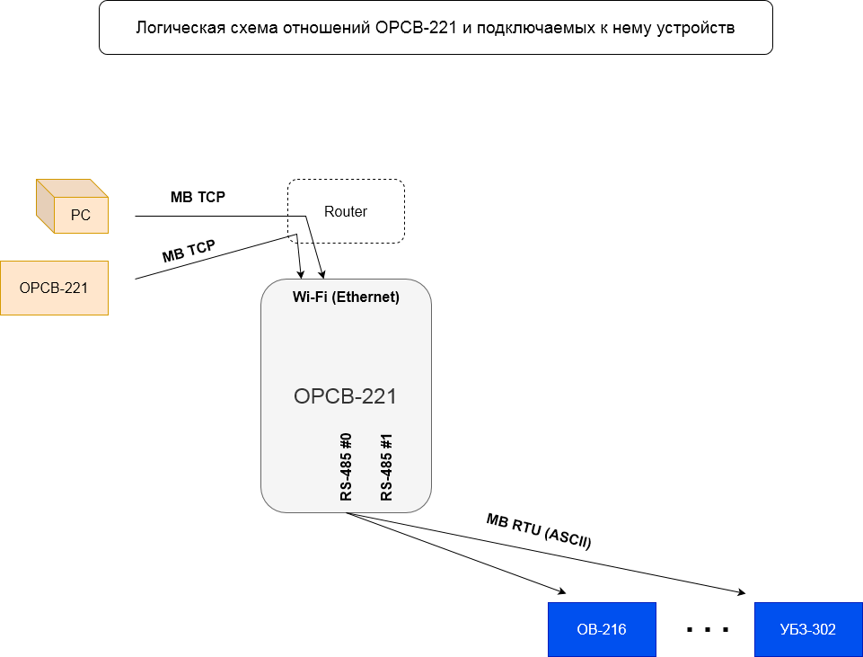
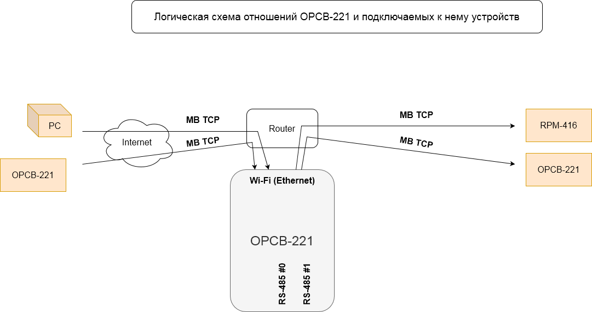
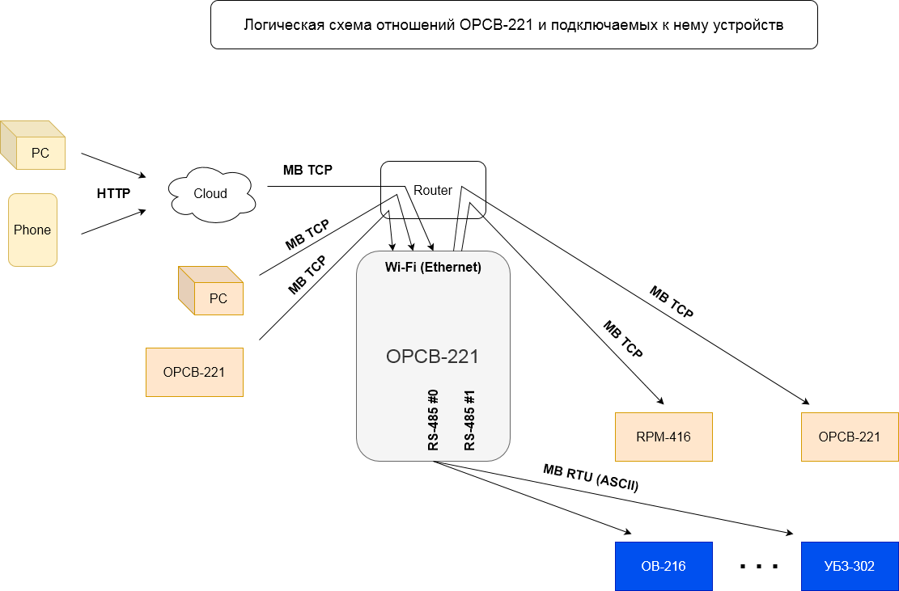
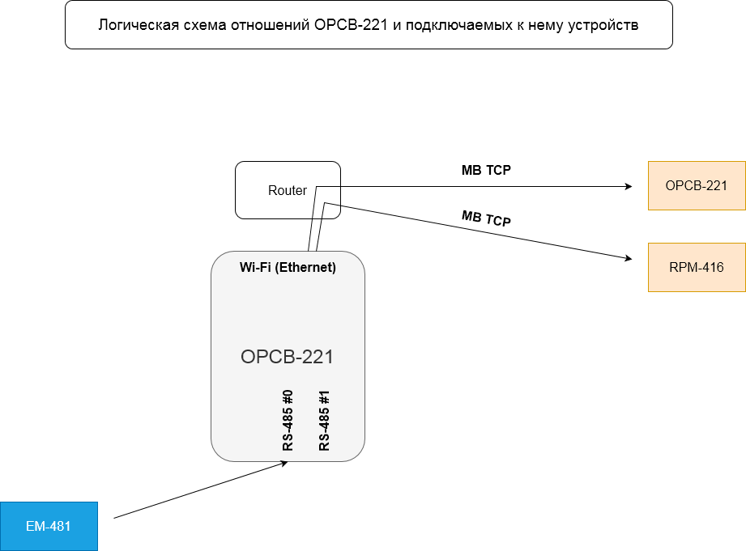
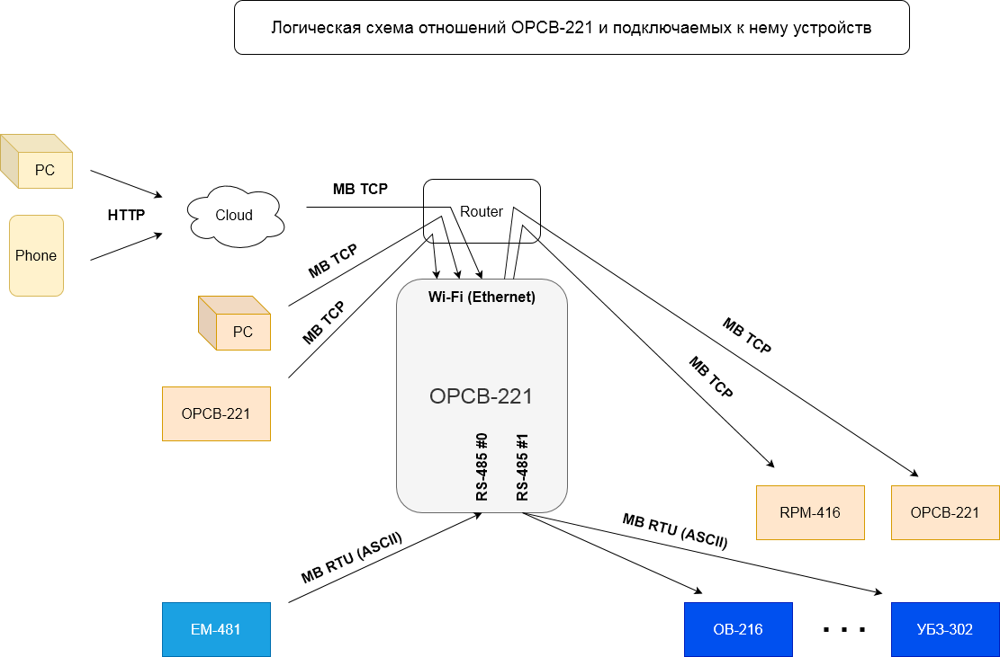

# OPCB-221 Applications

## 1. Modbus RTU/ASCII to Modbus TCP converter

- Local access.
- Remote access via internet.

This variant is usually specified with:

- 1...2 RS-485 ports enabled in Master mode;
- Modbus TCP server enabled;
- Modbus TCP clients turned off.

The RS-485 port or ports are configured for communication with the connected devices (speed and
byte format, i.e. parity and number of stop bits are specified). The gateway for RS-485 is
configured for the desired Modbus address ranges.

## 2. Converter for remote access to Modbus TCP via Internet

This option is usually specified with:

- OPCB-221 access to the Internet;
- 1...2 Modbus TCP clients enabled;
- Modbus TCP server enabled;
- disabled RS-485.

The Modbus TCP clients are configured to communicate with the desired remote servers or devices (IP
addresses are specified). The gateway for Modbus TCP clients is configured to the desired Modbus
address ranges.

## 3. Converter for remote access via a cloud server

The variant is most often a cloud variant of any of the other modes, or a combination of them.
However, when accessed exclusively through a cloud server, other ports for local control devices
(such as a Modbus TCP server) are most often disabled. The option is used under the following
conditions:

- The OPCB-221 has access to the Internet;
- reverse (device-to-server) connection to the cloud server is enabled.

To access OPCB-221 via the cloud server, you just need to provide access OPCB-221 to the Internet
and make sure that the address of the desired server is specified in the settings.

It is not recommended to disable the reverse (device-to-server) connection, even if remote user
access is not required at this time.

## 4. Modbus TCP to Modbus RTU/ASCII converter

- connection of Modbus TCP devices to a master that has an RS-485 interface
- extension, extension or synchronization of the RS-485 by means of converter(s) OPCB-221

This variant is usually specified with:

- 1...2 RS-485 ports enabled in Slave mode;
- 1...2 Modbus TCP clients enabled;
- Modbus TCP server turned off;
- disabled RS-485.

The RS-485 port or ports are configured for communication with the connected master device or
devices connected (the speed and byte format, i.e. parity and number of stop bit). Modbus TCP
clients are configured to communicate with the desired remote servers or devices (IP addresses are
specified). Gateway for Modbus TCP clients is configured to the desired Modbus address ranges.

## Combinations

The number of combined variants is quite large, basically they contain different parts of the
already listed variants.

For example:

- one RS-485 can be configured as either Master or Slave, but not both both at the same time.
  Accordingly, depending on this, either the slaves devices from variant 1, or control devices from
  variant 2 may or may not present or absent in either mode;
- the same applies to the second RS-485, which is independent of the first. Therefore, a
  combination of Master and Slave (a mixture of variants 1 and 4) is acceptable;
- Modbus TCP devices (from variants 2 and 4) can be present or not TCP devices (variants 2 and 4)
  can be present or absent in any of the modes, depending on the settings of the Modbus TCP;
- Modbus TCP control devices (of variants 1 and 2) may or may not be present in any mode, depending
  on the settings of the Modbus TCP Modbus TCP control devices (variants 1 and 2) may or may not be
  present in any of the modes depending on the local Modbus TCP Modbus TCP server settings;
- cloud server (from option 3) may or may not be present in any of modes, depending on the settings
  of the return connection.
