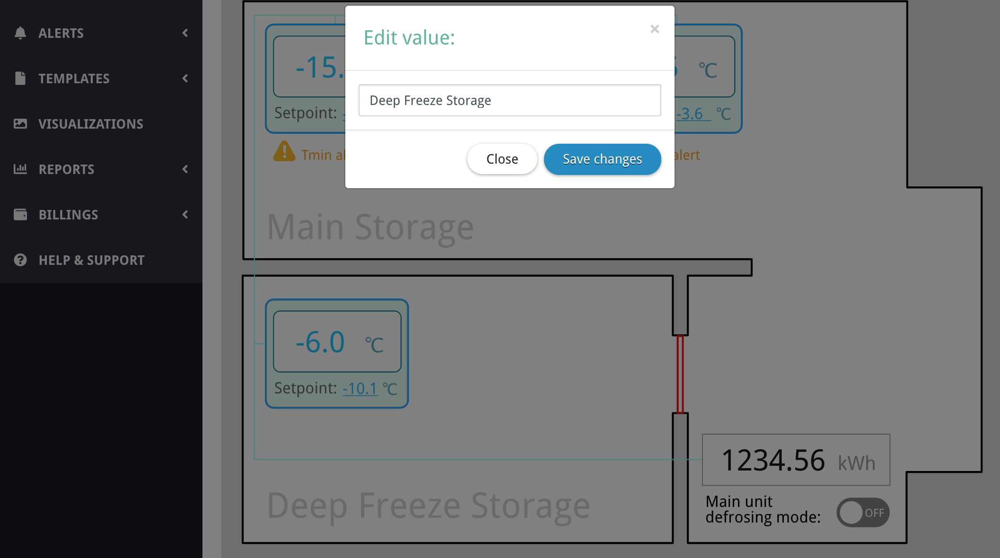

# Saving texts on the server

[< Return to the table of contents](../../README.md)

As an additional feature, let's add the ability to rename rooms. Maybe we want to give that visualization to a customer, who may want to change the names later. We could also name the fridges, for example, but naming rooms will be enough to illustrate the principle.

Devices don't have registers for room names, so, the only place where we can store that data is the Overvis database. To do that, first, let's add the following attribute to the root `svg` tag (that's the first line in our visualization source):

```xml
<svg use-vis-data="yes"...
```

It says that there is some information that should be loaded and stored in the Overvis database.

Now, let's change the room `text` tags as follows:

```xml
<text id="small-room-name" serif:id="small room name" x="45.195px" y="550.539px" style="font-family:'DroidSans', 'Droid Sans', sans-serif;font-size:36px;fill:rgb(211,211,211);" text-replacement="small-room-name" on-click="edit-visdata:small-room-name">Rental Storage Room</text>
<text id="main-room-name" serif:id="main room name" x="45.195px" y="266.539px" style="font-family:'DroidSans', 'Droid Sans', sans-serif;font-size:36px;fill:rgb(211,211,211);" text-replacement="main-room-name" on-click="edit-visdata:main-room-name">Main Storage</text>
```

We added the `text-replacement` attribute in both tags. The content of the attribute is just some key, where the string representing the room name will be stored. By default, this string will be the content of the tag itself (e.g `Rental Storage Room`). Overvis will load this string when the visualization will be shown and replace the tag content with it.

`on-click="edit-visdata:..."` tells Overvis to open a form that will allow editing this stored string when a user clicks on the element.



Next: [Conclusion of the example](../07-conclusion/README.md)
