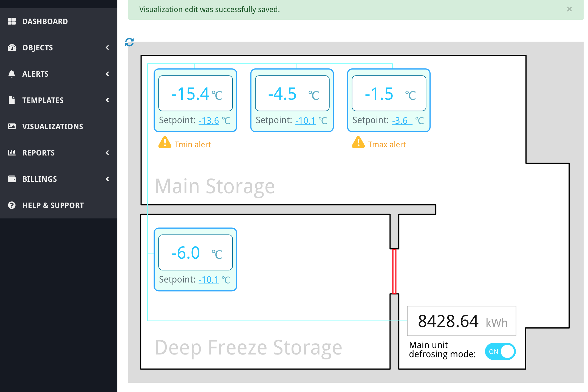

# Conclusion of the example

[< Return to the table of contents](../../README.md)

As a finishing touch, we will add `param-value` data-bind to the energy meter counter:

```xml
<text id="value" x="508.542px" y="502.132px" style="font-family:'DroidSans', 'Droid Sans', sans-serif;font-size:30px;fill:rgb(23,23,23);" param-value="11-22-33-44-55-66>10>1000">-</text>
```

This shouldn't require additional explanation, only one note: there is no `:r` after the register's
address. That's because we don't want that value read from the meter itself. It's enough for us to
take the last read value from the database (which is updated every 5 min). This will make
visualization slightly faster and decrease the network connection channel load a bit.

Let's update the visualization source code in Overvis and look at the result:



You can check the finished visualization code here:
[svg-vis-tutorial-final.svg](svg-vis-tutorial-final.svg)

This example has demonstrated the basic features of Overvis visualizations that are commonly used
among hundreds of dashboards that we created. With this knowledge, you can create any simple
equipment state representation for yourself or your customers.
[The next examples](../../../03-html-example/README.md) will introduce you to the more advanced
tricks. Or you can check the [reference document](/Overvis/References/Visualizations.md) and start
creating your own dashboards.
