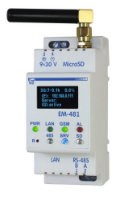

# Novatek-Electro EM-48X Programing

[Novatek-Electro](https://www.novatek-electro.com/) EM-48X controllers are often used in conjunction with [Overvis](https://www.overvis.com/) to set up industrial automation with remote control.

Following EM-48X controllers support simple programming logic language to automate some tasks that require PLC to do otherwise:
* [EM-481](https://www.overvis.com/equipment/em-481/)
* EM-483 (upcoming)
* EM-484 (upcoming)
* [EM-486](https://www.overvis.com/equipment/em-486/)

This language and its usage is described in details in the device's manuals (e.g. see [EM-481 manual](https://novatek-electro.com/docs/en/doc_em-481_en.pdf), appendix C).

This documentation contains several examples that provide you with the start point to write your own automation. We will update this list to include more examples.

* [Simple timer-based relay control using EM-486](./examples/simple-timer.md)
* [Simple temperature control based on EM-486](./examples/simple-temperature-control.md)
* [Astronomical timer or light sensor relay control for street lightning based on EM-481 + OB-215](./examples/astronomical-timer.md)

Please contact support@overvis.com if you have any questions and don't hesitate to create pull requests with more examples or fixes.
