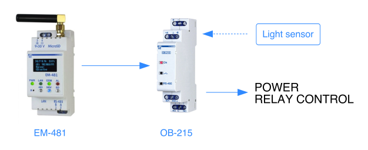

# Astronomical timer or light sensor relay control for street lightning based on EM-481 + OB-215



This example [EM-481](https://www.overvis.com/equipment/em-481/) program turns on/off the [OB-215](https://www.overvis.com/equipment/ob-215/) relay based on sunset/sunrise or light sensor connected to OB-215. 

It also includes additional energy saving interval (during night) when the relay should be switched off.


## Usage

The program is controlled through Overvis using registers on EM-481 device.

**Logic mode setting:**

Address | Description
--------|------------
5256    | Logic mode switch (1 = astronomical timer, 2 = sensor-based).

**Astronomical timer mode settings:**

Address | Description
--------|------------
5250    | Shift in seconds **before** sunrise (to switch relay OFF).
5251    | Shift in seconds **after** sunset (to switch relay ON).
5252    | Time of day in seconds to force-switch relay OFF to enter energy saving period.
5254    | Time of day in seconds to force-switch relay ON to exit energy saving period.

**Sensor-based mode settings:**

Address | Description
--------|------------
5257    | Sensor threshold: below this threshold relay will be switched OFF, above or  equal to threshold - ON.

## Code

```bash
!META
* PROTOCOLVERSION 5
# By default - updating once per minute

# This program assumes that OB-215 is connected on MODBUS ID 2 (see params 9 and 10, and section !ACTS).


# In this section we assign numbers to device's parameters (registers).
# The assigned number is the first column.
# "*" in second column means that we assign controller's addresses (EM-481's).
!PARAMS
# Time of day, s (integrated EM-481 register)
0 * INT32 H 230
# Time of sunrise, s (integrated EM-481 register)
1 * INT32 H 232
# Sunset time, s (integrated EM-481 register)
2 * INT32 H 234
# Shift for sunrise in seconds. Shift is substracted from sunrise time.
# In Overvis, this parameter can be changed through address 5250.
3 * INT16 H 5500
# Shift for sunset in seconds. Shift is added to sunset time.
# In Overvis, this parameter can be changed through address 5251.
4 * INT16 H 5501

# ?
# Additional energy saving mode: time in seconds after midnight to turn relay off.
# E.g. to turn off at 01:00, set this to 3600.
#      to turn off at 23:00, set this to 3600*23 = 82800.
# In Overvis, this parameter can be changed through address 5252.
5 * INT32 H 5502
# Additional energy saving mode: time in seconds after midnight to turn relay on.
# E.g. to turn on at 05:00, set this to 3600*5 = 18000.
# In Overvis, this parameter can be changed through address 5254.
6 * INT32 H 5504

# Logic mode: 1 - astronomical timer, 2 - based on light level sensor.
# In Overvis, this parameter can be changed through address 5256.
7 * INT16 H 5506
# Light level to turn relay off. Used if logic mode = 2 (param 7).
# In Overvis, this parameter can be changed through address 5257.
8 * INT16 H 5507

# OB-215 - current light level (from sensor).
# Assuming OB-215 has MODBUS ID 2 and has light sensor connected.
# Used only if logic mode = 2 (param 7)
9 2 INT16 H 6

# OB-215 - relay control register
10 2 INT16 H 50


!VARS
# V0 - Time of day, s (integrated EM-481 register)
0 PARAMVAL P0
# V1 - Time of sunrise, s (integrated EM-481 register)
1 PARAMVAL P1
# V2 - Sunset time, s (integrated EM-481 register)
2 PARAMVAL P2
# V3 - Shift for sunrise in seconds
3 PARAMVAL P3
# V4 - Shift for sunset in seconds
4 PARAMVAL P4
# V5 - Shifted sunrise time: V1 - V3
5 VARSUBVAR V1 V3
# V6 - Shifted sunset time: V2 + V4
6 VARADDVAR V2 V4
# V7 - Additional energy saving mode: time in seconds after midnight to turn relay off.
7 PARAMVAL P5
# V8 - Additional energy saving mode: time in seconds after midnight to turn relay on.
8 PARAMVAL P6
# V9 - Logic mode: 1 - astronomical timer, 2 - based on light level sensor.
9 PARAMVAL P7
# V10 - Light level to turn relay off.
10 PARAMVAL P8
# V11 - Current light level (from sensor).
11 PARAMVAL P9
# V12 - Error value constant for the light sensor.
# If this value is received from sensor, we ignore the sensor value.
12 VAL 32767


!CONDS

# C0: V0 >= V5 (Current time is greater than shifted sunrise time)
0 VARGEVAR V0 V5
# C1: V0 <= V6 (Current time is less than shifted sunset time)
1 VARLEVAR V0 V6
# C2: C0 && C1 (We are currently in between sunrise and sunset, i.e. it's daytime)
2 AND C0 C1
# C3: !C2 (We are not currently in between sunrise and sunset, i.e it's nighttime)
3 NOT C2

### Additional energy saving period:

# C4: V8 > V7
# Time to turn on the relay for additional saving is
#      after the time to turn the relay off, e.g. OFF at 01:00 and ON at 06:00.
# Inverse of this condition is processed in C11.
4 VARGRVAR V8 V7
# C5: V0 >= V7
# Current time is greater than turn off time for additional energy saving.
5 VARGEVAR V0 V7
# C6: V0 <= V8
# Current time is less than turn on time for additional energy saving.
6 VARLEVAR V0 V8
# C7: C5 && C6 = (V0 >= V7) && (V0 <= V8)
# We are in additional energy saving period (we have to turn relay off during that period).
7 AND C5 C6
# C8: C4 && C7 = (V8 > V7) && (V0 >= V7) && (V0 <= V8)
# We are in additional energy saving period, and this period is in the same day
# (i.e. starts after midnight and ends after midnight).
# The relay should be switched off in that case.
8 AND C4 C7
# C9: C2 || C8 = ((V0 >= V5) && (V0 <= V6)) || ((V8 > V7) && (V0 >= V7) && (V0 <= V8))
# Either currently is daytime or we are in energy saving mode. 
# In any case we have to turn relay off.
9 OR C2 C8
# С10: !C9 (Relay should be on)
10 NOT C9

# C11: !C4
# Time to turn on the relay for additional saving is
#      before the time to turn the relay off, e.g. OFF at 22:00 and ON at 06:00.
# If this is the case, we have to invert additional energy saving logic.
11 NOT C4
# C12: C5 || C6 = (V0 >= V7) || (V0 <= V8)
# We are in inverted additional energy saving period (we have to turn relay off during that period).
12 OR C5 C6
# C13: C11 & C12 = (V8 <= V7) && ((V0 >= V7) || (V0 <= V8))
# We are in additional energy saving period, and this period spans during two days
# (i.e. starts before midnight and ends after midnight).
# The relay should be switched off in that case.
13 AND C11 C12
# C14: C2 || C13 = ((V0 >= V5) && (V0 <= V6)) || ((V8 <= V7) && ((V0 >= V7) || (V0 <= V8)))
# Either currently is daytime or we are in energy saving mode. 
# In any case we have to turn relay off.
14 OR C2 C13
# С15: !C10 (Relay should be on)
15 NOT C14

### Logic mode (astronomical or sensor)

# C16: V9 == 1 (we are in astronomical timer mode)
16 VAREQVAL V9 1
# C17: V9 == 2 (we are in light sensor mode)
17 VAREQVAL V9 2

### Astronomical timer mode:

# C18: C16 && C9
# We are in astronomical timer mode and relay should be off.
18 AND C16 C9
# C19: C16 && C10
# We are in astronomical timer mode and relay should be on.
19 AND C16 C10
# C20: C16 && C14
# We are in astronomical timer mode and relay should be off.
20 AND C16 C14
# C21: C16 && C15
# We are in astronomical timer mode and relay should be on.
21 AND C16 C15

### Light sensor mode:

# C22: V11 < V10 (Current light level is less than threshold).
22 VARLSVAR V11 V10
# C23: C17 && C22 = V9 == 2 && V11 < V10
# We are in light sensor mode and current light level is less than threshold.
23 AND C17 C22
# C24: V11 >= V10 (Current light level is greater than than threshold).
24 NOT C22
# C25: C17 && C24 = V9 == 2 && V11 >= V10
# We are in light sensor mode and current light level is greater than threshold.
25 AND C17 C24
# C26: V11 == V12 (Current sensor reading is ERROR).
26 VAREQVAR V11 V12
# C27: C17 && C26 (We are in light sensor mode and current sensor reading is ERROR).
27 AND C17 C26
# C28: C23 || C27
# We are in light sensor mode and 
#    current light level is less than threshold or reading is ERROR.
28 OR C23 C27
# C29: V11 != V12 (Current sensor reading is not ERROR).
29 NOT C26
# C30: C25 && C29
# We are in light sensor mode and current light level is greater than threshold 
#     and current sensor reading is not ERROR.
30 AND C25 C29

### Incorrect mode:

# C31: !C16 (we are not in astronomical timer mode)
31 NOT C16
# C32: !C17 (we are not in light sensor mode)
32 NOT C17
# C33: !C16 && !C17 (we are in incorrect mode: parameter P7 has not 1 or 2 value).
33 AND C31 C32


!ACTS
# Turn relay ON
0 PARAMWRVAL P10 14262
# Turn relay OFF
1 PARAMWRVAL P10 14263


!REACTS
# Turn relay OFF if we are in astronomical timer mode and relay should be off.
* C18 ACT A1
# Turn relay ON if we are in astronomical timer mode and relay should be on.
* C19 ACT A0
# Turn relay OFF if we are in astronomical timer mode and relay should be off.
* C20 ACT A1
# Turn relay ON if we are in astronomical timer mode and relay should be on.
* C21 ACT A0

# Turn relay ON if we are in light sensor mode and 
#    current light level is less than threshold or reading is ERROR.
* C28 ACT A0
# Turn relay OFF if we are in light sensor mode and 
#    current light level is greater than threshold and reading is not ERROR.
* C30 ACT A1

# Turn relay OFF if we are in incorrect mode.
* C33 ACT A1

# END.
```

This program can be easily modified to work on EM-486 without OB-215. In that case, actions (section `!ACTS`) and `P10` should be changed to control EM-486 relay and param `P9` should be changed to read EM-486's sensor input.
