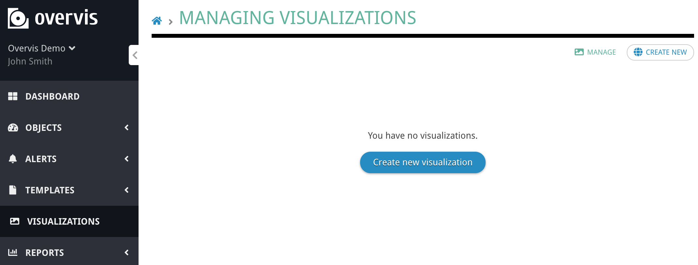
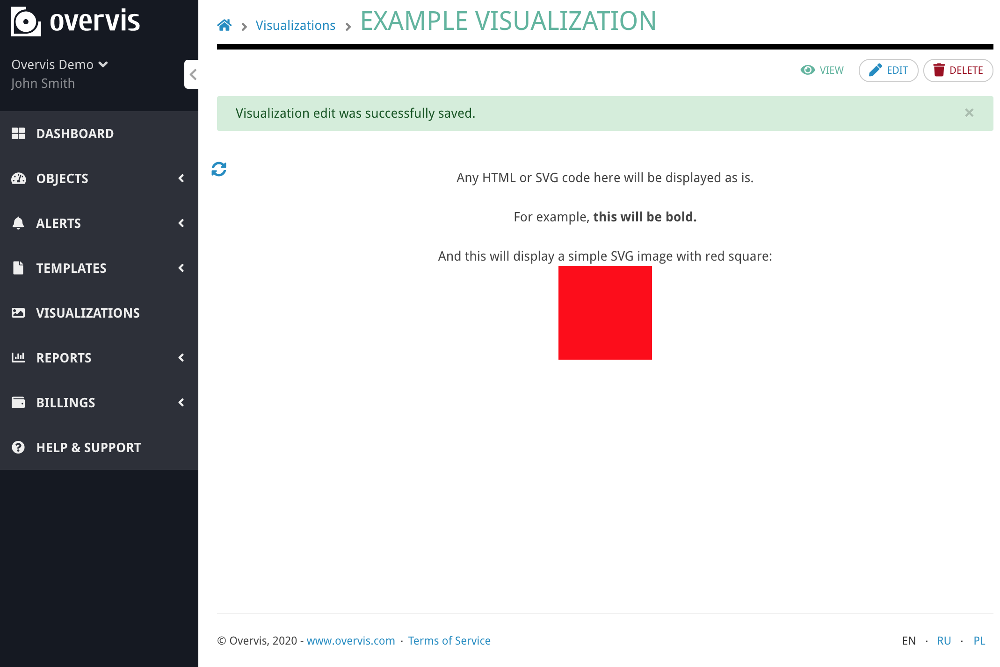
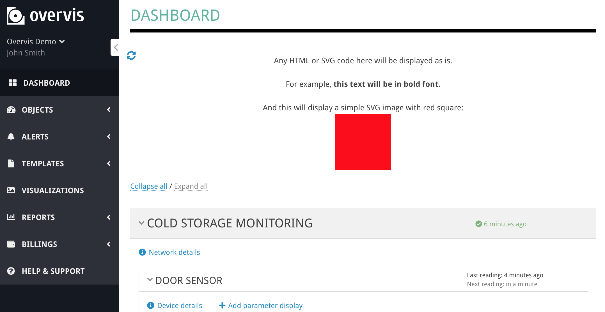

# Introduction to Overvis visualizations

[< Return to the table of contents](../README.md)

First, let's open the visualizations page in the Overvis menu. You will see the list of all visualizations created for your organization. This list is probably empty for you now.



Clicking the "Create new" button you will see the following form:


In the "Source (SVG)" text-box, you can enter any HTML/SVG/JavaScript code. It will be inserted on the page chosen in the "Display on" drop-down. That's the basics of the Overvis visualizations.

Let's try a simple example. We will insert the following code as a source:

```html
Any HTML or SVG code here will be displayed as is.<br><br>

For example, <b>this text will be in bold font.</b><br><br>

And this will display a simple SVG image with red square:<br>

<svg width="100px" height="100px" viewBox="0 0 100 100">
<rect fill="#FF0000" height="100" width="100" x="0" y="0"/>
</svg>
```


After clicking "Create visualization" the result is:



We can even place it on the main Overvis dashboard:



This visualization is static and doesn't have any useful data displayed.

You can add some values dynamically with the use of Overvis API and custom JavaScript code. Most complex visualizations we create do exactly that. But, thankfully, you don't have to do this for the majority of the cases. Overvis supports custom HTML/SVG attributes to display data values or modify other attributes. Those are called "data bindings."

In the next section of the tutorial, we will create a more complex graphic. It will contain some data bindings that will display the actual state of the equipment.

Next: [Basic SVG visualization example](../02-basic-example/README.md)
