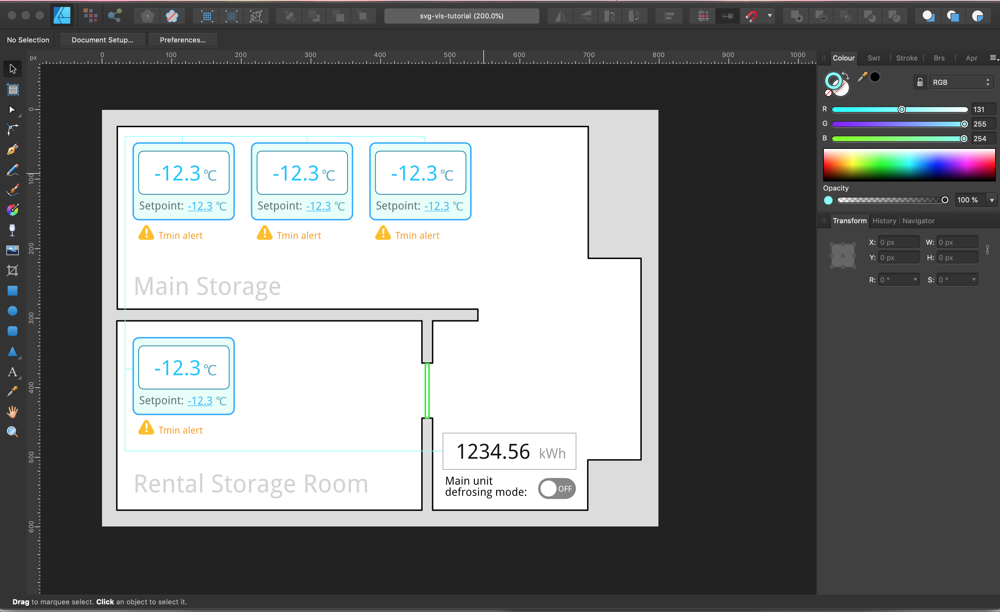
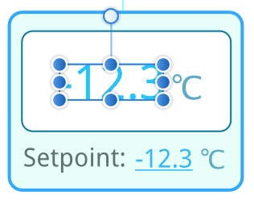

# Making a visualization graphics

[< Return to the table of contents](../README.md)

For this example we want to create a visualization of some storage with freezers. It should include:
* the rough room plan,
* real-time values of the fridge temperatures,
* the ability to change the setpoints,
* alarm indicators.

Let's start by drawing the image in the vector graphics editor. We used Affinity Designer here, but any other editor (that can export as SVG) will do.

Just for the sake of example, we added an energy meter display, switch for the defrosting mode and a door (we want to see if it's open or closed).

A few points to note while drawing a visualization picture in the editor:

* We inserted some placeholder values for temperatures, setpoints and energy. Those values will be replaced with data bindings later.
* Inside the placeholders we tried to place the most representative values. For example, we expect temperatures to be negative, have at most two digits and one decimal of precision, so we used "-12.3" here. That should help us position the values correctly during the design, otherwise we will have to change SVG source manually later to correct the placement.
* All the dynamic parts are created as separate texts. For example "-12.3" and "°C" are separate texts. That way we will only bind the data to the "-12.3" text, and units will remain static:

    

* Obviously, all dynamic texts should not be converted to curves. Static texts may be converted but that will make the resulting SVG code a bit larger.
* The only fonts that can be used here are [web-safe fonts](https://en.wikipedia.org/wiki/Core_fonts_for_the_Web) that are provided with most browsers (Arial, Times New Roman, Courier, etc.). One exception is the ["Droid Sans" font](https://github.com/aosp-mirror/platform_frameworks_base/tree/master/data/fonts), as this font is used in Overvis it is provided to all visualizations too. You can add your own fonts with inline CSS but that's out of scope of this tutorial.
* Everything is drawn and positioned before we export.
    * That includes the alarm indicators. We will be hiding and showing them dynamically.
    * Same for the door.
    * We also drew the "on/off" switch in both positions. We will just display one or another depending on the device data.
* In the next steps we will have to find correct SVG tags to bind data to. To make that process easier, during the design we named all the layers that we will need to find later. That includes all dynamic parts.

    

Next: [Exporting graphics as SVG file](../02-export/README.md)