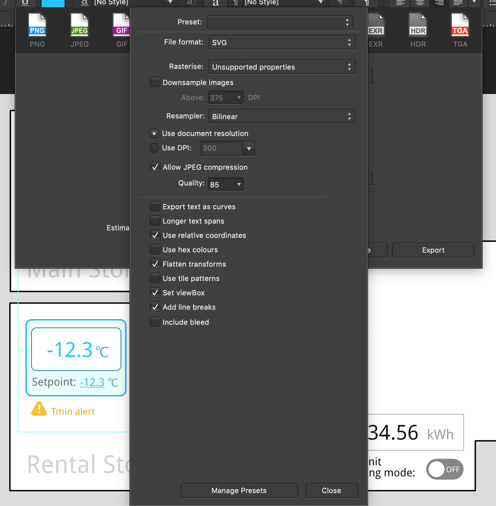
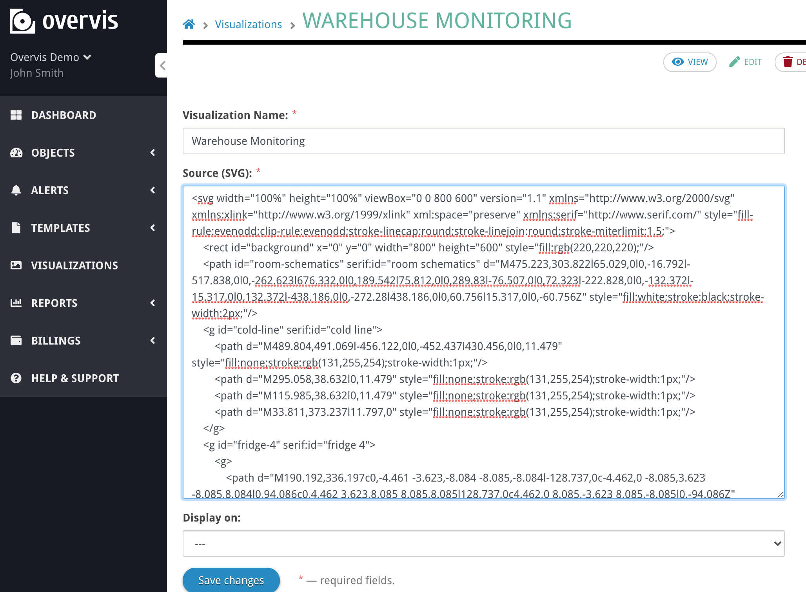
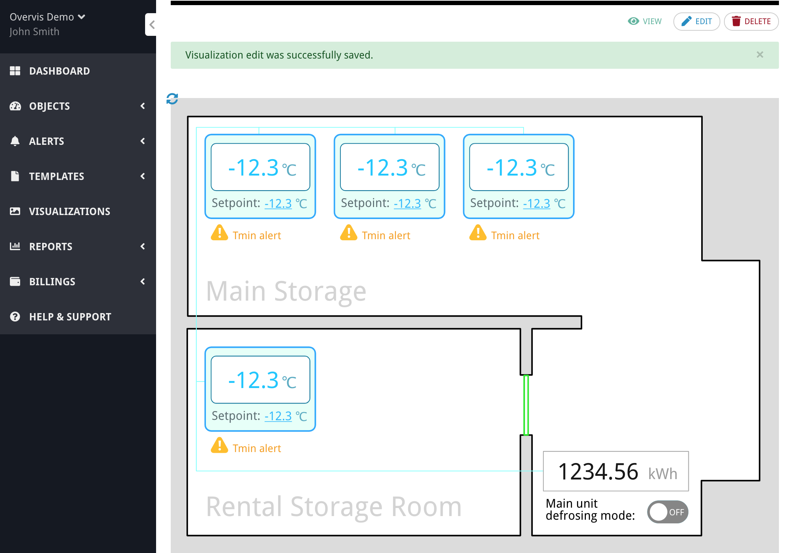

# Exporting graphics as SVG file

[< Return to the table of contents](../README.md)

After the design is finished, we export the picture in SVG format. A few notes:
* You will need to edit the resulting SVG code to add data bindings. Export with the most accessible preset (i.e., without compression or obfuscation, preserve layer names, etc.)
* Don't export texts as curves.

Here is how we export our example graphic from Affinity Designer:


You can see the resulting exported example SVG file here: [svg-vis-tutorial-after-export.svg](svg-vis-tutorial-after-export.svg)

The next step is to upload the file to Overvis and check if the graphics embedded on the page looks correct.

One thing to note here. Our exported SVG file contains the following header:

```html
<?xml version="1.0" encoding="UTF-8" standalone="no"?>
<!DOCTYPE svg PUBLIC "-//W3C//DTD SVG 1.1//EN" "http://www.w3.org/Graphics/SVG/1.1/DTD/svg11.dtd">
<svg width="100%" height="100%" viewBox="0 0 800 600" version="1.1" xmlns="http://www.w3.org/2000/svg" xmlns:xlink="http://www.w3.org/1999/xlink" xml:space="preserve" xmlns:serif="http://www.serif.com/" style="fill-rule:evenodd;clip-rule:evenodd;stroke-linecap:round;stroke-linejoin:round;stroke-miterlimit:1.5;">
...
```

Because this code will be embeded into Overvis' page HTML, we have to strip `<?xml...` and `<!DOCTYPE...` tags at the beginning.

The resulting source code looks like this:



Let's save the visualization and look at the result:



Everything appears the same as in the editor. The next step is to bind the data and add the interaction.

Next: [Binding the data to the graphics](../03-bind-data/README.md)
