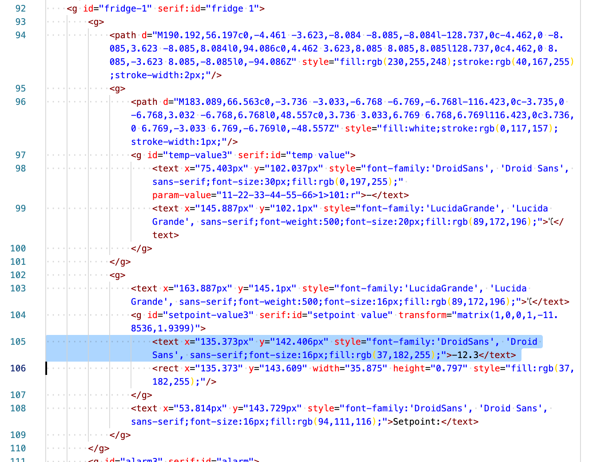

# Giving the ability to edit a device parameter value

[< Return to the table of contents](../../README.md)

First, let's find the setpoint value for the first fridge in the SVG code:



We want to be able to change it from the visualization. To give that ability, we modify the `text` tag as follows:

```xml
<text x="135.373px" y="142.406px" style="font-family:'DroidSans', 'Droid Sans', sans-serif;font-size:16px;fill:rgb(37,182,255);cursor:pointer;" param-value="11-22-33-44-55-66>1>201:r" on-click="edit-param:11-22-33-44-55-66>1>201">-</text>
```

Again, we removed the placeholder value and replaced it with dash.

The `param-value="11-22-33-44-55-66>1>201:r"` attribute works the same as previously, it just displays the current value that was read directly from the device.

More importantly, we have added a new attribute: `on-click="edit-param:11-22-33-44-55-66>1>201"`. It says: if user clicks on this element, open edit window, that should request new value for the parameter with the address **201 (holding)** of the device with the address **1** in the network with MAC address **11-22-33-44-55-66**. When user enters the new value and saves it, Overvis will send that value to the device parameter and update the visualization afterwards.

Now clicking on the setpont value opens the "Edit value" window:


`on-click` attribute can do several other things, like sending user to another visualization, increment the paramers by one, toggle the parameter between two values, and some other. We will use some of this features later in the tutorial. For a full list, please see the reference section.

As a final change we have also added `cursor:pointer;` into the content of the `style` attribute. It just changes the mouse cursor to the "finger" pointer when user hovers over the setpoint value.

Next: [Showing/hiding elements depending on the parameter value](../03-show-hide/README.md)