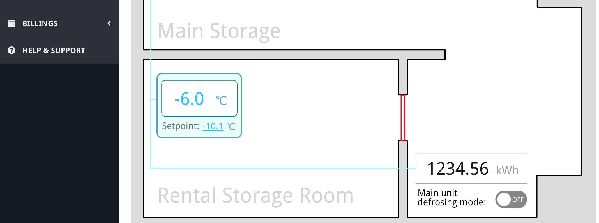

# Changing the color of an element depending on the parameter value

[< Return to the table of contents](../../README.md)

Let's use the same trick with our door. We want to display it in the red color if it is opened.

Here is the new code for the door `rect` element:

```xml
<rect id="door" x="464.852" y="365.301" width="5.254" height="78.242" style="fill:none;stroke:grey;stroke-width:2px;" on-param-value="11-22-33-44-55-66>11>500.2:=0:stroke:red:green:r" />
```

We have our door sensor in the device with address **11** as a **bit 2** of the register **500**. So the `on-param-value`'s parameter reference is `11-22-33-44-55-66>11>500.2`.

We change the `stroke` style property. If the door is closed, we get value 1 and show the door in green color. Zero value means the door is open and we draw it with the red stroke color.

Currently, the door is open:



By the way, `on-param-value` attribute can not only change the styles of the elements but also the values of other attributes. Syntax is the same.

Next: [Adding a toggle control](../05-toggle/README.md)