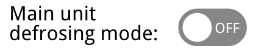
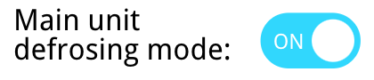

# Adding a toggle control

[< Return to the table of contents](../../README.md)

To make a toggle control we will use `on-param-value` combined with `on-click`. We have designed an positioned two variants of the control: on and off. We will display one of them depending on the current parameter value. Clicking on any of the variants will flip the parameter value.

Here is the resulting code:

```xml
<g style="cursor:pointer;" on-click="toggle-param:11-22-33-44-55-66>20>105:0:1:g">
    <g id="button-on" serif:id="button on" on-param-value="11-22-33-44-55-66>20>105:=1:display:block:none:r" style="display:none;">
        <path d="M680.921,544.957c0,-8.316 -6.751,-15.067 -15.066,-15.067l-24.005,0c-8.315,0 -15.066,6.751 -15.066,15.067c0,8.315 6.751,15.066 15.066,15.066l24.005,0c8.315,0 15.066,-6.751 15.066,-15.066Z" style="fill:rgb(29,214,255);"/>
        <circle cx="666.032" cy="544.957" r="11.536" style="fill:white;"/>
        <text x="633.575px" y="549.415px" style="font-family:'DroidSans', 'Droid Sans', sans-serif;font-size:11.449px;fill:white;">ON</text>
    </g>
    <g id="button-off" serif:id="button off" on-param-value="11-22-33-44-55-66>20>105:=0:display:block:none:r" style="display:none;">
        <path d="M680.921,544.957c0,-8.316 -6.751,-15.067 -15.066,-15.067l-24.005,0c-8.315,0 -15.066,6.751 -15.066,15.067c0,8.315 6.751,15.066 15.066,15.066l24.005,0c8.315,0 15.066,-6.751 15.066,-15.066Z" style="fill:rgb(134,134,134);"/>
        <circle cx="641.703" cy="544.957" r="11.536" style="fill:white;"/>
        <text x="655.519px" y="549.415px" style="font-family:'DroidSans', 'Droid Sans', sans-serif;font-size:11.449px;fill:white;">OFF</text>
    </g>
</g>
```

Both `g` elements that represent button variants now have `on-param-value` attribute. It differs only in condition. On state has `=1` condition, off state has `=0`.

The group that contains both variants now has `on-click="toggle-param:11-22-33-44-55-66>20>105:0:1:g"`. It says that when this element (in any state) is clicked, the parameter **105** of the device **20** has to be changed to **0** if it is not already zero, otherwise to **1**. `:g` at the end means that all data in the visualization should be updated after that, because we want to see not only the change of the toggle, but also changes in other parts.

Also we added the `style="cursor:pointer;"` to change the mouse cursor on hover.

Result:

 

Next: [Saving texts on the server](../06-store-text/README.md)