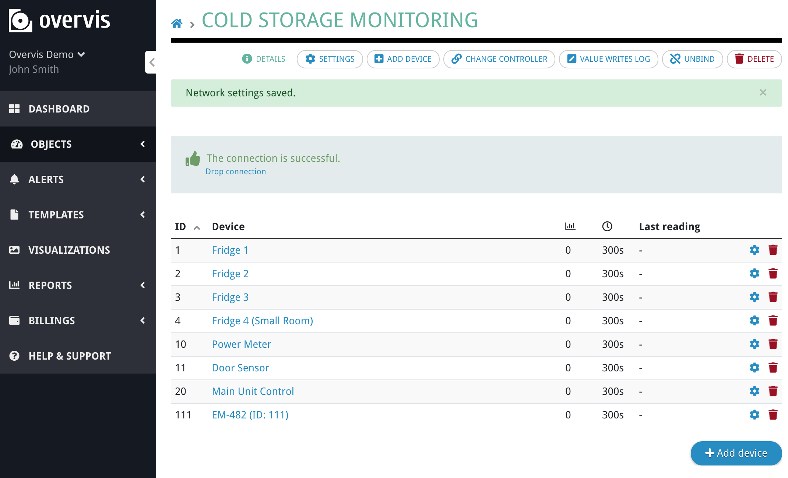
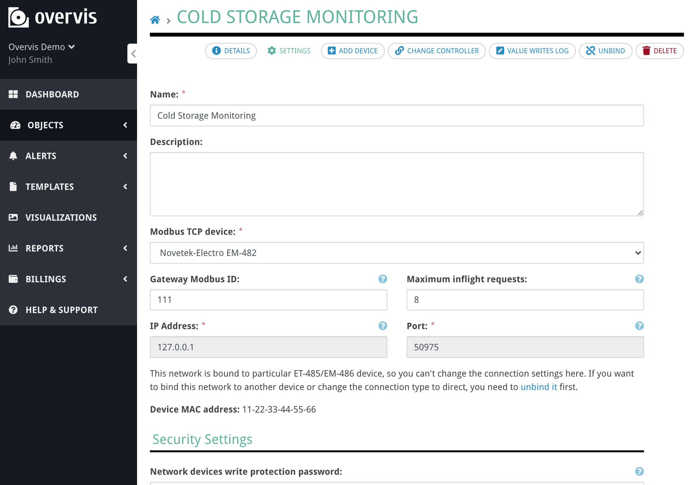

# Binding the data to the graphics

[< Return to the table of contents](../README.md)

For the rest of this example, we assume that we have the following network of devices connected to Overvis:

In the network settings, we can see the network controller MAC address. We will need it later:

In our case the MAC is `11-22-33-44-55-66`.

Next, we will edit the source code of the SVG file to add data bindings.

Next: [Displaying parameter values as a text](01-param-value/README.md)
