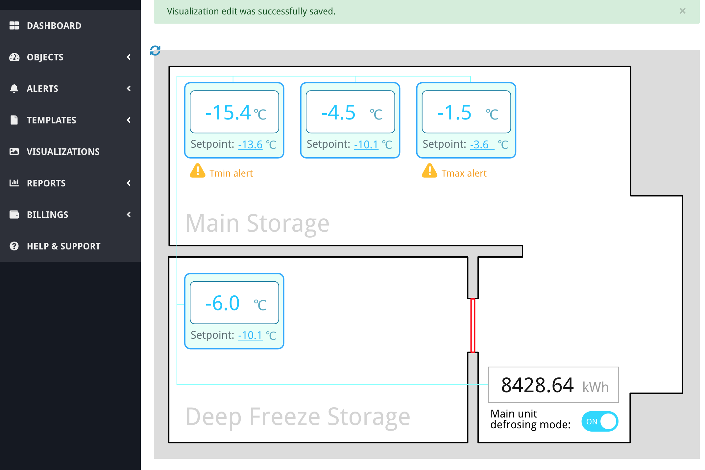

# Basic SVG visualization example

[< Return to the table of contents](../README.md)

In this tutorial we will create a simple SVG visualization that will show a refrigeration equipment in a cold storage room and have several interactive elements.

Table of contents:

* [Making a visualization graphics](01-design/README.md)
* [Exporting graphics as SVG file](02-export/README.md)
* [Binding the data to the graphics](03-bind-data/README.md)
    * [Displaying parameter values as a text](03-bind-data/01-param-value/README.md)
    * [Giving the ability to edit a device parameter value](03-bind-data/02-edit-value/README.md)
    * [Showing/hiding elements depending on the parameter value](03-bind-data/03-show-hide/README.md)
    * [Changing the color of an element depending on the parameter value](03-bind-data/04-change-color/README.md)
    * [Adding a toggle control](03-bind-data/05-toggle/README.md)
    * [Saving texts on the server](03-bind-data/06-store-text/README.md)
    * [Conclusion of the example](03-bind-data/07-conclusion/README.md)
