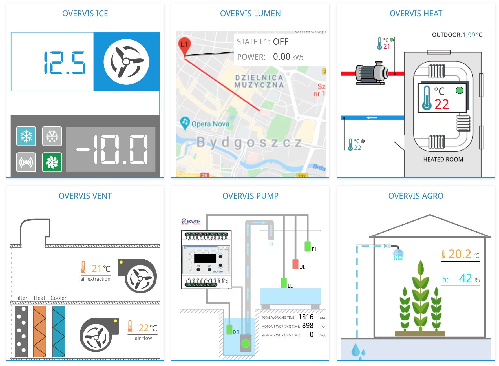

# Overvis Visualizations

_Overvis is a monitoring and control system for the industrial MODBUS-based equipment. You can find more information and create a free account on our site: https://www.overvis.com/_

Overvis connects to the devices, sends and receives the data, processes the alarms, and does many other things out of the box. But in the end, you want to see a visual dashboard that represents the current state of your equipment and some remote control buttons. Such dashboards in Overvis are called "visualizations".

Overvis visualization feature is low-level enough and flexible enough to create a wide range of dashboards using different engineering approaches.

This set of documentation and tutorials will help you to start developing Overvis visualizations. We will guide you through several examples. Using this information, you will be able to make graphics with the bound data and expand further to create monitoring dashboards of any complexity.

To be able to create Overvis visualizations using our tutorials, you will need the following:
* You should already know how to connect your equipment to Overvis.
* You will need some vector graphics editor that can export images as SVG. We will be using [Affinity Designer,](https://affinity.serif.com/en-us/designer/) but you can use any other free or paid editor: Inkscape, Adobe Illustrator, Sketch, etc. There is also [svg-edit](https://svgedit.netlify.app/editor/index.html), the online editor that should fit any basic needs.
* You will also need a text editor that can work with SVG (XML) text (Notepad+, VisualStudio Code, Atom, Sublime Text, or any other).
* We also assume that you know what SVG is. You can look at [SVG tutorial](https://developer.mozilla.org/en-US/docs/Web/SVG/Tutorial) but you won't need any deep knowledge of this topic to create simple visualizations in Overvis.

Table of contents:

* [Introduction to Overvis visualizations](01-introduction/README.md)
* [Basic SVG visualization example](02-basic-example/README.md)
    * [Making a visualization graphics](02-basic-example/01-design/README.md)
    * [Exporting graphics as SVG file](02-basic-example/02-export/README.md)
    * [Binding the data to the graphics](02-basic-example/03-bind-data/README.md)
        * [Displaying parameter values as a text](02-basic-example/03-bind-data/01-param-value/README.md)
        * [Giving the ability to edit a device parameter value](02-basic-example/03-bind-data/02-edit-value/README.md)
        * [Showing/hiding elements depending on the parameter value](02-basic-example/03-bind-data/03-show-hide/README.md)
        * [Changing the color of an element depending on the parameter value](02-basic-example/03-bind-data/04-change-color/README.md)
        * [Adding a toggle control](02-basic-example/03-bind-data/05-toggle/README.md)
        * [Saving texts on the server](02-basic-example/03-bind-data/06-store-text/README.md)
        * [Conclusion of the example](02-basic-example/03-bind-data/07-conclusion/README.md)
* [HTML visualizations](03-html-example/README.md)
* [Using JavaScript with Overvis API in visualizations](04-js-example/README.md)
* [Integrating Google Maps](05-google-maps/README.md)
* [More examples](06-more-examples/README.md)
* [Common questions](07-common-questions/README.md)
* [Contact us if you need any help](08-contact-us/README.md)
* [Reference](09-reference/README.md)
