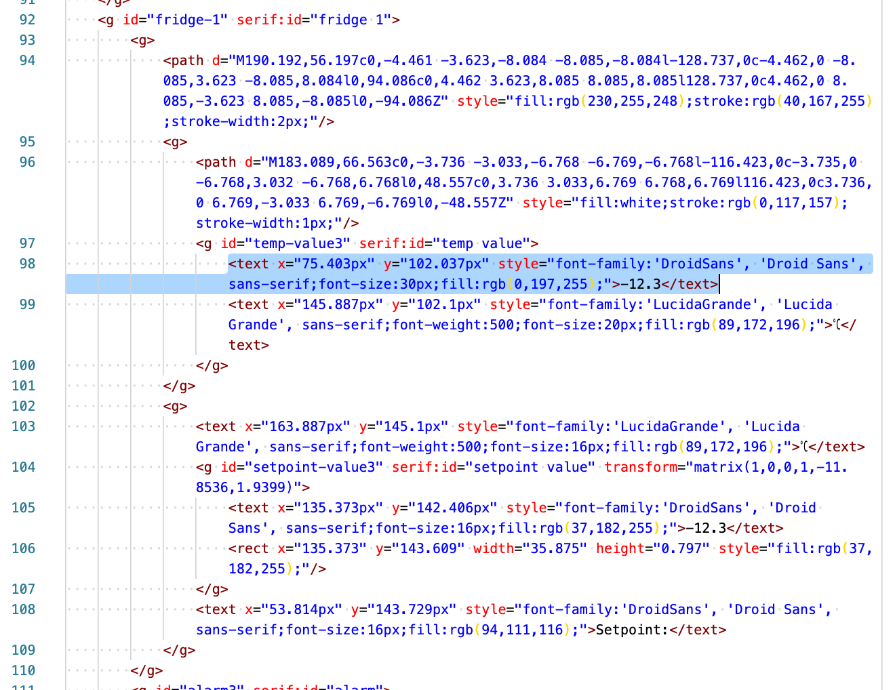
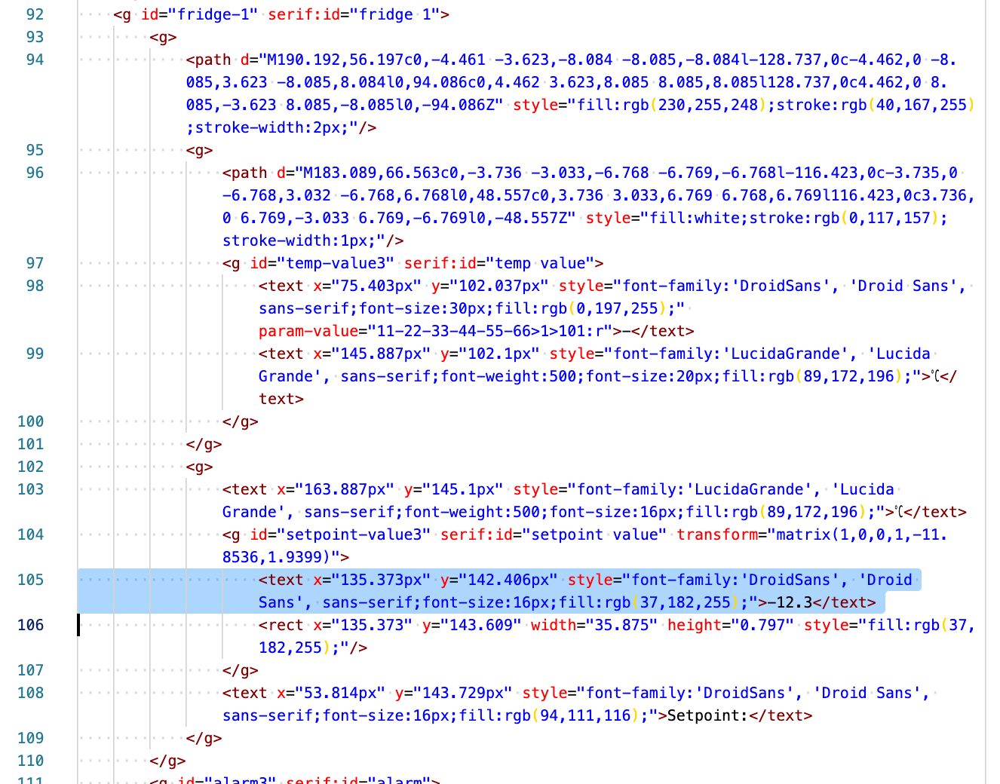
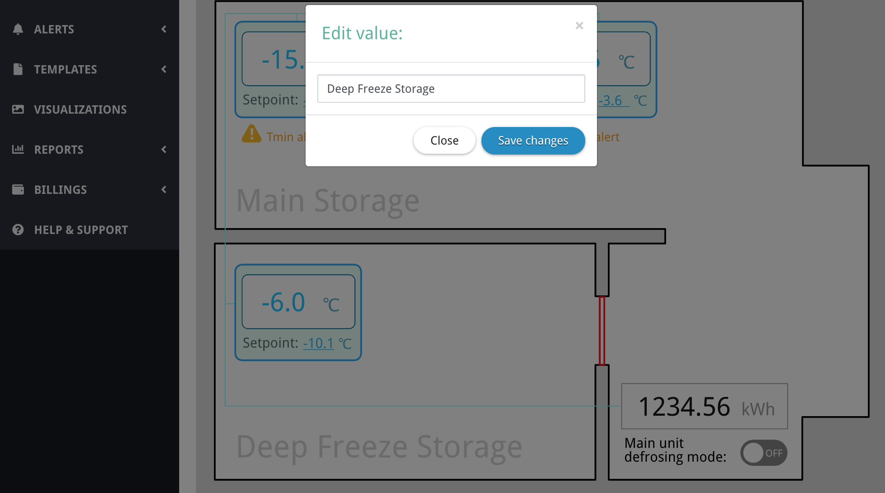

# Overvis Visualizations Tutorial

_Overvis is a monitoring and control system for the industrial MODBUS-based equipment. You can find more information and create a free account on our site: https://www.overvis.com/_

Overvis connects to the devices, sends and receives the data, processes the alarms and does many other things out of the box. But in the end, you want to see a visual dashboard which represents the current state of your equipment and some remote control buttons. Such dashboards in Overvis are called "visualizations".

This tutorial will help you understand how to add your own visualizations to Overvis monitoring system. We will guide you through several examples. Using this information you will be able to make graphics with the data bindings and expand further, to create monitoring dashboards of any complexity.

To be able to create Overvis visualizations using this tutorial, you will need the following:
* You have to already know how to connect your equipment to Overvis.
* You will need some vector graphics editor that can export images as SVG. We will be using Affinity Designer, but you can use any other free or paid editor: Inkscape, Adobe Illustrator, Sketch, etc. There is also [svg-edit](https://svg-edit.github.io/svgedit/dist/editor/index.html), online editor that should fit any basic needs.
* You will also need a text editor that can work with SVG (XML) text (Notepad+, VisualStudio Code, Atom, Sublime Text, or any other).
* We also assume that you know what SVG is. You can look at [SVG tutorial](https://developer.mozilla.org/en-US/docs/Web/SVG/Tutorial) but you won't need any deep knowledge of this topic to create simple visualizations in Overvis.

## Introduction to Overvis visualizations

First, let's open visualizations page in the Overvis menu. You will see the list of all visualizations that are created under your account. This list is probably empty for you now.


Clicking "Create new" button you will see the following form:


In the "Source (SVG)" field you can enter any HTML/SVG/JavaScript code and it will be inserted on the page that is chosen in the "Display on" drop-down. That's the basics of the Overvis visualizations.

Let's try a simple example. We will insert the following code as a source:

```
Any HTML or SVG code here will be displayed as is.<br><br>

For example, <b>this text will be in bold font.</b><br><br>

And this will display a simple SVG image with red square:<br>

<svg width="100px" height="100px" viewBox="0 0 100 100">
<rect fill="#FF0000" height="100" width="100" x="0" y="0"/>
</svg>
```


After clicking "Create visualization" the result is:


We can even place it on the main Overvis dashboard:


This visualization is static and doesn't have any useful data displayed.

You can add some values dynamically with the use of Overvis API and custom JavaScript code. Most complex visualisations we create do exactly that. But, thankfully, you don't have to do this for the majority of the cases. Overvis supports special HTML/SVG attributes to display data values or modify other attributes. Those are called "data bindings".

In the next section we will create a more complex drawing with some data bindings that will display the actual state of the equipment.

## Making a visualization graphics

For this example we want to create a visualization of some storage with freezers. It should include:
* the rough room plan,
* real-time values of the fridge temperatures,
* the ability to change the setpoints,
* alarm indicators.

Let's start by drawing the image in the vector graphics editor. We used Affinity Designer here, but any other editor (that can export as SVG) will do.


Just for the sake of example, we added an energy meter display, switch for the defrosting mode and a door (we want to see if it's open or closed).

A few points to note while drawing a visualization picture in the editor:

* We inserted some placeholder values for temperatures, setpoints and energy. Those values will be replaced with data bindings later.
* Inside the placeholders we tried to place the most representative values. For example, we expect temperatures to be negative, have at most two digits and one decimal of precision, so we used "-12.3" here. That should help us position the values correctly during the design, otherwise we will have to change SVG source manually later to correct the placement.
* All the dynamic parts are created as separate texts. For example "-12.3" and "°C" are separate texts. That way we will only bind the data to the "-12.3" text, and units will remain static:

    

* Obviously, all dynamic texts should not be converted to curves. Static texts may be converted but that will make the resulting SVG code a bit larger.
* The only fonts that can be used here are [web-safe fonts](https://en.wikipedia.org/wiki/Core_fonts_for_the_Web) that are provided with most browsers (Arial, Times New Roman, Courier, etc.). One exception is the ["Droid Sans" font](https://github.com/aosp-mirror/platform_frameworks_base/tree/master/data/fonts), as this font is used in Overvis it is provided to all visualizations too. You can add your own fonts with inline CSS but that's out of scope of this tutorial.
* Everything is drawn and positioned before we export.
    * That includes the alarm indicators. We will be hiding and showing them dynamically.
    * Same for the door.
    * We also drew the "on/off" switch in both positions. We will just display one or another depending on the device data.
* In the next steps we will have to find correct SVG tags to bind data to. To make that process easier, during the design we named all the layers that we will need to find later. That includes all dynamic parts.

    

## Exporting graphics as SVG file

After the design is finished, we export the picture in SVG format. A few notes:
* You will need to edit the resulting SVG code to add data bindings. So export with the most accessible preset (e.g. without compression or obfuscation, preserve layer names, etc.)
* Don't export texts as curves.

Here is how we export our example graphic from Affinity Designer:


You can see the resulting exported example SVG file here: [svg-vis-tutorial-after-export.svg](svg-vis-tutorial-after-export.svg)

The next step is to upload the file to Overvis to check if the graphics embeded on the page looks correct.

One thing to note here. Our exported SVG file contains the following header:

```html
<?xml version="1.0" encoding="UTF-8" standalone="no"?>
<!DOCTYPE svg PUBLIC "-//W3C//DTD SVG 1.1//EN" "http://www.w3.org/Graphics/SVG/1.1/DTD/svg11.dtd">
<svg width="100%" height="100%" viewBox="0 0 800 600" version="1.1" xmlns="http://www.w3.org/2000/svg" xmlns:xlink="http://www.w3.org/1999/xlink" xml:space="preserve" xmlns:serif="http://www.serif.com/" style="fill-rule:evenodd;clip-rule:evenodd;stroke-linecap:round;stroke-linejoin:round;stroke-miterlimit:1.5;">
...
```

Because this code will be embeded in Overvis' page HTML, we have to strip `<?xml...` and `<!DOCTYPE...` tags at the beginning.

The resulting source code looks like this:


Let's save the visualization and see the result:


Everything looks the same as in the editor. Next step is to bind the data and add the interaction.

## Binding the data to the graphics

For the rest of this example, we assume that we have the following network of devices connected to Overvis:


In the network settings we can see the network controller MAC address. We will need it later:


In our case the MAC is `11-22-33-44-55-66`.

Next, we will edit the source code of the SVG file to add data bindings.

### Displaying parameter values as a text

Let's start with the values of probe temperatures on the fridge boxes. The fridge controller device parameters in our example are:


We want to display the **"Probe 1 Value, °C"** (address 101) inside the fridge box on the graphic. To do so, first, we have to open the SVG source and find the tag that contains first fridge box value (-12.3). Here it is:



*How do we know that it's the correct tag? During graphic design we gave the fridge box layer name `fridge 1` and temperature text group should have a name `temp value`. We can see, that `id` attributes in the tags preserve that naming.*

Now, let's modify this `text` tag as following:

```xml
<text x="75.403px" y="102.037px" style="font-family:'DroidSans', 'Droid Sans', sans-serif;font-size:30px;fill:rgb(0,197,255);" param-value="11-22-33-44-55-66>1>101:r">-</text>
```

First, we removed the content of the tag (`-12.3`) and replaced it with the dash symbol. This symbol will be displayed until the data will be loaded in the visualization. You can use any other placeholder value.

We also added the data binding itself. It is a special attribute: `param-value="11-22-33-44-55-66>1>101:r"`. It says: replace the content of this tag with the value of the parameter that has the address **101 (holding)** of the device with the address **1** in the network with the MAC address **11-22-33-44-55-66**. The `:r` at the end also says that this value should be read from the device on-line and not taken from the database of recent readings.

There are several ways to access networks/devices/parameters and also some additional options available for this attribute. You can find the list in the reference section.

We do the similar code modifications for the rest of fridge boxes. Afterwards, we update the code of the visualization in Overvis to check the result:


The data displayed inside the boxes was read directly from the controllers. It will be automatically update every 10 seconds. User also can click on the "refresh" icon in the top-left corner to update immediately.

### Giving the ability to edit a device parameter value

First, let's find the setpoint value for the first fridge in the SVG code:



We want to be able to change it from the visualization. To give that ability, we modify the `text` tag as follows:

```xml
<text x="135.373px" y="142.406px" style="font-family:'DroidSans', 'Droid Sans', sans-serif;font-size:16px;fill:rgb(37,182,255);cursor:pointer;" param-value="11-22-33-44-55-66>1>201:r" on-click="edit-param:11-22-33-44-55-66>1>201">-</text>
```

Again, we removed the placeholder value and replaced it with dash.

The `param-value="11-22-33-44-55-66>1>201:r"` attribute works the same as previously, it just displays the current value that was read directly from the device.

More importantly, we have added a new attribute: `on-click="edit-param:11-22-33-44-55-66>1>201"`. It says: if user clicks on this element, open edit window, that should request new value for the parameter with the address **201 (holding)** of the device with the address **1** in the network with MAC address **11-22-33-44-55-66**. When user enters the new value and saves it, Overvis will send that value to the device parameter and update the visualization afterwards.

Now clicking on the setpont value opens the "Edit value" window:


`on-click` attribute can do several other things, like sending user to another visualization, increment the paramers by one, toggle the parameter between two values, and some other. We will use some of this features later in the tutorial. For a full list, please see the reference section.

As a final change we have also added `cursor:pointer;` into the content of the `style` attribute. It just changes the mouse cursor to the "finger" pointer when user hovers over the setpoint value.

### Showing/hiding elements depending on the parameter value

The idea with alert indicators is to show them only when the alert is triggered. In the example fridge controller device we have two alert parameters: **1 (discrete)** and **2 (discrete)**. Let's find an alert indicator of the first fridge in SVG source:


Let's look only at the first line, it's the `g` tag that contains everything else:

```xml
<g id="alarm3" serif:id="alarm">
```

We will change it as follows:

```xml
<g id="alarm3" serif:id="alarm" on-param-value="11-22-33-44-55-66>1>1d:=1:display:block:none:r" style="display:none;">
```

`on-param-value` attibute here says the following:
1. Check parameter with the address **1 (discrete)** of the device with the address **1** in the network with MAC address **11-22-33-44-55-66**. This parameter is our `Tmin` alert.
2. If the parameter value equals to **1**, change the `display` style of this element to `block`, otherwise, change it to `none`.

We have set the default `display` style to `none`, that means this element (alarm indicator) won't be visible initially. If the alarm register will contain 1 when the data will be read from the device, Overvis will change `display` style to `block` and make this indicator visible.

What about `Tmax` alarm? We can use the fact that both `Tmin` and `Tmax` should be never active at the same time. We can just copy the alarm indicator, change the text and the register address in the condition. When register 1 will be on, the first alarm will be shown. If register 2 will be on, the second one will be displayed, while the first one is hidden.

```xml
<g id="alarm3" serif:id="alarm tmin" on-param-value="11-22-33-44-55-66>1>1d:=1:display:block:none:r" style="display:none;">
    <g>
        <path d="M61.063,167.991c0.622,-1.108 1.793,-1.793 3.063,-1.793c1.271,0 2.442,0.685 3.064,1.793c2.353,4.192 5.582,9.945 7.904,14.08c0.61,1.087 0.598,2.417 -0.032,3.494c-0.63,1.077 -1.784,1.738 -3.032,1.738l-15.808,0c-1.247,0 -2.401,-0.661 -3.031,-1.738c-0.63,-1.077 -0.642,-2.407 -0.032,-3.494c2.321,-4.135 5.551,-9.888 7.904,-14.08Z" style="fill:rgb(255,191,7);"/>
        <path d="M65.53,179.025l0.508,-7.97l-3.17,0l0.525,7.97l2.137,0Zm-2.68,3.468c0,0.858 0.701,1.558 1.577,1.558c0.928,0 1.629,-0.7 1.629,-1.558c0,-0.946 -0.701,-1.647 -1.629,-1.647c-0.876,0 -1.577,0.701 -1.577,1.647Z" style="fill:white;fill-rule:nonzero;"/>
    </g>
    <text x="81.599px" y="186.034px" style="font-family:'DroidSans', 'Droid Sans', sans-serif;font-size:14px;fill:rgb(246,160,0);">Tmin alert</text>
</g>
<g id="alarm3-1" serif:id="alarm tmax" on-param-value="11-22-33-44-55-66>1>2d:=1:display:block:none:r" style="display:none;">
    <g>
        <path d="M61.063,167.991c0.622,-1.108 1.793,-1.793 3.063,-1.793c1.271,0 2.442,0.685 3.064,1.793c2.353,4.192 5.582,9.945 7.904,14.08c0.61,1.087 0.598,2.417 -0.032,3.494c-0.63,1.077 -1.784,1.738 -3.032,1.738l-15.808,0c-1.247,0 -2.401,-0.661 -3.031,-1.738c-0.63,-1.077 -0.642,-2.407 -0.032,-3.494c2.321,-4.135 5.551,-9.888 7.904,-14.08Z" style="fill:rgb(255,191,7);"/>
        <path d="M65.53,179.025l0.508,-7.97l-3.17,0l0.525,7.97l2.137,0Zm-2.68,3.468c0,0.858 0.701,1.558 1.577,1.558c0.928,0 1.629,-0.7 1.629,-1.558c0,-0.946 -0.701,-1.647 -1.629,-1.647c-0.876,0 -1.577,0.701 -1.577,1.647Z" style="fill:white;fill-rule:nonzero;"/>
    </g>
    <text x="81.599px" y="186.034px" style="font-family:'DroidSans', 'Droid Sans', sans-serif;font-size:14px;fill:rgb(246,160,0);">Tmax alert</text>
</g>
```

One note: when copying tags, if there is `id` attribute, it needs to be changed in the copy. All `id` attributes in the source should be unique.

In the result, we see that only fridge 1 triggers `Tmin` and only fridge 3 triggers `Tmax`:


What if we would require to display several alarms at once? Then we would have to design and position each alarm indicator separately and use `on-param-value` for each of them. Or design some smart JavaScript code to dynamically position indicators. This is information representation design problem and requires more complicated approach in some cases, especially when the density of the information displayed is getting higher.

### Changing the color of an element depending on the parameter value

Let's use the same trick with our door. We want to display it in the red color if it is opened.

Here is the new code for the door `rect` element:

```xml
<rect id="door" x="464.852" y="365.301" width="5.254" height="78.242" style="fill:none;stroke:grey;stroke-width:2px;" on-param-value="11-22-33-44-55-66>11>500.2:=0:stroke:red:green:r" />
```

We have our door sensor in the device with address **11** as a **bit 2** of the register **500**. So the `on-param-value`'s parameter reference is `11-22-33-44-55-66>11>500.2`.

We change the `stroke` style property. If the door is closed, we get value 1 and show the door in green color. Zero value means the door is open and we draw it with the red stroke color.

Currently, the door is open:


By the way, `on-param-value` attribute can not only change the styles of the elements but also values of other attributes. Syntax is the same.

### Adding a toggle control

To make a toggle control we will use `on-param-value` combined with `on-click`. We have designed an positioned two variants of the control: on and off. We will display one of them depending on the current parameter value. Clicking on any of the variants will flip the parameter value.

Here is the resulting code:

```xml
<g style="cursor:pointer;" on-click="toggle-param:11-22-33-44-55-66>20>105:0:1:g">
    <g id="button-on" serif:id="button on" on-param-value="11-22-33-44-55-66>20>105:=1:display:block:none:r" style="display:none;">
        <path d="M680.921,544.957c0,-8.316 -6.751,-15.067 -15.066,-15.067l-24.005,0c-8.315,0 -15.066,6.751 -15.066,15.067c0,8.315 6.751,15.066 15.066,15.066l24.005,0c8.315,0 15.066,-6.751 15.066,-15.066Z" style="fill:rgb(29,214,255);"/>
        <circle cx="666.032" cy="544.957" r="11.536" style="fill:white;"/>
        <text x="633.575px" y="549.415px" style="font-family:'DroidSans', 'Droid Sans', sans-serif;font-size:11.449px;fill:white;">ON</text>
    </g>
    <g id="button-off" serif:id="button off" on-param-value="11-22-33-44-55-66>20>105:=0:display:block:none:r" style="display:none;">
        <path d="M680.921,544.957c0,-8.316 -6.751,-15.067 -15.066,-15.067l-24.005,0c-8.315,0 -15.066,6.751 -15.066,15.067c0,8.315 6.751,15.066 15.066,15.066l24.005,0c8.315,0 15.066,-6.751 15.066,-15.066Z" style="fill:rgb(134,134,134);"/>
        <circle cx="641.703" cy="544.957" r="11.536" style="fill:white;"/>
        <text x="655.519px" y="549.415px" style="font-family:'DroidSans', 'Droid Sans', sans-serif;font-size:11.449px;fill:white;">OFF</text>
    </g>
</g>
```

Both `g` elements that represent button variants now have `on-param-value` attribute. It differs only in condition. On state has `=1` condition, off state has `=0`.

The group that contains both variants now has `on-click="toggle-param:11-22-33-44-55-66>20>105:0:1:g"`. It says that when this element (in any state) is clicked, the parameter **105** of the device **20** has to be changed to **0** if it is not already zero, otherwise to **1**. `:g` at the end means that all data in the visualization should be updated after that, because we want to see not only the change of the toggle, but also changes in other parts.

Also we added the `style="cursor:pointer;"` to change the mouse cursor on hover.

Result:

 

### Saving texts on the server

As an additional feature, let's add the ability to rename rooms. Maybe we want to give that visualization to our customer, who may want to change the names later. We could also name the fridges, for example, but naming rooms will be enough to illustrate the principle.

Devices don't have registers for room names, so, the only place where we can store that data is Overvis database. To do that, first, let's add the following attribute to the root `svg` tag (that's the first line in our visualization source):

```xml
<svg use-vis-data="yes"...
```

It says that there is some information that should be loaded and stored in Overvis database.

Now, let's change the room `text` tags as follows:

```xml
<text id="small-room-name" serif:id="small room name" x="45.195px" y="550.539px" style="font-family:'DroidSans', 'Droid Sans', sans-serif;font-size:36px;fill:rgb(211,211,211);" text-replacement="small-room-name" on-click="edit-visdata:small-room-name">Rental Storage Room</text>
<text id="main-room-name" serif:id="main room name" x="45.195px" y="266.539px" style="font-family:'DroidSans', 'Droid Sans', sans-serif;font-size:36px;fill:rgb(211,211,211);" text-replacement="main-room-name" on-click="edit-visdata:main-room-name">Main Storage</text>
```

We added `text-replacement` attribute in both tags. The content of the attribute is just some key, where the string representing the room name will be stored. By default this string will be the content of the tag itself (e.g `Rental Storage Room`). Overvis will load this string when the visualization will be shown and replace the tag content with it.

`on-click="edit-visdata:..."` tells Overvis to open a form that will allow to edit this stored string when user clicks on the element.



### Conclusion of the example

As a finishing touch, we will add `param-value` data bind to the energy meter counter:

```xml
<text id="value" x="508.542px" y="502.132px" style="font-family:'DroidSans', 'Droid Sans', sans-serif;font-size:30px;fill:rgb(23,23,23);" param-value="11-22-33-44-55-66>10>1000">-</text>
```

This shouldn't require additional explanation, only one note: there is no `:r` after the register address. That's because we don't want that value read from the meter itself. It's enough for us to take the last read value from database (which is updated every 5 min). This will make visualization slightly faster and decrease the network connection channel load a bit.

Let's update the visualization source code in Overvis and look at the result:


You can check the finished visualization code here: [svg-vis-tutorial-final.svg](svg-vis-tutorial-final.svg)

This example has demonstrated the basic features of Overvis visualizations that are commonly used among hundreds of dashboards that we created. With this knowledge you can create any simple equipment state representation for yourself or your customers. Next examples will introduce you to the more advanced tricks. Or you can check the reference document and start creating your own dashboards.

## HTML visualizations

## Using JavaScript in visualizations

## Integrating Google Maps

## More examples

## Common questions

## Contact us if you need any help

### Plans for the future

## Reference

### Parameter value text binding

### Possible error indicators