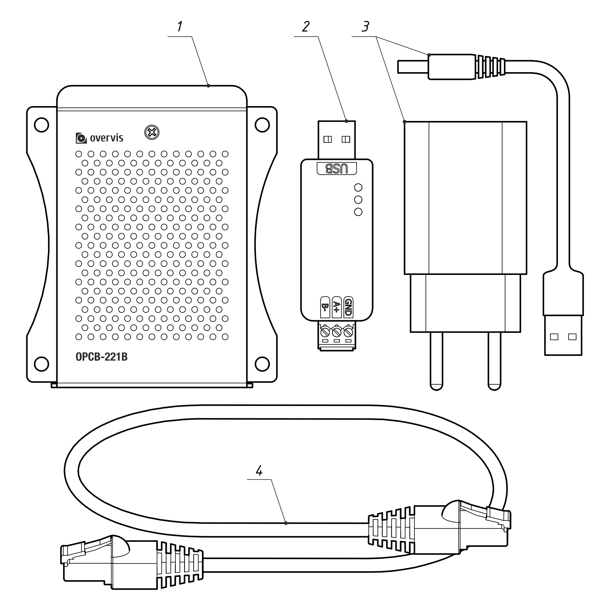
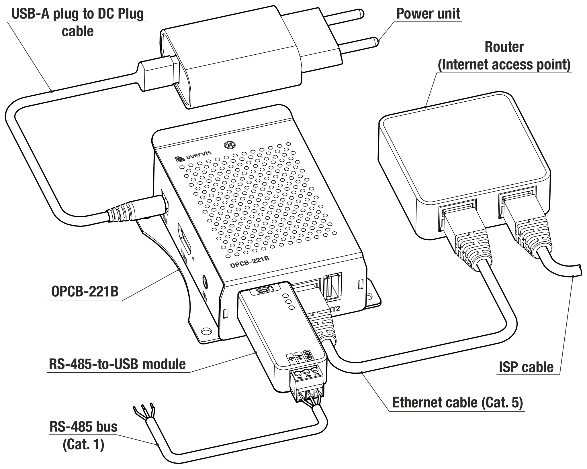

# Instrukcja obsługi OPCB-221B

System Zarządzania Jakością w zakresie projektowania i produkcji urządzenia spełnia wymagania
normy ISO 9001:2015.

## Przeznaczenie

Kontroler OPCB-221B (zwany dalej "Kontrolerem", "Produktem", "Urządzeniem" lub
"OPCB-221B") zapewnia komunikację MODBUS pomiędzy klientami i serwerami w sieciach TCP (Internet)
oraz pomiędzy urządzeniami w interfejsie RS-485.

OPCB-221B służy do zdalnego monitorowania i sterowania funkcjonowaniem:

- Sterowniki chłodnicze,
- Sterowniki systemów HVAC,
- Inteligentne urządzenia rolnicze,
- Przekaźniki sieci energetycznej, liczniki, inne urządzenia elektryczne,
- Przemysłowe urządzenia IoT,
- Czujniki i mierniki przemysłowe,
- Inne urządzenia elektroniczne zgodne z MODBUS.

Lista funkcji OPCB-221B:

- Konwerter MODBUS RTU/TCP.
- Wbudowana obsługa chmury Overvis (www.overvis.com).
- Służenie jako serwer lub klient TCP, master lub slave MODBUS RTU.
- Rozszerzenie sieci RS-485.
- Obsługa trybu MODBUS ASCII.
- Obsługa połączenia LAN i/lub Wi-Fi.
- Opcjonalne połączenie 3G/LTE za pomocą zewnętrznego modemu USB.
- Tryb punktu dostępu Wi-Fi.
- Interfejs WWW, dostępny z sieci lokalnej, poprzez punkt dostępowy Wi-Fi lub za pomocą chmury Overvis
  połączenie.
- Zdalna konfiguracja (za pomocą MODBUS lub interfejsu WWW).
- Ustawienia sieci RS-485: szybkość transmisji, parzystość, czas odpowiedzi.
- Obsługa wielu sieci RS-485.
- Narzędzia do debugowania żądań MODBUS.
- Automatyczna lub ręczna aktualizacja oprogramowania sprzętowego.
- HTTP API.

## Terminy i skróty

**Stacja Wi-Fi** - urządzenie połączone z innym urządzeniem poprzez Wi-Fi (punkt dostępu);

**Punkt dostępu do sieci Wi-Fi** - urządzenie umożliwiające połączenie z nim poprzez Wi-Fi;

**DHCP** – protokół umożliwiający jednostkom sieciowym automatyczne uzyskanie parametrów TCP/IP (adres IP
adres);

**HTTP** - protokół przesyłania stron internetowych i innych danych przy użyciu technologii klient-serwer;

**IP (adres)** – adres urządzenia, który jest unikalny w ramach jednej sieci działającej
zgodnie z protokołem IP;

**IPv4** - а czterobajtowy adres IP;

**MAC (adres)** – adres używany w transmisjach sieciowych do identyfikacji urządzenia. Z reguły,
jest on globalnie unikalny;

**MAC-48** - sześciobajtowy adres MAC;

**MODBUS** - standardowy protokół komunikacji pakietowej oparty na technologii klient-serwer
przeznaczony dla elektronicznych urządzeń przemysłowych;

**MODBUS RTU** - Protokół łączenia urządzeń, przez który pakiet jest przesyłany bajt po bajcie;

**MODBUS ASCII** - Protokół łączenia urządzeń, przez który przesyłany jest pakiet w postaci
znaków ASCII;

**MODBUS TCP** - MODBUS Protokół transmisji pakietów zgodnie ze standardem TCP/IP;

**WEB** - system dostępu do dokumentów serwerowych używany w Internecie;

**Wi-Fi** - grupa norm dotyczących transmisji danych przez kanały radiowe.

## Pełny zestaw

<!-- TODO: update the RS-485 stick looks or comment on varying set -->

**Tabela 1.** – Zestaw produktów

<!-- TODO: is power supply with an attached DC Plug cable ? consider redrawing it also -->

| Nazwa                                                                                             | Ilość (szt.) |
| ------------------------------------------------------------------------------------------------ | --------------- |
| 1. Kontroler OPCB-221B (z zainstalowaną kartą pamięci MicroSD i zintegrowaną anteną Wi-Fi, 3 dbm)| 1               |
| 2. Moduł rozszerzający USB/RS-485 (obsługujący do 32 podłączonych urządzeń RS-485)               | 1               |
| 3. Zasilacz z wyjściem USB Type-A i kablem DC Plug                                               | 1               |
| 4. Kabel Ethernet                                                                                | 1               |
| 5. Instrukcja obsługi                                                                            | 1               |

## Ogólne wymiary montażowe i elementy sterujące

<!-- TODO: item 4 should be DC Plug, not HDMI, other numerations chnage to total 7 items -->

**Rysunek 1** – Wymiary całkowite i montażowe OPCB-221B

1. **"EXT1"** gniazda - 2 gniazda USB Type-A do podłączenia dodatkowych modułów (np. RS-485
   / RS-232 konwertery interfejsów szeregowych).
2. **"ETH"** gniazdo - 8P8C/RJ45 do przewodowego połączenia z lokalną siecią Ethernet;
3. **"EXT2"** gniazda - gniazdo USB Type-A do podłączenia dodatkowych modułów (np. konwerterów interfejsu szeregowego RS-485 /
   konwertery interfejsu szeregowego RS-485 / RS-232).
4. **"PWR"** gniazdo - wtyk DC do podłączenia źródła zasilania 5V DC o mocy co najmniej 9W.
5. **"HDMI"** gniazdo - wyjście HDMI (nieużywane).
6. **"AUX"** gniazdo - wyjście audio (nieużywane).
7. **"MEM"** gniazdo - gniazdo kart MicroSD umożliwiające dostęp do zainstalowanej wcześniej karty pamięci.

## Dane techniczne

<!--
TODO: check:`
  - Maximum number of incoming connections via MODBUS TCP protocol
  - Maximum number of serial interfaces
  - USB-RS485 characteristics (terminator, terminal characteristics, etc.) table;
  - Power supply characteristics table
  - Weight, kg, no more than, (measure)
  - Insulation rated voltage, V, (power connector)
  - Galvanic insulation, kV (power)
  - Rated pulse withstand voltage, kV (power)
  - Electric shock protection class
  - The device meets the requirements of the following standards
TODO: Fill in the table with the correct parameters of the motherboard
-->

**Tabela 2** – Główne dane techniczne sterownika OPCB-221B

| Nazwa                                                                                            | Wartość                                  |
| :---------------------------------------------------------------------------------------------- | -------------------------------------- |
| Napięcie zasilania DC, V                                                                        | 5,0                                    |
| Płyta główna                                                                                    | Orange Pi PC Plus 1G RAM               |
| Interfejs łącza sieci TCP                                                                       | Ethernet, Wi-Fi                        |
| Interfejs komunikacyjny Ethernet                                                                | 10BASE-T/100BASE-T (twisted pair)      |
| Częstotliwość Wi-Fi, GHz                                                                        | 2.4                                    |
| Obsługiwane standardy Wi-Fi                                                                     | IEEE 802.11 b/g/n                      |
| Obsługiwane protokoły TCP/IP                                                                    | MODBUS TCP, HTTP, DNS, DHCP, WireGuard |
| Maksymalna liczba połączeń przychodzących przez protokół MODBUS TCP                             | 4                                      |
| Maksymalna liczba połączeń wychodzących przez protokół MODBUS TCP                               | 4                                      |
| Maksymalna liczba interfejsów szeregowych                                                       | 3 (through individual USB ports)       |
| Obsługiwane protokoły interfejsu szeregowego                                                    | MODBUS RTU, MODBUS ASCII               |
| Obsługiwane tryby szeregowe MODBUS                                                              | Master, Slave                          |
| Maksymalna liczba podłączonych urządzeń MODBUS                                                  | 255                                    |
| Wbudowane serwery                                                                               | MODBUS TCP, HTTP                       |
| Czas gotowości przy włączeniu zasilania, s, nie więcej niż                                      | 60                                     |
| Pobór prądu, mA, maks.                                                                          | 2000                                   |
| Waga, kg, nie więcej niż                                                                        | 0,200                                  |
| Wymiary całkowite HxBxL, mm, nie więcej niż                                                     | 99 х 82 х 36                           |
| Oznaczenie produktu                                                                             | Switchgear and control equipment       |
| Warunki znamionowe pracy                                                                        | continuous                             |
| Stopień ochrony                                                                                 | ІР30                                   |
| Klasa ochrony przed porażeniem prądem elektrycznym                                              | III                                    |
| Wersja projektu klimatycznego                                                                   | NF 3.1                                 |
| Dopuszczalny poziom zanieczyszczeń                                                              | II                                     |
| Izolacja galwaniczna, kV<ul><li>złącze zasilania</li><li>Złącze Ethernet</li><li>USB</li></ul>  |  – 1.5 –                      |
| Instalacja (montaż)                                                                             | panel                                  |

- Produkt spełnia wymagania zawarte w: EN 60947-1; EN 60947-6-2; EN 55011; EN
  61000-4-2.
- Produkt zachowuje swoją funkcjonalność w każdej pozycji w przestrzeni.
- Materiał obudowy - aluminium.
- Nie występują substancje szkodliwe w ilościach przekraczających najwyższe dopuszczalne stężenia.

**Tabela 3** – Dane techniczne modułu rozszerzenia USB-RS485

| Nazwa                                       | Wartość                                                                          |
| :------------------------------------------ | -------------------------------------------------------------------------------- |
| Prędkość komunikacji, bps                   | 300-921600                                                                       |
| Kontrola kierunku                           | sprzęt automatycznie określa i kontroluje kierunek transmisji danych             |
| Odległość transmisji(przy niskiej prędkości)| około 1200 metrów                                                                |
| Tryb nadawania                              | do 32 węzłów w parach punktowych (dla więcej niż 16 węzłów zalecane są repeatery)|
| Opór równowagi                              | wbudowany 120Ohm, podłączany za pomocą zworki                                    |
| Pobór prądu, mA, maks.                      | 50                                                                               |
| Ochrona interfejsu                          | Zapewnienie 600W ochrony przed wyładowaniami atmosferycznymi, przepięciami i 15kV ochrony statycznej|
| Izolacja galwaniczna                        | Brak                                                                             |
| Waga, kg, nie więcej niż                    | 0,010                                                                            |
| Wymiary całkowite HxBxL, mm, nie więcej niż | 15x18x63                                                                         |
| Przekrój przewodów do połączenia, mm2       | 0,13 – 0,82                                                                      |
| Moment dokręcenia śruby zaciskowej, Np.     | 0,3                                                                              |
| Stopień ochrony                             | ІР20                                                                             |

**Tabela 4.** – Dane techniczne zasilacza

| Nazwa                                      | Wartość                                               |
| :----------------------------------------- | ----------------------------------------------------- |
| Zakres wejściowego napięcia AC, V          | 100-240                                               |
| Prąd wejściowy AC, mA                      | 500                                                   |
| Zakres wejściowej częstotliwości AC, Hz    | 50/60                                                 |
| Napięcie wyjściowe DC, V                   | 5,0                                                   |
| Prąd wyjściowy DC, mA, max                 | 3000                                                  |
| Wejście AC                                 | Wtyczka EU 2 pin                                      |
| Złącze DC                                  | USB Type-A                                            |
| Waga, kg, nie więcej niż                   | 0,065                                                 |
| Wymiary całkowite HxBxL, mm, nie więcej niż| 80x30x75                                              |
| Stopień ochrony                            | IP20                                                  |
| Klasa ochrony przed porażeniem prądem elektrycznym | II                                            |
| Napięcie izolacji                          | Wejście/wyjście do obudowy zewnętrznej, 500VDC, większe niż 10MOhm |
| Napięcie wytrzymywane od wejścia do wyjścia| AC 3kV / 10mA, 3s                                     |

<!-- TODO: check
| Galvanic insulation, kV | ??? | - is it the same as I/O withstand voltage ? test the value
| Insulation-rated voltage, V | ??? | - is it the same as insulation voltage 500VDC ? test it
| Rated pulse withstand voltage, kV | ??? | - is it the same as I/O withstand voltage ? test it
-->

## Warunki eksploatacji

Produkt jest przeznaczony do pracy w następujących warunkach:

<!-- TODO: test conditions -->

- temperatura otoczenia od -10 do +55 °C;
- ciśnienie atmosferyczne od 84 do 106,7 kPa;
- wilgotność względna (przy +25 °С) 30 do 80%.

**Uwaga!!! Produkt nie jest przeznaczony do stosowania w następujących warunkach:**

- znaczne wibracje i wstrząsy;
- wysoka wilgotność;
- agresywnym środowisku zawierającym kwasy, zasady itp. oraz silne zanieczyszczenia
  (smary, oleje, pyły itp.)..

## Wskazówki ogólne

**UWAGA! WSZYSTKIE POŁĄCZENIA MUSZĄ BYĆ WYKONYWANE PRZY WYŁĄCZONYM NAPIĘCIU.**

**Błąd podczas wykonywania prac instalacyjnych może spowodować uszkodzenie produktu i podłączonych urządzeń.**

Przy podłączaniu do magistrali RS-485 należy stosować skrętkę komputerową, kat. 1 lub wyższej. Końce muszą być
pozbawione izolacji na 4±0,5 mm i dokręcone końcówkami tulejkowymi. Zaleca się stosowanie ekranowanego kabla z uziemieniem
zalecany.

**NIE POZOSTAWIAĆ GOŁYCH PRZEWODÓW WYSTAJĄCYCH POZA BLOK ZACISKÓW.**

**W celu zapewnienia niezawodnego kontaktu należy dokręcić śruby zaciskowe z siłą wskazaną w tabeli charakterystyki technicznej
tabela właściwości technicznych.**

Przy podłączeniu do sieci Ethernet należy użyć kabla dołączonego do zestawu, lub skrętki kat. 5e z wtyczką 8P8C
(RJ45).

Podczas mocowania przewodów należy unikać uszkodzeń mechanicznych, skręcania lub ścierania izolacji przewodów.

## Połączenie

Przed startem:

- Rozpakuj i sprawdź, czy produkt nie został uszkodzony po transporcie, a jeśli tak się stało, skontaktuj się z dostawcą lub producentem.
- Przed podłączeniem do zasilania należy pozostawić produkt w warunkach roboczych przez dwie
  godziny (w przypadku ewentualnej kondensacji na elementach).
- Dokładne zapoznaj się z instrukcją obsługi;
- W przypadku pytań dotyczących instalacji produktu należy skontaktować się z pomocą techniczną
  pod numerem telefonu podanym na końcu instrukcji obsługi.

**Rysunek 2** – schemat podłączenia produktu

Podłączyć OPCB-221B zgodnie z rysunkiem 2, w następującej kolejności:

- Używając skrętki kategorii 1 lub wyższej, podłącz blok zacisków modułu RS-485
  do magistrali interfejsu szeregowego (lub bezpośrednio do urządzenia z tym interfejsem); _Uwaga: styk
  "A" dla sygnału nieodwróconego (D+), styk "B" dla sygnału odwróconego (D-)._.
- Jeśli produkt powinien mieć dostęp do Internetu lub sieci LAN: za pomocą kabla połączeniowego Ethernet
  (dołączony do opakowania) lub skrętki komputerowej kat. 5e z wtyczką 8P8C (RJ45), należy podłączyć do
  **"ETH "** złącze (8P8C/RJ45) do sieci lokalnej lub komputera.
- Upewnić się, że w gnieździe **"MEM "** znajduje się karta pamięci (zainstalowana przez producenta).
- Podłączyć moduł RS-485 do jednego ze złączy **"EXT1"** lub **"EXT2** (USB Type-A).
- Podłączyć zasilacz (w zestawie) do złącza **"PWR "** (DC Plug).
- Opcjonalnie: zabezpiecz połączenia USB plastikowymi opaskami zaciskowymi, aby uniknąć przypadkowego rozłączenia.
- Podłącz jednostkę zasilającą do sieci energetycznej 220-240VAC (50Hz).

## Działanie OPCB-221B

### Informacje ogólne

OPCB-221B posiada 32-bitowy procesor, na którym działa system operacyjny zgodny z POSIX. Kieruje on ruch pomiędzy
modułami rozszerzającymi USB, takimi jak interfejsy szeregowe RS-485 / RS-232 (protokoły MODBUS RTU/ASCII) oraz
interfejsy Ethernet/Wi-Fi LAN (protokół MODBUS TCP), ewentualnie kierowany dalej do Internetu.

OPCB-221B posiada wbudowany interfejs internetowy, który może być wykorzystany do konfiguracji.

OPCB-221B zapewnia możliwość połączenia z serwerem w chmurze w celu zdalnego monitorowania i konfiguracji
produktu i podłączonych urządzeń.

OPCB-221B zapewnia punkt dostępu Wi-Fi (hotspot), aby uprościć początkową konfigurację. Punkt
Punkt dostępu Wi-Fi może być wyłączony w ustawieniach.

**OPCB-221B przechowuje system operacyjny i dane na fabrycznie zainstalowanej karcie pamięci microSD. Usunięcie strony
lub wymiana karty pamięci spowoduje, że produkt nie będzie działał.**

### Włączenie zasilania i sekwencja ponownego uruchomienia

Po włączeniu zasilania OPCB-221B ładuje system operacyjny i konfiguruje interfejsy komunikacyjne.
Może to zająć do 1 minuty.

Przy zapewnionym połączeniu internetowym, OPCB-221B automatycznie łączy się z serwerem chmury, jeśli
dozwolone w ustawieniach. Domyślnie, nieskonfigurowany OPCB-221B tworzy punkt dostępu Wi-Fi o SSID
"OPCB_XXXX" (gdzie XXXXXX to ostatnie 6 znaków MAC urządzenia), w celu przeprowadzenia wstępnej konfiguracji
zgodnie z opisem w dodatku A.

Miękki restart OPCB-221B można wykonać poprzez interfejs WWW, naciskając przycisk
"Reboot device" w sekcji "Actions". Spowoduje to zakończenie wszystkich aktualnie trwających operacji,
zapisze dane i zrestartuje urządzenie w ciągu 1 minuty.

Restart urządzenia polega na wyłączeniu zasilania, odczekaniu 5 sekund, a następnie ponownym włączeniu zasilania.
ponownie.

### Obsługa przez HTTP

OPCB-221B udostępnia interfejs WWW HTTP oraz HTTP REST API dla aplikacji internetowych. OPCB-221B akceptuje
połączenia HTTP przez interfejs Ethernet lub Wi-Fi na porcie TCP 80.

Aby uzyskać dostęp do interfejsu internetowego HTTP, należy:

- Połącz się z punktem dostępu Wi-Fi OPCB-221B za pomocą komputera lub urządzenia mobilnego i otwórz następujący adres URL
  w przeglądarce: http://setup.overvis.com/;
- Korzystając z dowolnego komputera lub urządzenia mobilnego w sieci lokalnej, otwórz adres IP OPCB-221B w
  przeglądarce. Adres IP OPCB-221B można zazwyczaj znaleźć poprzez dostęp do interfejsu routera sieci lokalnej
  interfejs.

Szczegółowe informacje na temat podłączania, konfigurowania i korzystania z produktu za pomocą interfejsu internetowego zawiera Dodatek
C. Szczegółowe informacje na temat korzystania z interfejsu REST API zawiera Dodatek F.

### Obsługa OPCB-221B przez MODBUS (TCP/RTU/ASCII)

OPCB-221B odbiera żądania MODBUS TCP poprzez interfejsy Ethernet lub Wi-Fi i przekazuje je w formacie
MODBUS RTU lub MODBUS ASCII przez interfejs szeregowy. Odpowiedzi są konwertowane na MODBUS TCP
i wysyłane z powrotem do strony żądającej.

OPCB-221B może być również skonfigurowany do odbierania żądań MODBUS RTU lub MODBUS ASCII poprzez interfejs szeregowy
i przesyłania ich w formacie MODBUS TCP do określonych adresów IP przez interfejs Ethernet lub Wi-Fi
interfejsy. W takim przypadku odpowiedzi (skonwertowane do protokołu żądania) są wysyłane z powrotem na linię szeregową
linii.

Połączenie z komputera PC lub urządzenia mobilnego może być wykonane za pomocą dowolnego oprogramowania klient MODBUS TCP. Wersja dla systemu Windows
wersja klienta MODBUS TCP jest dostępna do pobrania tutaj:
https://novatek-electro.com/en/software/modbus-tcp-client.html

Podłączenie, konfiguracja i użytkowanie produktu poprzez MODBUS są szczegółowo opisane w załączniku
D.

### Obsługa OPCB-221B z wykorzystaniem serwera w chmurze Overvis

OPCB-221B może nawiązywać połączenia z serwerem chmury Overvis za pomocą dowolnego interfejsu z dostępem do Internetu.
dostęp do Internetu. OPCB-221B komunikuje się z chmurą Overvis wykorzystując jeden lub oba z następujących protokołów:

- MODBUS TCP do komunikacji, uwierzytelniania i zbierania danych.

- WireGuard (VPN). Zapewnia pełne szyfrowanie ruchu pomiędzy urządzeniem a serwerem w chmurze Overvis
  serwerem.

Połączenie w chmurze MODBUS TCP Overvis jest domyślnie włączone i może być wyłączone w ustawieniach.
Połączenie WireGuard jest wykorzystywane do celów serwisowych - skontaktuj się z działem wsparcia, aby zamówić jego rekonfigurację.

Połączenie, konfiguracja i użytkowanie produktu z serwerem w chmurze Overvis są opisane szczegółowo w dodatku E.
szczegółowo w dodatku E.

## Ustawienie

<!-- TODO: check -->

Wstępna konfiguracja połączeń sieciowych jest opisana w dodatkach A i B.

Urządzenie można skonfigurować za pomocą:

- interfejs internetowy (patrz: dodatek C);
- interfejs MODBUS (patrz Załącznik D);
- serwer w chmurze Overvis (zob. dodatek E).

Konfigurowalne parametry zostały opisane w dodatku D. Wartości parametrów są zapisywane w pliku na karcie pamięci
karcie pamięci.

**Uwaga: niektóre ustawienia wymagają soft-reboot'u, klienci mogą stracić połączenie i muszą się połączyć ponownie.**

**UWAGA!!! Przed wyłączeniem punktu dostępu Wi-Fi należy upewnić się, że połączenie internetowe jest prawidłowo skonfigurowane.
punktu dostępu Wi-Fi. W przeciwnym razie nieprawidłowa konfiguracja może uniemożliwić jakąkolwiek komunikację z
z urządzeniem, co można naprawić jedynie poprzez przywrócenie ustawień fabrycznych.**

Częściowe przywrócenie ustawień fabrycznych można wykonać w jeden z następujących sposobów:

- używając klucza sterującego USB flash. Zapisz pusty plik lub pusty folder o nazwie `"RESET_CONF"` w pamięci USB.
  do jakiejś pamięci USB flash, następnie podłącz ją do jednego z **"EXT1"** lub **"EXT2** slotów, aby przywrócić ustawienia fabryczne.
  ustawień do domyślnych ustawień fabrycznych. Reset może potrwać do 30 sekund, po czym można odłączyć pamięć USB.
  można odłączyć.
- poprzez interfejs internetowy, patrz załącznik C.

## Automatyczna aktualizacja oprogramowania sprzętowego

Firmware urządzenia jest na bieżąco aktualizowany przez producenta. Domyślnie nowa wersja jest
domyślnie instalowana jest automatycznie po włączeniu urządzenia lub w ciągu 24h pracy. Automatyczne
aktualizacje gwarantują kompatybilność wsteczną wszystkich funkcji OPCB-221B. Wersje bez kompatybilności wstecznej
kompatybilności wstecznej wymagają ręcznej instalacji.

Aktualnie zainstalowana wersja jest wyświetlana w interfejsie internetowym OPCB-221B. Lista zmian dla
każdej wersji jest dostępna tutaj:
https://github.com/overvis/opcb-release/blob/opcb-221-opipc/CHANGELOG.md

## Ręczna aktualizacja oprogramowania sprzętowego i pełny reset fabryczny

Ręczna aktualizacja wymaga pełnego przywrócenia ustawień fabrycznych poprzez wgranie nowego obrazu firmware'u na kartę pamięci SD
na kartę pamięci SD. Wszystkie aktualne obrazy oprogramowania firmowego można znaleźć na stronie poświęconej wydaniu:
https://github.com/overvis/opcb-release/tags

**UWAGA! Upewnij się, że słowo hardware name w pobranym pliku obrazu pasuje do Twojego
urządzenie (np. `"opipc"`). Zainstalowana wersja wyświetlana w interfejsie internetowym urządzenia ma takie samo
słowo nazwy sprzętu.**

Pełna procedura przywracania ustawień fabrycznych została opisana w dodatku F. Podsumowując:

1. Pobierz najnowszy obraz ze strony wydania.
2. Wyjmij kartę SD z produktu.
3. Zapisać obraz na istniejącej lub nowej karcie SD (usuwa wszystkie dane na karcie, w tym
   ustawienia).
4. Włóż świeżo namalowaną kartę SD do produktu.
5. Podłącz OPCB-221B do Internetu za pomocą kabla Ethernet i włącz zasilanie porduktu.
6. Połącz się z interfejsem internetowym produktu poprzez punkt dostępu Wi-Fi (używając etykiety produktu).
7. Otwórz stronę **"Manufacturing "** i wprowadź klucz prywatny urządzenia z etykiety, aby go przywrócić.
8. Ponownie skonfiguruj ustawienia urządzenia, które są wymagane do pracy w Twoich warunkach.

## Środki ostrożności

Aby zapewnić bezpieczne działanie produktu, surowo zabrania się:

- przeprowadzać prace instalacyjne i konserwacyjne bez odłączania produktu od sieci elektrycznej;
- otwierać i naprawiać produkt bez pomocy fachowców;
- obsługi produktu z uszkodzeniem mechanicznym obudowy.

Niedopuszczalne jest przenikanie wody na zaciski i elementy wewnętrzne wyrobu.

Podczas eksploatacji i konserwacji muszą być spełnione wymagania dokumentów regulacyjnych, a mianowicie:

- Przepisy dotyczące działania konsumenckich instalacji elektrycznych
- Instalacje elektryczne; Przepisy bezpieczeństwa dotyczące eksploatacji konsumenckich instalacji elektrycznych;
- Bezpieczeństwo pracy przy eksploatacji instalacji elektrycznych.

**NIEDOPUSZCZALNE JEST WNIKANIE CIECZY NA ZACISKI I ELEMENTY WEWNĘTRZNE URZĄDZENIA.**

## Konserwacja

**PODCZAS KONSERWACJI PRODUKT I PODŁĄCZONE DO NIEGO URZĄDZENIA MUSZĄ BYĆ ODŁĄCZONE OD ZASILANIA.
ZASILANIE.**

Konserwacja produktu powinna być przeprowadzona przez **wykwalifikowanych techników**.

Zalecana częstotliwość konserwacji to co sześć miesięcy.

Procedura:

1. Sprawdzić pewność połączenia przewodów, w razie potrzeby zacisnąć;
2. Sprawdź niezawodność połączeń USB, w razie potrzeby przymocuj je plastikowymi zaciskami;
3. Sprawdź wizualnie integralność obudowy, w przypadku uszkodzeń produkt powinien zostać wyłączony z eksploatacji i wysłany do naprawy.
   z eksploatacji i wysłać do naprawy;
4. W razie potrzeby wyczyść obudowę produktu suchą szmatką.

**Do czyszczenia nie należy używać materiałów ściernych ani rozpuszczalników.**

## Okres użytkowania i gwarancja producenta

Okres użytkowania produktu wynosi 10 lat. Po zakończeniu okresu użytkowania należy skontaktować się z
producentem.

Okres przydatności do spożycia wynosi 3 lata.

Okres gwarancji na produkt wynosi 3 lata od daty sprzedaży.

W okresie gwarancji (w przypadku awarii) producent dokonuje bezpłatnej naprawy produktu.

**UWAGA! JEŚLI PRODUKT NIE BYŁ UŻYWANY ZGODNIE Z WYMAGANIAMI NINIEJSZEJ INSTRUKCJI OBSŁUGI, UŻYTKOWNIK STRACI PRAWO DO SERWISU GWARANCYJNEGO.
UŻYTKOWNIK TRACI PRAWO DO SERWISU GWARANCYJNEGO.**

Serwis gwarancyjny realizowany jest w miejscu zakupu lub przez producenta.

Pogwarancyjny serwis wyrobu wykonywany jest przez producenta według aktualnych stawek.

Przed wysłaniem produktu do naprawy należy go zapakować w opakowanie fabryczne lub inne, które
zapobiega uszkodzeniom mechanicznym.

**W przypadku zwrotu produktu lub przekazania go do serwisu gwarancyjnego (pogwarancyjnego) należy szczegółowo podać
szczegółowo podać przyczynę zwrotu w polu informacji o reklamacji.**

## Transport i przechowywanie

Produkt w oryginalnym opakowaniu jest dopuszczony do transportu i przechowywania w temperaturze
od minus 45 do +60 °C i przy wilgotności względnej nie większej niż 80%. Podczas
transportu wyrób powinien być chroniony przed uszkodzeniami mechanicznymi.

## Świadectwo odbioru

Wyrób został wykonany i odebrany zgodnie z wymaganiami aktualnej
dokumentacji technicznej i zakwalifikowany jako zdatny do eksploatacji.

Kierownik działu QCD:

Data produkcji:

## Informacja o skardze

**Firma jest wdzięczna za informacje o jakości produktu oraz sugestie dotyczące
na temat jego działania.**

W razie jakichkolwiek pytań prosimy o kontakt z producentem: NOVATEK-ELECTRO LTD. Ukraina, 65007,
Odessa, Admirala Lazareva str. 59

tel. +38(048)738-00-28

tel/fax +38(048)234-36-73.

http://www.novatek-electro.com

Dział Obsługi Gwarancyjnej: +38(067) 557-12-49

Dział Wsparcia Technicznego: +38(067) 565-37-68

Data sprzedaży

VN221012

<!-- TODO: check and add all Appendixes -->
<!-- TODO: All links should lead to docs.overvis.com -->
