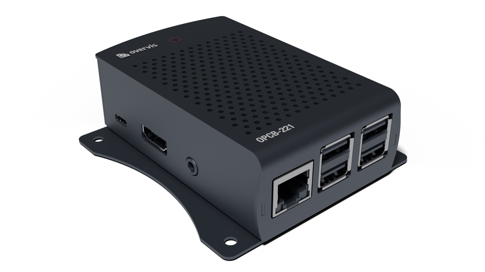
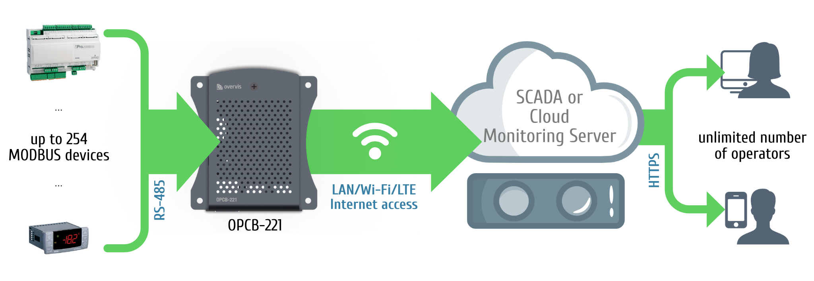
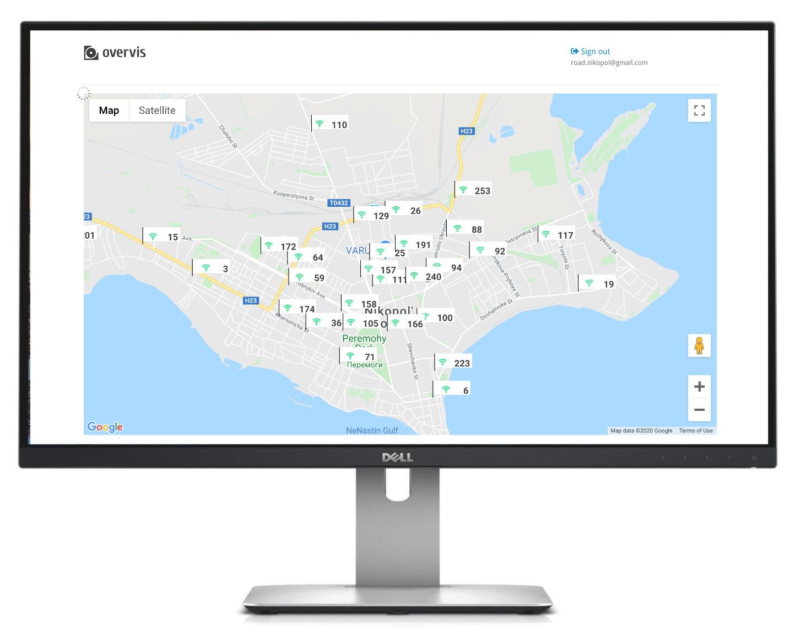

# Обладнання Overvis серії OPCB

Overvis OPCB - це серія пристроїв контролерів зв'язку:

- [OPCB-221B](./OPCB-221B_Manual/)

<!-- TODO: acquire links -->

Основною функцією контролерів OPCB є з'єднання MODBUS обладнання з
[Системою хмарного моніторингу Overvis](../OCP/README.md) або іншими SCADA-системами. OPCB працює
як перетворювач MODBUS RTU<>TCP.

<!-- TODO: photo -->

OPCB використовується для підключення:

- Контролери охолодження
- Контролери систем опалення, вентиляції та кондиціонування
- Сільськогосподарські смарт-пристрої
- Реле електромереж, лічильники та інше електрообладнання
- Промислові IoT-пристрої
- Промислові датчики та вимірювачі
- Будь-яка інша електроніка з підтримкою MODBUS

<!-- TODO: review diagram -->

У поєднанні з хмарним моніторингом Overvis пристрої OPCB забезпечують:

**Збір даних:**

- Зберіть робочі дані (будь-які числові значення) з вашого обладнання.
- Зберігайте історію операційних даних, отримуйте інсайти та аналітику.
- Зібрані дані можна повністю експортувати (Excel, CSV).
- Звітність з аналізу ризиків та критичних контрольних точок (HACCP).

**Сповіщення через SMS та електронну пошту:**

- Налаштуйте сповіщення про перевищення порогових значень робочих параметрів або помилки з'єднання.
- Створіть "ланцюжок відповідальності", що вимагає підтвердження сигналів в разі аварій від
  персоналу та їх ескалації у разі відсутності реакції.
- Усі повідомлення про аварійні ситуації реєструються та доступні для перегляду.

**Усі повідомлення про аварійні ситуації реєструються та доступні для перегляду:**

- Створення панелей керування з інформацією, отриманою від обладнання в реальному часі.
- Візуалізація даних у відкритому форматі SVG.
- Використовуйте Google Maps API для відображення розташування об'єктів.
- Використовуйте JavaScript та Overvis API для налаштування елементів керування швидкими діями для
  операційного персоналу.

**І навіть більше:**

- Використовуйте шаблони для швидкого створення пристроїв і систем сповіщення.
- Керуйте рівнями доступу для різних облікових записів в межах однієї організації.
- Працює з динамічними IP-адресами та обходить брандмауери.
- Оптимізація мобільного доступу.
- Шифрування за промисловим стандартом.
- Overvis API дозволяє автоматизувати управління і може використовуватися для завантаження даних в
  інші системи управління.

## Перелік функцій

- Перетворювач MODBUS RTU/TCP.
- Вбудована підтримка хмарного сервісу Overvis (www.overvis.com).
- Робота в якості TCP-сервера або клієнта, ведучого або веденого пристрою MODBUS RTU.
- Розширення мережі RS-485.
- Підтримка режиму MODBUS ASCII.
- Підтримка з'єднання LAN та/або Wi-Fi.
- Додаткове підключення 3G/LTE за допомогою зовнішнього USB-модему.
- Режим точки доступу Wi-Fi.
- Веб-інтерфейс, доступний з локальної мережі або через точку доступу WiFi.
- Віддалена конфігурація (за допомогою MODBUS або веб-інтерфейсу).
- Налаштування мережі RS-485: швидкість передачі, парність, таймаут відповіді.
- Підтримка декількох мереж RS-485.
- MODBUS запитує інструменти налаштування.
- Автоматичне або ручне оновлення прошивки.
- HTTP API.
