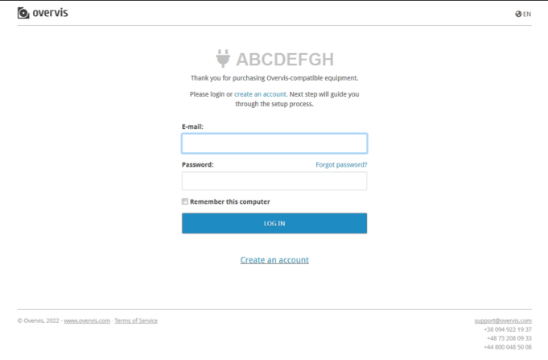
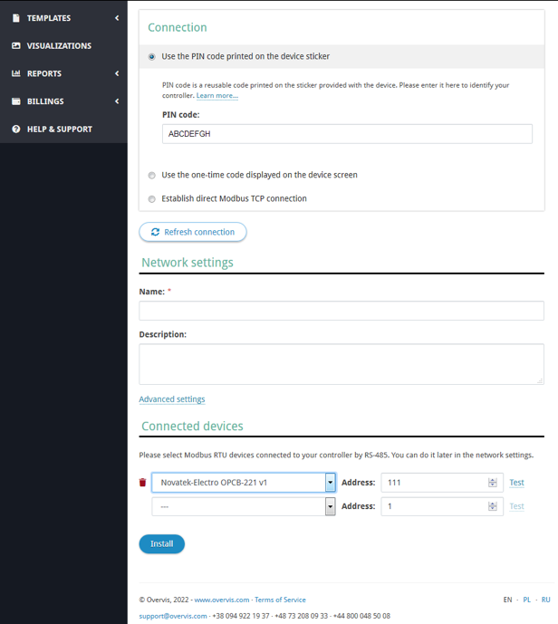

# Підключення до хмарного серверу

Щоб отримати доступ до OPCB через хмарний сервер, перейдіть за посиланням на етикетці виробу (або
за QR-кодом на етикетці). Якщо обліковий запис Overvis ще не введено, відкриється сторінка входу.
Якщо облікового запису немає, необхідно створити його на цій сторінці. Приклад сторінки показано на
зображенні.

Після входу в систему відкриється сторінка для додавання нової мережі (з OPCB в якості шлюзу
доступу до цієї мережі). Поля форми на сторінці будуть заповнені для зв'язку з виробом. Якщо виріб
вже був налаштований і має доступ до Інтернету, це буде підтверджено на цій сторінці. Приклад
сторінки показано на зображенні.

У полі `Назва` введіть назву для мережі з виробом. За необхідності, можна додати Modbus-пристрої,
підключені до OPCB, до списку `Підключені пристрої`, або зробити це пізніше. Після цього натисніть
кнопку `Встановити`, щоб додати мережу з виробом до облікового запису.
