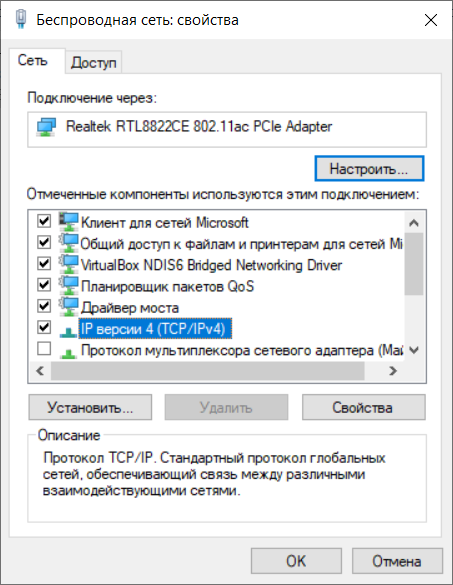
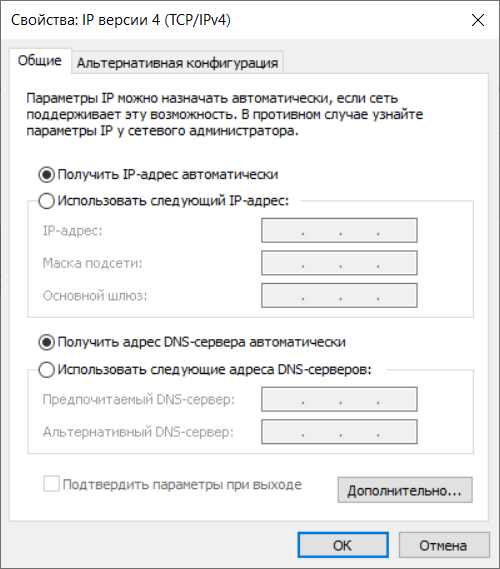

# Підключення до Ethernet та Інтернет

**УВАГА! Підключення пристрою до мережі Ethernet вимагає взаємного узгодження між підключеними
пристроями. Підключення неправильно налаштованого пристрою до мережі може вплинути на зв'язок,
зокрема інших пристроїв з мережею. Як правило, всі підключення до мережі з більше ніж 2 пристроями
виконує кваліфікований персонал (системний адміністратор).**

## IP адреса

Коли пристрої обмінюються даними через мережу Ethernet за протоколом TCP/IP, кожен пристрій
використовує набір налаштувань IP-адресації для визначення відправника та отримувача даних.
Пристрій зберігає в пам'яті свою власну, унікальну в межах однієї підмережі IP-адресу (чотири
байти, записані у вигляді чотирьох цілих чисел в діапазоні 0-255, розділені крапками); маску
підмережі, однакову для всіх пристроїв у підмережі (записується аналогічно до IP адреса); та
IP-адресу шлюзу, який використовується для зв'язку з іншими мережами. Для пристроїв у підмережі
необхідно виконати декілька умов, щоб вони могли належним чином взаємодіяти:

1. Маска однакова для всіх пристроїв в одній підмережі. Зазвичай у невеликих локальних мережах
   використовується маска 255.255.255.0.
2. Маска починається з групи бітів, встановлених в 1, за якими слідує група бітів, скинутих в 0.
3. В усіх IP-адресах пристроїв у межах однієї підмережі біти, що дорівнюють 1 у масці є однаковими
   і представляють адресу підмережі. Для маски 255.255.255.0 у локальних мережах найчастіше
   використовуються адреси, що починаються з 192.168. Третій байт може використовуватися як номер
   підмережі у складній локальній мережі. У невеликих мережах третій байт зазвичай дорівнює 0.
4. Набір бітів в IP-адресах пристроїв, які скинуті в 0 у масці, є унікальним для кожного пристрою в
   межах однієї підмережі.
5. У більшості випадків пристрій (наприклад, роутер), який зв'язується з іншими мережами, входить
   до складу мережі. Часто для нього зарезервовано адресу 192.168.0.1, або 192.168.0.100, або
   192.168.0.101. Іншім пристроям у мережі надають IP-адресу цього пристрою як адресу шлюзу.
   Вказування цієї адреси необов'язкове для зв'язку пристроїв у підмережі між собою, а
   використовується лише для зв'язку пристрою в одній підмережі з пристроями в інших мережах
   (наприклад, для Інтернет-доступу).

Коли OPCB ще неналаштований (налаштування за замовчуванням), клієнтський пристрій (і будь-які інші
пристрої в тій же підмережі) повинні використовувати адресу OPCB, надану маршрутизатором локальної
мережі через DHCP, для зв'язку з ним. Якщо з'єднання здійснюється в мережі з DHCP або, якщо
пристрій потребує фіксованої адреси для доступу до OPCB, то (для уникнення конфліктів)
рекомендується тимчасово відключити клієнтський пристрій, що буде преналаштовуватися, і встановити
зв'язок безпосередньо з OPCB. Це дозволить налаштувати клієнтський пристрій, а потім і OPCB для
подальшої роботи в мережі. Налаштування клієнтського пристрою згодом можна буде повернути до
попередніх значень.

## Налаштування клієнтського пристрою

Адресація пристрою встановлюється згідно з документацією до цього пристрою та програмного
забезпечення, що використовується на ньому.

Нижче наведено приклад, як налаштувати персональний комп'ютер (ПК) під управлінням операційної
системи (ОС) Windows для прямого зв'язку з неналаштованим OPCB (налаштування за замовчуванням).

Щоб налаштувати мережеву адресу в ОС Windows, відкрийте список мережевих підключень ОС. Для цього,
в залежності від версії ОС, виконайте наступні дії.

<!-- TODO: for macOS -->

Для Windows 11:

1. Увійдіть до ОС під обліковим записом Адміністратора
2. Виберіть "Пуск-> Параметри".
3. Виберіть категорію "Мережа та Інтернет". Розгорніть групу "Додаткові мережеві параметри".
4. Виберіть пункт "Додаткові параметри мережевого адаптера".

Для Windows 10/7:

1. Увійдіть до ОС під обліковим записом Адміністратора
2. Виберіть "Пуск-> Панель управління".
3. Якщо елементи Панелі управління розділені на категорії, виберіть категорію "Мережа та Інтернет
   Підключення". Відкрийте елемент "Панель управління мережею і загальним доступом".
4. У списку завдань (на лівій панелі) виберіть "Змінити налаштування адаптера".

Для Windows XP:

1. Увійдіть до ОС під обліковим записом адміністратора.
2. Виберіть "Пуск-> Панель управління".
3. Якщо елементи Панелі управління розділені на категорії, виберіть категорію "Мережа та Інтернет
   Підключення".
4. Відкрийте розділ "Підключення до мережі".

Далi виконайте наступні кроки:

1. У вікні підключень, що з'явиться, виберіть потрібне підключення через адаптер, адресу якого
   потрібно змінити. Багато комп'ютерів мають лише один адаптер і одне з'єднання, яке буде
   відображено у цьому вікні. Якщо у вікні показано декілька підключень, виберіть потрібне
   підключення, використовуючи назву адаптера в підписі підключення, або зверніться до системного
   адміністратора.
2. Натиснiть правою кнопкою миші на іконці вибраного з'єднання, виберіть "Властивості" у
   випадаючому меню. Відкриється вікно властивостей, приклад вікна показано на зображенні.

3. У вікні, що з'явиться, виберіть "Internet Protocol (TCP/IP)" у списку компонентів з'єднання.
   Переконайтеся, що компонент активовано (позначено прапорцем у списку). Натисніть кнопку
   "Властивості". Відкриється вікно властивостей TCP/IP, приклад вікна показано на зображенні.

4. Виберіть опцію "Використовувати вказану IP-адресу".
5. У полі "IP-адреса" вкажіть адресу в діапазоні 192.168.0.1-192.168.0.255 (крім 192.168.0.111, яка
   буде використовуватися OPCB).
6. Введіть "255.255.255.0" у полі "Маска підмережі".
7. Поля "Шлюз за замовчуванням", "Бажаний DNS-сервер", "Альтернативний DNS-сервер" залиште
   порожніми.
8. Натисніть "ОК", щоб закрити вікно налаштування протоколу.
9. Натисніть "ОК", щоб закрити вікно налаштувань з'єднання.
10. Якщо після закриття вікон, при застосуванні параметрів, ОС попросить перезавантажити комп'ютер,
    виберіть "так".

## Підключення до Інтернету

**УВАГА! Настійно рекомендується підключати пристрій до мережі Інтернет під наглядом системного
адміністратора локальної мережі та/або представником Інтернет-провайдера.**

Для підключення до Інтернету дотримуйтесь наступних рекомендацій:

- необхідно отримати виділену лінію від постачальника послуг Інтернету (якщо ви хочете отримати
  доступ до пристрою з Інтернету, необхідно також замовити послугу статичної IP-адреси; статична
  адреса не потрібна для підключення пристрою до хмарного сервера);
- використовуйте мережевий маршрутизатор або роутер для зв'язку з провайдером і створіть локальну
  мережу, до якої буде підключено пристрій; в цьому випадку кабель провайдера підключається до
  роз'єму роутера `Uplink` (зазвичай виділений кольором і не має номера, в залежності від виробника
  роутера маркування може бути іншим, наприклад, `WAN` або `Internet` - див. документацію до
  роутера). Підключіть пристрій до роутера за допомогою прямого кабелю Ethernet (входить до
  комплекту). Використовуючи документацію до роутера, налаштуйте його на підключення до Інтернету,
  відповідно до рекомендацій провайдера. Також, якщо ви хочете отримати доступ до пристрою з
  Інтернету без хмарного сервера, необхідно увімкнути перенаправлення вхідних запитів (на статичну
  IP-адресу, надану провайдером) на IP-адресу OPCB в налаштуваннях роутера (при цьому адреса
  пристрою повинна бути зафіксована або в налаштуваннях роутера або в налаштуваннях OPCB);
- переконайтеся, що підключення пристрою до Інтернету буде захищено стандартними засобами (див.
  нижче);
  <!-- TODO: list the required functions and the corresponding ports to forward -->
- при отриманні доступу до пристрою в Інтернеті, використовуйте IP-адресу, зазначену вашим
  провайдером.

## Захист підключення

<!-- TODO: check this part -->

- OPCB має базові засоби захисту від несанкціонованого доступу через мережу;
- налаштування пристрою можуть бути змінені дистанційно тільки після введення пароля (не менше 5
  символів). Повторення неправильних паролів з метою пошуку правильного значення блокується
  пристроєм;
- введення пароля робить налаштування доступним лише для даного клієнта за даним протоколом. Якщо
  протягом тривалого часу немає запитів від клієнта, з'єднання припиняється. **Примітка - Якщо
  пароль введено правильно, режим налаштування через Modbus відкривається в незахищеному з'єднанні.
  Коли необхідно змінити налаштування через мережу (особливо в мережах, де безпека не гарантується
  іншими засобами), настійно рекомендується налаштовувати пристрій за допомогою браузера через
  Web-інтерфейс або через хмарний сервер;**
- вбудовані засоби захисту доступу не призначені для захисту від мережевих атак (особливо тих, що
  спрямовані на блокування доступу до пристрою, а не на отримання доступу до нього);
- у складних та розгалужених мережах (особливо при забезпеченні доступу до OPCB через мережу
  Інтернет) рекомендується обмежити доступ до пристрою з небезпечних мереж за допомогою стандартних
  засобів захисту (роутер, налаштований на фільтрацію передачі, Firewall, тощо).
