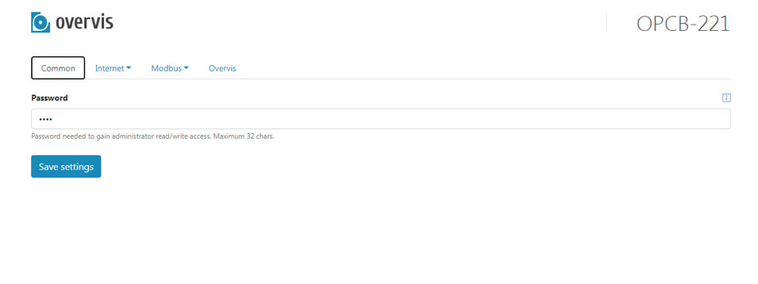

# Початкове налаштування

Неналаштований OPCB створює точку доступу `OPCB_XXXXXX` (де XXXXXX - останні 6 цифр MAC-адреси на
етикетці виробу) після увімкнення та ініціалізації.

Для налаштування підключіться до цієї точки доступу без пароля, потім введіть адресу
`setup.overvis.com` (або `192.168.4.1`) у браузері.

Відкриється сторінка стану OPCB. Виберіть розділ `Налаштування` з меню у верхньому правому куті.

Відкриється сторінка налаштування OPCB, як показано на зображенні.

Вибравши потрібні вкладки і підрозділи в них, слід налаштувати OPCB.

_Якщо пристрій має працювати через хмарний сервер, необхідно налаштувати один або декілька
мережевих інтерфейсів на вкладці `Мережа`, через котрі OPCB може отримати доступ до Інтернету. Якщо
необхідно, встановити адресу хмарного серверу на вкладці `Overvis`. Після коректного налаштування
параметрів доступу Інтернету та збереження їх, OPCB встановить зв'язок із хмарним сервером.
Подальше налаштування можна виконати через хмарний сервер._

Після завершення налаштування збережіть параметри кнопкою `Зберегти налаштування`.
