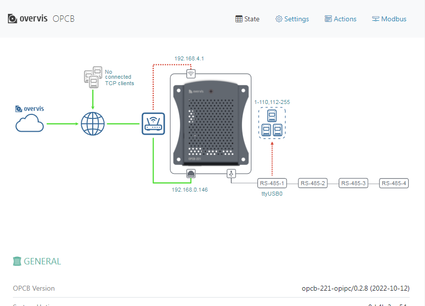
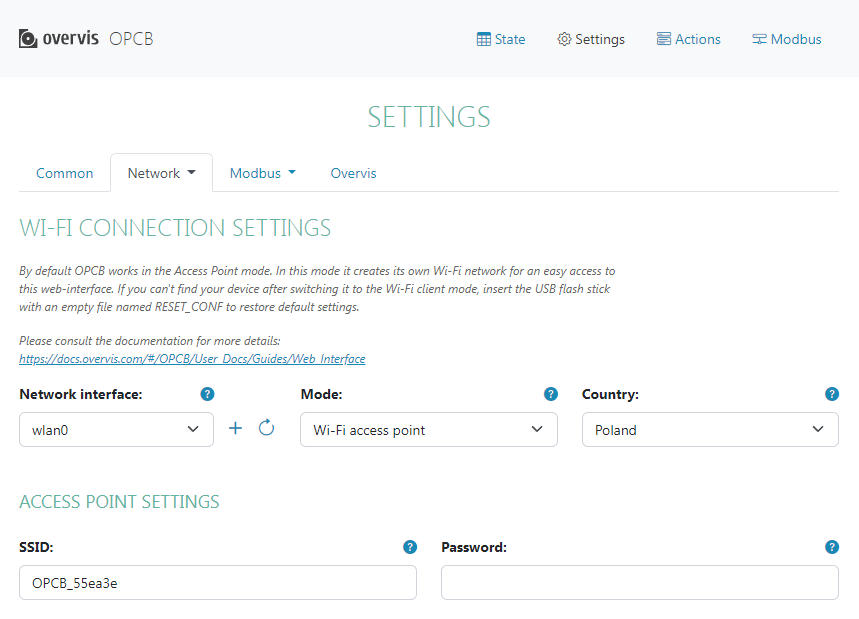
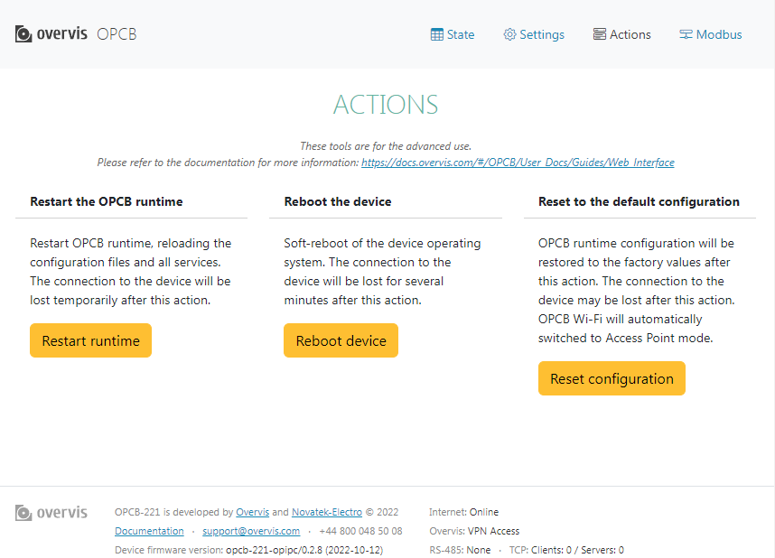
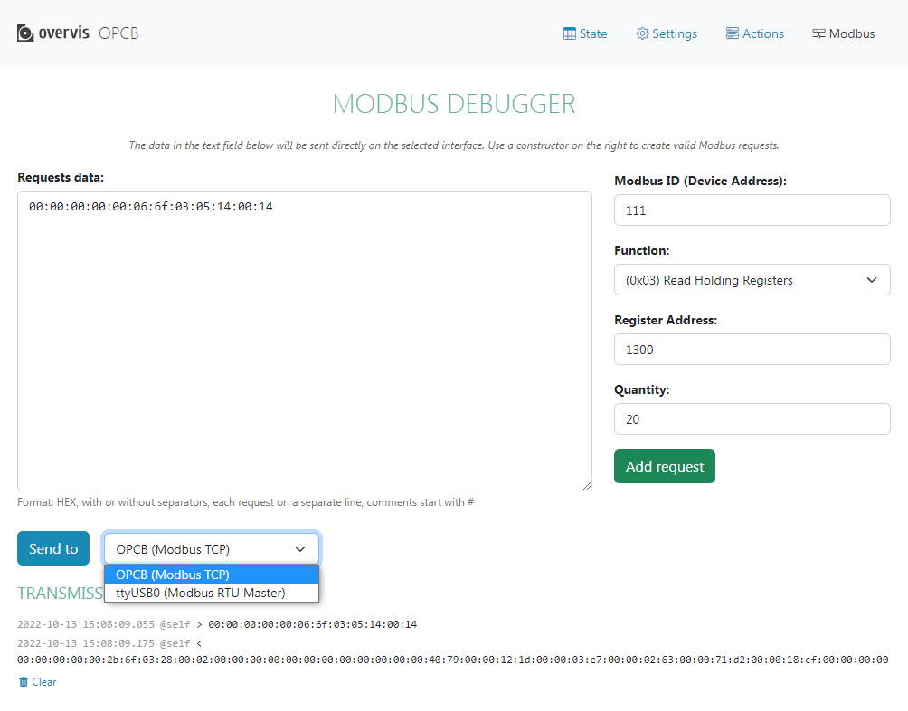

# Веб-інтерфейс

Щоб отримати доступ до веб-інтерфейсу OPCB через точку доступу Wi-Fi або хот-спот (якщо він
увімкнений, наприклад під час початкового налаштування), підключіть пристрій для перегляду
(комп'ютер або телефон) до цієй точки доступу, а потім введіть у браузері адресу
`setup.overvis.com` (або `192.168.4.1`).

Щоб отримати доступ до веб-інтерфейсу виробу через локальну мережу, підключіть пристрій для
перегляду (комп'ютер або телефон) до локальної мережі, на роботу в якій налаштовано OPCB. Потім
введіть адресу виробу в браузері:

- фіксовану адресу, надану OPCB під час налаштування мережі;
- або тимчасову динамічну адресу, яку можна отримати через Web-інтерфейс LAN-маршрутизатора (за
  наявності доступу до нього).

Відкриється сторінка стану, як показано на зображенні нижче.

Існує 4 основні розділи, які можна вибрати з меню у верхньому правому куті.

## Стан

З'єднання та інші деталі стану можна переглянути на цій сторінці. Схема у верхній частині сторінки
показує схему підключення відповідно до налаштувань мережевих інтерфейсів та MODBUS.

Кольори на схемі вказують на активність з'єднань:

- з'єднання послідовних інтерфейсів MODBUS показані зеленим кольором для успішно відкритого порту
  (навіть якщо віддалені пристрої недоступні), червоним - якщо порт недоступний;
- лінії клієнтських з'єднань з віддаленими серверами MODBUS показані зеленим кольором, при цьому
  колір прямокутника віддаленого сервера вказує на стан з'єднання, червоний для розірваного та
  синій для встановленого з'єднання;
- Wi-Fi з'єднання з роутером залишається червоним у режимі точки доступу Wi-Fi (тому що підключення
  до роутера не передбачено);
- інші лінії з'єднань показують стан своїм кольором, червоним для розірваного з'єднання і зеленим,
  якщо встановлене з'єднання.

У таблицях під схемою наведено стан OPCB та його інтерфейсів.

## Налаштування

OPCB можна налаштувати, вибравши необхідні вкладки та встановивши параметри.

_Якщо пристрій має працювати через хмарний сервер, необхідно налаштувати один або декілька
мережевих інтерфейсів у вкладці `Мережа`, через які OPCB може отримати доступ до Інтернету. Потім
на вкладці `Overvis`, за необхідності, налаштуйте ім'я хоста хмарного сервера. Після коректного
налаштування доступу до Інтернету та збереження налаштувань, буде встановлено з'єднання з хмарним
сервером. Подальша конфігурація може бути виконана через хмарний сервер._

Деякі з параметрів (наприклад, список мережевих інтерфейсів на зображенні) надаються у динамічно
випадаючому списку. Якщо потрібного значення ще немає у списку, скористайтеся круглою кнопкою
оновлення праворуч, щоб оновити випадаючий список.

Використовуйте кнопку довідки `?` у верхньому правому куті параметру, щоб отримати його опис.

Коли конфігурацію буде завершено, скористайтеся кнопкою "Зберегти налаштування", щоб зберегти та
застосувати налаштування.

## Дії

Доступні розширені дії управління:

- м'який рестарт;
- жорсткий рестарт (перезавантаження виробу);
- часткове скидання до заводських налаштувань (повернення до заводських налаштувань за
  замовчуванням).

## MODBUS

На цій сторінці можна запустити налагоджувальні тести інтерфейсів MODBUS. Спочатку слід вибрати
інтерфейс призначення у випадаючому списку біля кнопки `Надіслати до`. Потім один або декілька
запитів можна помістити у список за допомогою конструктора праворуч:

- виберіть цільову адресу пристрою;
- виберіть потрібну функцію і встановіть її параметри (для запису декількох значень натисніть
  `+ Додати поле значення` за необхідності);
- натисніть кнопку `Додати запит`, щоб додати його до списку.

Список також можна редагувати вручну.

Після підготовки запитів натисніть кнопку `Надіслати до`. Результати обміну по MODBUS будуть
показані в `Журналі передач` внизу сторінки.
