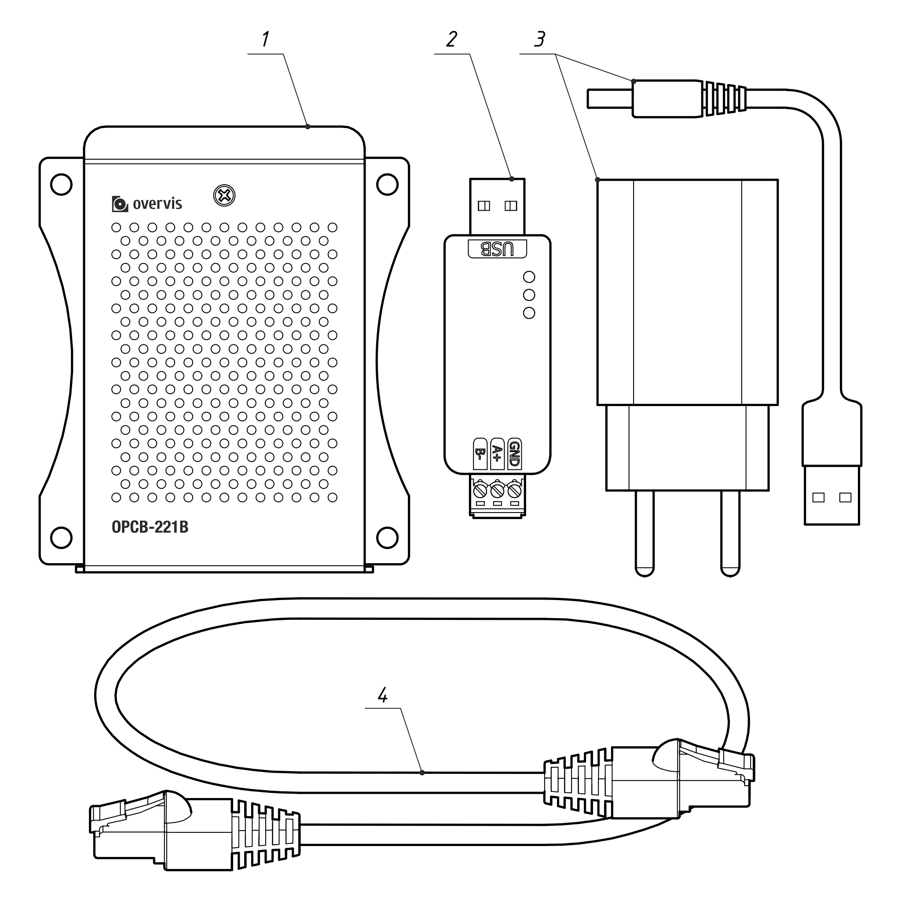

# OPCB-221B Керівництво з експлуатації

Система управління якістю проектування та виробництва виробу відповідає вимогам ISO 9001:2015.

## Цільове призначення

Контролер OPCB-221B (далі - "Контролер", "Виріб" або "OPCB-221B") реалізує зв'язок за протоколом
MODBUS між клієнтом і сервером в мережах TCP (Інтернет); та між обладнанням з інтерфейсом RS-485.

OPCB-221B використовується для дистанційного моніторингу та управління:

- Контролерами холодильного обладнання,
- Контролерами систем опалення, вентиляції та кондиціонування,
- Сільськогосподарськими смарт-пристроями,
- Реле електромереж, лічильниками, іншим електрообладнанням,
- Промисловими IoT-пристроями,
- Промисловими датчиками та вимірювачами,
- Іншим обладнанням, яке сумісне з протоколом MODBUS.

Перелік характеристик та функцій OPCB-221B:

- Конвертер MODBUS RTU/TCP.
- Вбудована підтримка хмарного сервісу Overvis (www.overvis.com).
- Використовується як TCP сервер або клієнт, MODBUS RTU ведучий або ведений.
- Подовження мережі RS-485.
- Підтримка MODBUS ASCII.
- Підтримка з'єднання з локальною мережею (LAN) та Wi-Fi.
- Додаткове підключення 3G/LTE за допомогою зовнішнього USB-модему.
- Режим точки доступу до Wi-Fi.
- Веб-інтерфейс, доступний по локальній мережі, через точку доступу Wi-Fi або за допомогою серверу
  Overvis.
- Віддалене конфігурування (за допомогою MODBUS або веб-інтерфейсу).
- Налаштування мережі RS-485: швидкість передачі, параметри парності, інтервал очікування
  відповіді.
- Підтримка декількох RS-485 мереж.
- Засіб для тестових запитів MODBUS.
- Автоматичне або ручне оновлення прошивки.
- HTTP API.

## Терміни та абривіатури

**Wi-Fi station** - пристрій, підключений через Wi-Fi до іншого пристрою (точки доступу);

**Точка доступу Wi-Fi** - пристрій, що забезпечує підключення до нього через Wi-Fi;

**DHCP** - протокол, що дозволяє пристроям автоматично отримувати параметри TCP/IP (IP адресу);

**HTTP** - протокол передачі веб-сторінок та інших даних за технологією клієнт-сервер;

**IP (адреса)** - адреса пристрою, яка є унікальною в межах однієї мережі, що експлуатується згідно
з протоколом IP;

**IPv4** - чотирьохбайтна IP-адреса;

**MAC (адреса)** - адреса, яка використовується в мережевих передачах для ідентифікації пристрою.
Як правило, вона є неповторною;

**MAC-48** - шестибайтна MAC-адреса;

**MODBUS** - стандартний протокол пакетної передачі даних, створений на основі технології
клієнт-сервер, призначений для промислових електронних пристроїв;

**MODBUS RTU** - протокол зв'язку пристроїв, за яким дані передаються байт за байтом;

**MODBUS ASCII** - протокол зв'язку пристроїв, за яким дані передаються у вигляді символів ASCII;

**MODBUS TCP** - протокол передачі даних MODBUS відповідно до стандарту TCP/IP;

**WEB** - система доступу до серверних документів, що використовується в Інтернеті;

**Wi-Fi** - це серія стандартів для передачі даних по радіоканалах.

## Повна комплектація

<!-- TODO: picture -->

**Таблиця 1** - Комплект виробу

| Назва                                                                                | Кількість (шт.) |
| ------------------------------------------------------------------------------------ | --------------- |
| 1. Контролер OPCB-221B (з вбудованою картою пам'яті MicroSD та антеною Wi-Fi, 3 dbm) | 1               |
| 2. Модуль розширення USB/RS-485 (підтримує до 32 підключених пристроїв RS-485)       | 1               |
| 3. Блок живлення з виходом USB Type-A та кабелем DC Plug                             | 1               |
| 4. Кабель Ethernet                                                                   | 1               |
| 5. Інструкція з експлуатації                                                         | 1               |

## Габаритні розміри та елементи керування

**Рисунок 1** - Габаритні та монтажні розміри OPCB-221B

1. **"EXT1"** роз'єми - 2 роз'єми USB Type-A для підключення додаткових модулів (наприклад, RS-485
   / RS-232 конверторів інтерфейсу).
2. **"ETH "** роз'єм - 8P8C/RJ45 для дротового підключення до локальної мережі Ethernet;
3. **"EXT2"** роз'єм - USB Type-A для підключення додаткових модулів (наприклад, RS-485/ RS-232
   конверторів).
4. **"PWR"** роз'єм - штекер постійного струму для підключення джерела живлення 5 V DC потужністю
   не менше 9 Вт.
5. **"HDMI"** роз'єм - HDMI вихід (не використовується).
6. **"AUX"** роз'єм - Аудіовихід (не використовується).
7. **"MEM"** слот - слот для карти пам'яті MicroSD.

## Технічні характеристики

<!--
TODO: check:`
  - Maximum number of incoming connections via MODBUS TCP protocol
  - Maximum number of serial interfaces
  - USB-RS485 characteristics (terminator, terminal characteristics, etc.) table;
  - Power supply characteristics table
  - Weight, kg, no more than, (measure)
  - Insulation rated voltage, V, (power connector)
  - Galvanic insulation, kV (power)
  - Rated pulse withstand voltage, kV (power)
  - Electric shock protection class
  - The device meets the requirements of the following standards
TODO: Fill in the table with the correct parameters of the motherboard
-->

**Таблиця 2** - Основні технічні характеристики контролера OPCB-221B

| Назва                                                                                     | Значення                                         |
| :---------------------------------------------------------------------------------------- | ------------------------------------------------ |
| Напруга живлення DC, В                                                                    | 5.0                                              |
| Материнська плата                                                                         | Orange Pi PC Plus 1G RAM                         |
| Інтерфейс зв'язку з мережами TCP                                                          | Ethernet, Wi-Fi                                  |
| Обмін даними з Ethernet                                                                   | 10BASE-T/100BASE-T (вита пара)                   |
| Wi-Fi частота, ГГц                                                                        | 2.4                                              |
| Підтримка стандартів Wi-Fi                                                                | IEEE 802.11 b/g/n                                |
| Підтримка протоколів TCP/IP                                                               | MODBUS TCP, HTTP, DNS, DHCP, WireGuard           |
| Максимальна кількість вхідних з'єднань за протоколом MODBUS TCP                           | 4                                                |
| Максимальна кількість вихідних з'єднань за протоколом MODBUS TCP                          | 4                                                |
| Максимальна кількість послідовних портів                                                  | 3 (через окремі USB-порти)                       |
| Доступні протоколи послідовних інтерфейсів                                                | MODBUS RTU, MODBUS ASCII                         |
| Максимальна кількість підключених пристроїв MODBUS                                        | 255                                              |
| Вбудовані сервери                                                                         | MODBUS RTU/ASCII/TCP, HTTP                       |
| Час готовності при включенні, с, не більше                                                | 60                                               |
| Струм споживання, А, не більше                                                            | 2                                                |
| Вага, кг, не більше                                                                       | 0.200                                            |
| Габаритні розміри, мм, не більше                                                          | 99 х 82 х 36                                     |
| Призначення виробу                                                                        | Розподільчі пристрої та обладнання для керування |
| Рекомендований режим роботи                                                               | безперервний                                     |
| Ступінь захисту                                                                           | ІР30                                             |
| Клас захисту від ураження електричним струмом                                             | III                                              |
| Кліматичне виконання                                                                      | NF 3.1                                           |
| Допустимий рівень забруднення                                                             | II                                               |
| Гальваноізоляція, кВ<ul><li>роз'єм живлення</li><li>Ethernet роз'єм</li><li>USB</li></ul> |  – 1.5 –                                |
| Монтаж                                                                                    | панель/щит                                       |

- Контролер відповідає наступним стандартам: EN 60947-1; EN 60947-6-2; EN 55011; EN 61000-4-2.
- Виріб зберігає свою функціональність у будь-якому положенні.
- Матеріал корпусу - алюміній.
- Шкідливі речовини в кількостях, що перевищують гранично допустимі концентрації - відсутні.

**Таблиця 3** – Технічні зарактеристики USB-RS485

| Назва                                                  | Значення                                                                                              |
| :----------------------------------------------------- | ----------------------------------------------------------------------------------------------------- |
| Швидкість передачі даних, біт/с                        | 300 - 230400                                                                                          |
| Контроль напрямку                                      | апаратне забезпечення автоматично визначає та контролює напрямок передачі даних                       |
| Відстань передачі (на низькій швидкості 1200 біт/с), м | приблизно 1000                                                                                        |
| Режим передачі                                         | до 32 вузлів (рекомендовано повторювачі для більше ніж 16)                                            |
| Балансний резістор                                     | вбудований 120 Ом (підключається опціонально за допомогою джампера)                                   |
| Струм споживання, А, не більше                         | 0.05                                                                                                  |
| Захист інтерфейсу                                      | Забезпечує захист від перенапруги та статичної електрики до 15 кВ (вбудований балансовий опір 120 Ом) |
| Гальваноізоляція                                       | -                                                                                                     |
| Вага, кг, не більше                                    | 0.010                                                                                                 |
| Габаритні розміри, мм, не більше                       | 15 x 18 x 63                                                                                          |
| Температурний діапазон                                 | -15°C до +70°C                                                                                        |
| Діапазон вологості (від +25 °С)                        | 5% to 95%                                                                                             |
| Перетин проводів, що підключаються, мм2                | 0.13 – 0.82                                                                                           |
| Момент затяжки клемних гвинтів, Н\*м                   | 0.3                                                                                                   |
| Рівень захисту                                         | ІР20                                                                                                  |

<!-- TODO: | Galvanic insulation, kV | ??? | -->

**Таблиця 4** – Характеристики адаптера живлення

| Назва                                     | Значення                                                     |
| :---------------------------------------- | ------------------------------------------------------------ |
| Діапазон вхідної напруги AC, В            | 100 - 240                                                    |
| Вхідний AC струм, А                       | 0.5                                                          |
| Діапазон вхідних змінних частот, Hz       | 50 - 60                                                      |
| Вихідна напруга DC, В                     | 5                                                            |
| Вихідний струм DC, А, не більше           | 3                                                            |
| Вилка AC                                  | EU 2 pin plug                                                |
| Роз'єм постійного струму                  | USB Type-A                                                   |
| Вага, кг, не більше                       | 0.065                                                        |
| Габаритні розміри, мм, не більше          | 80 x 30 x 75                                                 |
| Рівень захисту                            | IP20                                                         |
| Клас захисту від ураження струмом         | II                                                           |
| Ізоляційна напруга                        | Вхід/вихід на корпус, 500 В постійного струму, більше 10 МОм |
| Витримувана напруга між входом та виходом | AC 3 кВ (10 мА), до 3 с                                      |

<!-- TODO:
| Galvanic insulation, kV | ??? |
| Insulation-rated voltage, V | ??? |
| Rated pulse withstand voltage, kV | ??? |
-->

## Умови експлуатації

Виріб призначений для експлуатації за таких умов:

<!-- TODO: test conditions -->

- температура навколишнього середовища від -10 до +55 °C;
- атмосферний тиск від 84 до 106,7 кПа;
- відносна вологість (при +25 °С) від 30 до 80%.

**Увага! Виріб не призначений для використання в наступних умовах:**

- значні вібрації та ударні навантаження;
- висока вологість;
- середовище, що містить кислоти, луги тощо, а також сильні забруднення (мастила, масла, пил і
  т.д.).

## Загальні рекомендації

**УВАГА! ВСІ З'ЄДНАННЯ ПОВИННІ ВИКОНУВАТИСЯ ПРИ ЗНЕСТРУМЛЕНОМУ ВИРОБІ.**

**Помилка при виконанні монтажних робіт може призвести до пошкодження виробу та підключених
пристроїв.**

Для підключення до RS-485 використовуйте кабель типу "вита пара", Cat. 1 або вище. Кінці кабелю
повинні бути зачищені від ізоляції на 4±0,5 мм і обтиснуті втулковими наконечниками. Рекомендується
використовувати екранований заземлений кабель.

**НЕ ЗАЛИШАЙТЕ ЖОДНОГО ОГОЛЕНОГО ДРОТУ, ЩО ВИСТУПАЄ ЗА МЕЖІ КЛЕМНОЇ КОЛОДКИ.**

**Для надійного контакту затягуйте гвинти клем із зусиллям, зазначеним у таблиці технічних
характеристик.**

Для підключення до Ethernet використовуйте кабель, що входить до комплекту, або виту пару Cat. 5e
зі штекером 8P8C (RJ45).

Під час кріплення дротів слід уникати механічних пошкоджень, скручування або зносу ізоляції
кабелів.

## Підключення

Перед початком:

- Розпакуйте та перевірте виріб на наявність пошкоджень після транспортування і, в разі їх
  виявлення, зверніться до постачальника або виробника;
- Перед підключенням до електромережі витримайте виріб в умовах експлуатації протягом двох годин
  (на випадок можливого утворення конденсату на елементах).
- Уважно вивчіть інструкцію з експлуатації;
- Якщо у вас виникли питання щодо встановлення виробу, будь ласка, зверніться до служби технічної
  підтримки за номером телефону, вказаним в кінці інструкції з експлуатації.

<!-- TODO: picture -->

**Рисунок 2** - схема підключення виробу

Підключіть OPCB-221B відповідно до рис. 2, в наступному порядку:

- За допомогою кабелю типу "вита пара" категорії 1 або вище підключіть клемну колодку модуля RS-485
  до шини (або безпосередньо до пристрою з інтерфейсом RS-485); _Примітка: контакт "A" для
  неінвертованого сигналу (D+), контакт "B" для інвертованого сигналу (D-)._
- Якщо виріб повинен мати доступ до Інтернету або локальної мережі: за допомогою з'єднувального
  кабелю Ethernet (входить в комплект поставки) або витої пари Cat. 5e з вилкою 8P8C (RJ45),
  підключіть **"ETH"** роз'єм (8P8C/RJ45) до локальної мережі або комп'ютера.
- Переконайтеся, що карта пам'яті (встановлена виробником) присутня в гнізді **"MEM"**.
- Підключіть модуль RS-485 до одного з роз'ємів **"EXT1"** або **"EXT2** (USB Type-A).
- Підключіть блок живлення (входить в комплект) до роз'єму **"PWR"** (DC Plug).
- При необхідності закріпіть USB-роз'єми пластиковими кабельними стяжками, щоб уникнути випадкового
  від'єднання.
- Підключіть блок живлення до електромережі 220-240 В змінного струму (50 Гц).

## Робота OPCB-221B

### Загальна інформація

OPCB-221B має 32-розрядний процесор під управлінням POSIX-сумісної ОС. Він маршрутизує трафік між
модулями розширення USB, такими як послідовні інтерфейси RS-485 / RS-232 (протоколи MODBUS
RTU/ASCII) та інтерфейси Ethernet/Wi-Fi LAN (протокол MODBUS TCP), з можливістю подальшої
маршрутизації в Інтернет.

OPCB-221B має вбудований веб-інтерфейс, який можна використовувати для налаштування.

OPCB-221B надає можливість підключення до сервера для віддаленого моніторингу та налаштування
виробу та підключених до нього пристроїв.

OPCB-221B має точку доступу Wi-Fi (хот-спот), щоб спростити початкове налаштування. Точку доступу
Wi-Fi можна вимкнути в налаштуваннях.

**OPCB-221B зберігає операційну систему та дані на попередньо встановленій карті пам'яті microSD.**
**УВАГА!!! Виймання або заміна карти пам'яті може призвести до непрацездатності виробу.**

### Увімкнення та послідовність перезавантаження

Після увімкнення живлення OPCB-221B завантажує операційну систему та налаштовує інтерфейси зв'язку.
Це може зайняти до 1 хвилини.

При наявності інтернет-з'єднання OPCB-221B автоматично підключається до хмарного сервера, якщо це
дозволено в налаштуваннях. За замовчуванням, неналаштований OPCB-221B створює точку доступу Wi-Fi з
SSID "OPCB_XXXXXX" (де XXXXXX - останні 6 символів MAC-адреси виробу) для початкового налаштування,
як описано у Додатку А.

Перезавантаження OPCB-221B можна виконати через веб-інтерфейс, натиснувши кнопку "Перезавантажити
пристрій" у розділі "Дії". Це призведе до завершення всіх поточних операцій, збереже дані та
перезавантажить OPCB-221B протягом 1 хвилини.

Примусове перезавантаження виконується вимкненням живлення, із затримкою на 5 секунд і повторним
увімкненням живлення.

### Робота через HTTP

OPCB-221B надає веб-інтерфейс HTTP і HTTP REST API для веб-додатків. OPCB-221B приймає
HTTP-з'єднання через інтерфейси Ethernet або Wi-Fi на TCP-порт 80.

Для доступу до веб-інтерфейсу HTTP або:

- Підключіться до точки доступу WiFi OPCB-221B за допомогою ПК або мобільного пристрою і відкрийте
  наступну URL-адресу у браузері: http://setup.overvis.com/ (або http://192.168.4.1);
- За допомогою будь-якого ПК або мобільного пристрою в локальній мережі відкрийте IP-адресу
  OPCB-221B в браузері. IP-адресу OPCB-221B зазвичай можна дізнатися, звернувшись до маршрутизатора
  локальної мережі інтерфейсу.

Для отримання детальної інформації про підключення, налаштування та використання виробу через
веб-інтерфейс див. Додаток C. Детальніше про використання REST API див. у Додатку F.

### Робота OPCB-221B через MODBUS (TCP/RTU/ASCII)

OPCB-221B приймає запити MODBUS TCP через інтерфейси Ethernet або Wi-Fi і передає їх у форматі
MODBUS RTU або MODBUS ASCII через послідовний інтерфейс. Відповіді конвертуються в MODBUS TCP і
надсилаються назад.

OPCB-221B також може бути налаштований на прийом запитів MODBUS RTU або MODBUS ASCII і передавати
їх у форматі MODBUS TCP на вказані IP-адреси через Ethernet або Wi-Fi. У цьому випадку відповіді,
перетворені в протокол запиту, надсилаються назад на послідовну лінію.

Підключення з ПК або мобільного пристрою може бути здійснено за допомогою будь-якого програмного
забезпечення MODBUS TCP-клієнтів. Версію клієнта MODBUS TCP для Windows можна завантажити тут:
https://novatek-electro.com/en/software/modbus-tcp-client.html

Підключення, конфігурація та використання виробу через MODBUS детально описані в Додатку D.

### Робота OPCB-221B з хмарним сервером Overvis

OPCB-221B може встановлювати з'єднання з хмарним сервером Overvis через будь-який інтерфейс з
доступом до Інтернету. OPCB-221B зв'язується з хмарним сервером Overvis за допомогою одного або
обох наступних протоколів:

- MODBUS TCP для зв'язку, автентифікації та збору даних.

- WireGuard (VPN). Забезпечує повне шифрування трафіку між виробом і хмарним сервером Overvis.

З'єднання MODBUS TCP і з'єднання WireGuard із хмарним сервером Overvis увімкнені за замовчуванням.
З'єднання MODBUS TCP можна вимкнути в налаштуваннях. З'єднання WireGuard необхідне для віддаленої
підтримки виробу. При потребі вимкнення з'єднання WireGuard зверніться до технічної підтримки.

Підключення, налаштування та використання виробу з хмарним сервером Overvis описані у Додатку E.

## Налаштування

<!-- TODO: check -->

Початкове налаштування мережевих з'єднань описано в додатках А і B.

OPCB-221B можна налаштувати за допомогою:

- веб-інтерфейсу (див. Додаток С);
- інтерфейсу MODBUS (див. Додаток D);
- хмарного серверу Overvis (див. Додаток E).

Параметри, що налаштовуються, описані в Додатку D. Значення параметрів зберігаються у файлі на
карті пам'яті.

**Примітка: деякі налаштування вимагають перезавантаження, клієнти можуть втратити з'єднання і
будуть змушені перепідключитися.**

**УВАГА! Будь ласка, переконайтеся, що підключення до Інтернету правильно налаштоване, перш ніж
вимкнути точку доступу Wi-Fi. В іншому випадку неправильне налаштування може призвести до
неможливості зв'язку з виробом, що можна виправити лише за допомогою скидання до заводських
налаштувань.**

Часткове скидання до заводських налаштувань можна виконати одним із таких способів:

- за допомогою флешки з ключем керування. Запишіть порожній файл або порожню папку з назвою
  `"RESET_CONF"` на якийсь USB-накопичувач, а потім підключіть його до одного з гнізд **"EXT1"**
  або **"EXT2**, щоб скинути налаштування до заводських значень за замовчуванням. Скидання може
  зайняти до 30 секунд, після чого флешку можна від'єднати.
- через веб-інтерфейс, див. Додаток C.

## Автоматичне оновлення прошивки

Прошивка виробу постійно оновлюється виробником. За замовчуванням, нова версія встановлюється
автоматично після увімкнення виробу або протягом 24 годин після початку роботи. Автоматичне
оновлення гарантує зворотню сумісність усіх функцій OPCB-221B. Версії без зворотньої сумісності
вимагають ручного встановлення.

Поточна встановлена версія відображається у веб-інтерфейсі OPCB-221B. Список змін для кожної версії
доступний тут: https://github.com/overvis/opcb-release/tree/OPCB-221-opipc/CHANGELOG.md

## Ручне оновлення прошивки та повне скидання до заводських налаштувань

Ручне оновлення вимагає повного скидання до заводських налаштувань шляхом завантаження нового
образу прошивки на карту пам'яті SD. Всі поточні образи прошивок можна знайти на сторінці випусків:
https://github.com/overvis/opcb-release/tags

<!-- TODO: correct release page url -->

Повна процедура скидання до заводських налаштувань описана у Додатку G.

## Техніка безпеки

Для безпечної експлуатації виробу категорично забороняється наступне:

- проводити монтажні роботи та технічне обслуговування без відключення виробу від електромережі;
- відкривати та ремонтувати вирiб без професійної допомоги;
- експлуатувати виріб з механічними пошкодженнями корпусу.

Не допускається потрапляння води на клеми та внутрішні елементи виробу.

Під час експлуатації та технічного обслуговування необхідно дотримуватися вимог нормативних
документів, а саме:

- Правила технічної експлуатації електроустановок споживачів
- Правила техніки безпеки при експлуатації електроустановок споживачів;
- Охрана труду при експлуатації електроустановок.

**НЕ ДОПУСКАЄТЬСЯ ПОТРАПЛЯННЯ РІДИНИ НА КЛЕМИ ТА ВНУТРІШНІ ЕЛЕМЕНТИ ВИРОБУ.**

## Технічне обслуговування

**ПРИ ПРОВЕДЕННІ ТЕХНІЧНОГО ОБСЛУГОВУВАННЯ ВИРІБ ТА ПІДКЛЮЧЕНІ ДО НЬОГО ПРИСТРОЇ ПОВИННІ БУТИ
ВІДКЛЮЧЕНІ ВІД МЕРЕЖІ ЕЛЕКТРОЖИВЛЕННЯ.**

Технічне обслуговування виробу повинно виконуватися **кваліфікованими фахівцями**.

Рекомендована періодичність технічного обслуговування - кожні шість місяців.

Порядок дій:

1. Перевірте надійність з'єднання проводів, при необхідності закріпіть;
2. Перевірте надійність USB-з'єднань, за необхідності зафіксуйте їх пластиковими хомутами;
3. Візуально перевірте цілісність корпусу, у разі виявлення пошкоджень виріб слід відправити в
   ремонт;
4. За необхідності очистіть корпус виробу сухою ганчіркою.

**Не використовуйте для чищення абразиви або розчинники.**

## Термін експлуатації та гарантія виробника

Термін експлуатації виробу становить 10 років. По закінченню терміну, будь ласка, зверніться до
виробника.

Термін придатності - 3 роки.

Гарантійний термін експлуатації виробу - 3 роки з дня продажу.

Протягом гарантійного терміну (у разі поломки) виробник безкоштовно ремонтує виріб.

**УВАГА! ЯКЩО ВИРІБ ЕКСПЛУАТУВАВСЯ З ПОРУШЕННЯМ ВИМОГ ЦІЄЇ ІНСТРУКЦІЇ З ЕКСПЛУАТАЦІЇ, КОРИСТУВАЧ
ВТРАЧАЄ ПРАВО НА ГАРАНТІЙНЕ ОБСЛУГОВУВАННЯ.**

Гарантійне обслуговування здійснюється за місцем придбання або виробником.

Післягарантійне обслуговування виробу здійснюється виробником за діючими тарифами.

Перед відправкою виробу в ремонт його необхідно упакувати в заводську або іншу упаковку, яка
запобігає механічним пошкодженням.

**При поверненні товару або передачі його на гарантійне (післягарантійне) обслуговування, будь
ласка, детально вкажіть причину повернення у полі "Інформація для скарги"**

## Транспортування і зберігання

Виріб в оригінальній упаковці допускається транспортувати та зберігати за температури від мінус 45
до +60 °С і відносній вологості повітря не більше 80%. Під час транспортування виріб повинен бути
захищений від механічних пошкоджень.

## Акт прийому-передачі

Виріб виготовлений і прийнятий відповідно до вимог чинної технічної документації та визнаний
придатним до експлуатації.

Керівник відділу QCD:

Дата виробництва:

## Інформація про скарги

**Компанія вдячна Вам за інформацію про якість продукції та пропозиції щодо його експлуатації.**

У разі виникнення питань, будь ласка, звертайтеся до виробника: ТОВ "НОВАТЕК-ЕЛЕКТРО". Україна,
65007, м. Одеса, вул. Адмірала Лазарєва, 59

телефон. +38(048)738-00-28

тел/факс +38(048)234-36-73.

http://www.novatek-electro.com

Відділ гарантійного сервісу: +38(067) 557-12-49

Служба технічної підтримки: +38(067) 565-37-68

Дата продажу

VN221012

<!-- TODO: check and add all Appendixes -->
<!-- TODO: All links should lead to docs.overvis.com -->

---

**Додаток A.** Початкове налаштування.

**Додаток B.** Підключення до Ethernet та Інтернет.

**Додаток C.** Веб-інтерфейс.

**Додаток D.** Робота з MODBUS.

**Додаток E.** Підключення до хмарного серверу.

**Додаток F.** HTTP API.

**Додаток G.** Завантаження образу на картку пам'яті.
