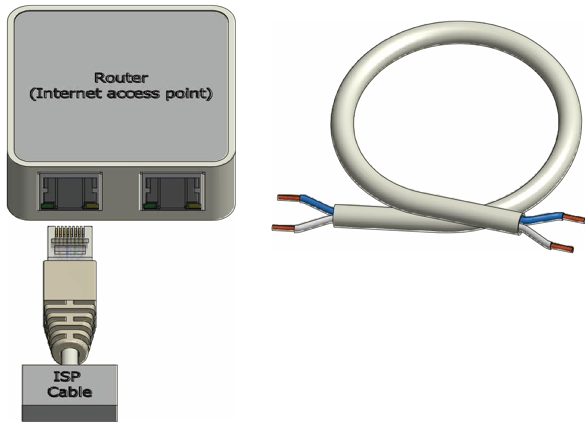
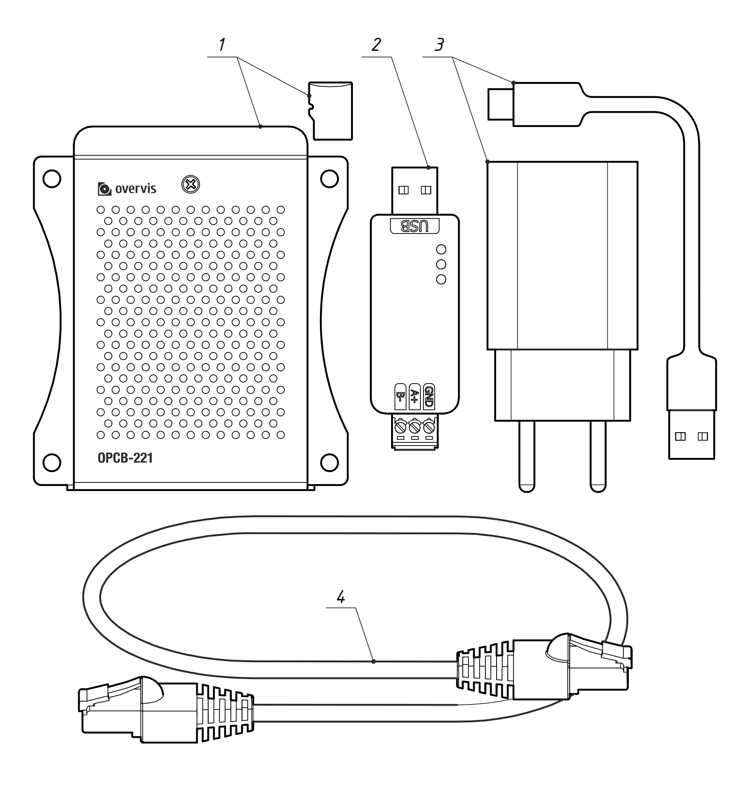
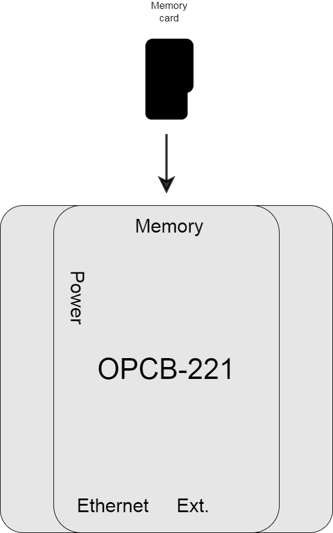
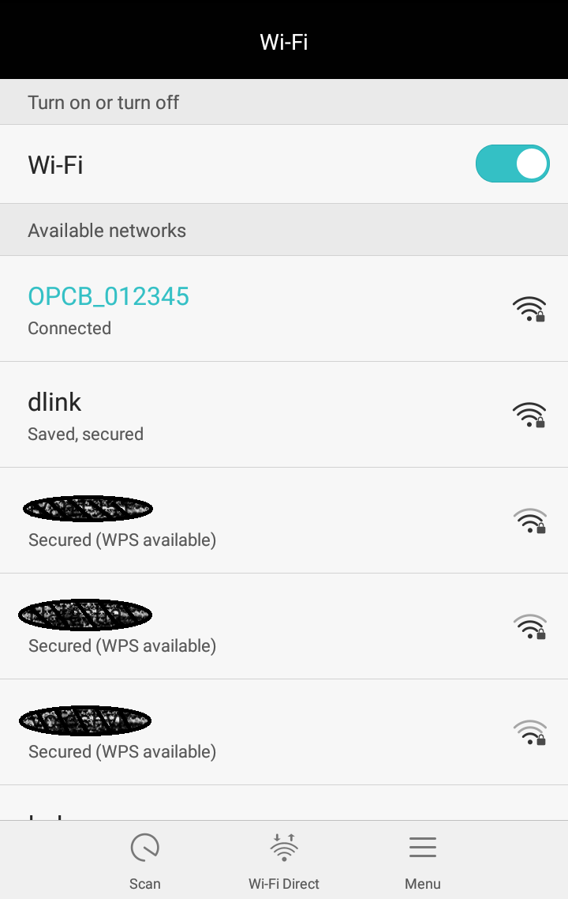
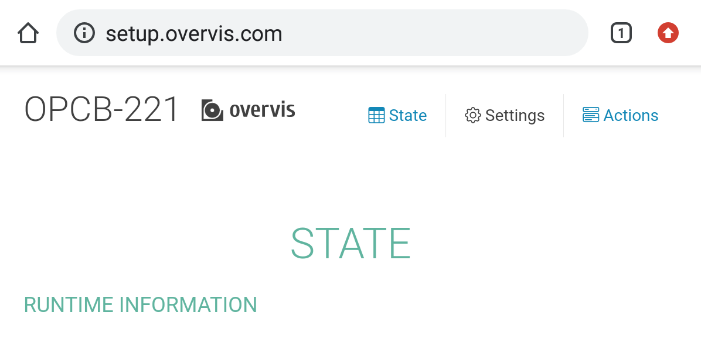

# Застосування OPCB-221

## 1. Конвертер Modbus RTU/ASCII в Modbus TCP

- Локальний доступ до мережі.
- Віддалений доступ через Інтернет.

Цей варіант зазвичай задається за допомогою:

- 1...2 Порти RS-485 увімкнено в режимі Master;
- Ввімкнено сервер Modbus TCP;
- Клієнти Modbus TCP вимкнено.

Порт або порти RS-485 налаштовані для зв'язку з підключеними пристроями (задано швидкість і формат
байта, тобто вказано парність та кількість стоп-біт). Шлюз для RS-485 налаштований на потрібні
діапазони адреси Modbus.

## 2. Конвертер для віддаленого доступу до Modbus TCP через Інтернет

Цей параметр зазвичай вказується за допомогою:

- OPCB-221 доступ до мережі Інтернет;
- 1...2 Клієнти Modbus TCP увімкнено;
- Сервер Modbus TCP увімкнено;
- вимкнено RS-485.

Клієнти Modbus TCP налаштовані на зв'язок з потрібними віддаленими серверами або пристроями (IP
адреси вказано). Шлюз для клієнтів Modbus TCP налаштовано на потрібні діапазони адреси Modbus.

## 3. Конвертер для віддаленого доступу через хмарний сервер

Найчастіше це хмарний варіант будь-якого з інших режимів або їх комбінація. Однак при доступі
виключно через хмарний сервер інші порти для локальних пристроїв керування (наприклад, сервер
Modbus TCP) найчастіше відключені. Опція використовується за таких умовах:

- OPCB-221 має доступ до мережі Інтернет;
- увімкнено зворотне (пристрій-сервер) з'єднання з хмарним сервером.

Для доступу до OPCB-221 через хмарний сервер достатньо забезпечити доступ OPCB-221 до мережі
Інтернет і переконатися, що в налаштуваннях вказано адресу потрібного сервера.

Не рекомендується відключати зворотне з'єднання (пристрій-сервер), навіть якщо віддалений доступ
користувача на даний момент не потрібен.

## 4. Конвертер Modbus TCP в Modbus RTU/ASCII

- підключення пристроїв Modbus TCP до ведучого пристрою, що має інтерфейс RS-485
- розширення, доповнення або синхронізація RS-485 за допомогою перетворювача(ів) OPCB-221

Цей варіант зазвичай задається за допомогою:

- 1...2 Порти RS-485 увімкнено в режимі Slave;
- 1...2 Клієнти Modbus TCP увімкнено;
- Сервер Modbus TCP вимкнено;
- вимкнено RS-485.

Порт або порти RS-485 налаштовані для зв'язку з підключеним головним пристроєм або підключеними
пристроями (швидкість і формат байта, тобто парність і кількість стоп-біт). Modbus TCP клієнти
налаштовані на зв'язок з потрібними віддаленими серверами або пристроями (вказані IP-адреси). Шлюз
для клієнтів Modbus TCP налаштовано на бажані діапазони адреси Modbus.

## Поєднання (комбінації)

Кількість комбінованих варіантів досить велика, в основному вони містять різні частини вже
перерахованих варіантів.

Наприклад:

- один RS-485 може бути сконфігурований як ведучий або підлеглий, але не як ведучий і підлеглий
  одночасно. Відповідно, залежно від цього, або підлеглі пристрої з варіанту 1, або керуючі
  пристрої з варіанту 2 можуть бути наявні або відсутні в обох режимах, а можуть бути відсутніми;
- Те саме стосується і другого RS-485, який не залежить від першого. Тому допустима комбінація
  Master і Slave (суміш варіантів 1 і 4) є прийнятною;
- Пристрої Modbus TCP (з варіантів 2 і 4) можуть бути наявними або відсутніми у будь-якому з
  режимів, залежно від налаштувань Modbus TCP;
- Пристрої керування Modbus TCP (варіанти 1 і 2) можуть бути наявними або відсутніми в будь-якому
  режимі, залежно від від налаштувань Modbus TCP. Пристрої керування Modbus TCP (варіантів 1 і 2)
  можуть бути наявними, а можуть бути відсутніми в будь-якому з режимів, залежно від налаштувань
  локального сервера Modbus TCP Modbus TCP;
- хмарний сервер (з варіанту 3) може бути наявним, а може бути відсутнім в будь-якому з режимів, в
  залежності від налаштувань зворотного з'єднання.

# Швидкий запуск

## Підключення OPCB-221 до мережі

1. підготувати шину RS485, LAN / Wi-Fi роутер, підключений до Інтернету;

 

2. розпакуйте OPCB-221;

 

- порівняти вміст упаковки OPCB-221 з інструкцією, що знаходиться всередині, і переконатися у
  відсутності слідів пошкоджень на будь-якому з елементів;
- **порівняти характеристики блоку живлення з характеристиками місцевої електромережі**;
- витримайте пристрій у цільовому середовищі протягом 2 годин (щонайменше) перед увімкненням;

3. Карта пам'яті попередньо встановлена на заводі в слот "Пам'ять" OPCB-221;

 

4. підключіть шину RS-485 до модуля перетворювача RS485 на USB (входить до комплекту);

 

- зверніть увагу на контакт прямого сигналу `A`/`A+`/`D+` та контакт інверсного сигналу
  `B`/`B-`/`D-` екран шини (за наявності) повинен бути заземлений в одній точці поблизу клеми;
- якщо модуль є останнім (або першим) з'єднанням на шині, розгляньте можливість додавання
  оконечного резистора 120 Ом 0,25 Вт паралельно, щоб покращити продуктивність для високошвидкісних
  або довгих ліній;

5. підключіть до шини RS-485 інші пристрої, керовані Modbus;

 

- кількість пристроїв, що розділяють одну шину (без вставки пристрою повторювача RS-485, що не
  входить до комплекту), обмежена споживанням приймача до 32 мА. обмежена струмом споживання їх
  приймачів, зазвичай не менше 32 пристроїв зі споживанням 1 мА можна підключити (більше, якщо їхнє
  споживання менше 1 мА);
- кожен пристрій повинен бути доданий на будь-якому з двох кінців шини (замість кінцевого
  резистора), уникаючи з'єднань і розгалужень;
- прямі та інвертовані контакти повинні бути з'єднані відповідно, інакше деякі або всі пристрої
  шини будуть недоступні;
- якщо порядок контактів шини невідомий для кастомного пристрою, можна протестувати його пізніше
  (спробувавши в обох напрямках);
- частина екрану шини між будь-якими двома пристроями повинна бути заземлена окремо, а не з'єднана
  з іншими частинами до інших частин екрану;
- розгляньте можливість додавання кінцевого резистора 120 Ом 0,25 Вт паралельно до клемних
  контактів крайнього пристрою (тобто два резистори на обох кінцях шини RS-485), щоб покращити
  продуктивність для високошвидкісних або довгих ліній;

6. підключіть модуль перетворювача RS-485 в USB до OPCB-221;

 

- можна використовувати будь-який з USB-роз'ємів OPCB-221 з позначкою `Ext.`.;
- щоб уникнути випадкового від'єднання, зафіксуйте модуль на місці за допомогою стяжок (входять до
  комплекту);

7. додатково: якщо ви використовуєте Ethernet замість Wi-Fi, підключіть OPCB-221 до роутера за
   допомогою LAN-кабелю (у комплекті);

 

- не підключайте до роутера роз'єм `WAN`/`Internet`, а використовуйте звичайний роз'єм `LAN`
  замість нього;

8. підключіть блок живлення (входить до комплекту) до роз'єму OPCB-221 `Power`.;

 

9. підключити блок живлення до електромережі, увімкнути OPCB-221 та інші пристрої на шині RS-485.

 

- **переконайтеся, що підключення до електромережі захищене (за допомогою обмежувача струму 1А)**;

## Підключення OPCB-221 до мережі Інтернет

1. за допомогою телефону або іншого смарт-пристрою з підтримкою Wi-Fi проскануйте точку доступу
   `OPCB_XXXXXX`, (де XXXXXX - це останні 6 цифр у маркованій MAC-адресі пристрою, запуск може може
   зайняти до 1 хвилини);

2. підключіться до точки доступу;

- пароль за замовчуванням: `12345678`.;

3. перейдіть за посиланням `setup.overvis.com`, щоб відкрити сторінку налаштування OPCB-221;

- якщо відкривається сторінка попередження з поясненням помилкового напрямку, спробуйте спочатку
  від'єднати ваш смарт-пристрій;
- також можна використовувати пряму адресу `192.168.4.1`, щоб уникнути помилкових перенаправлень;

4. налаштуйте мережеві інтерфейси OPCB-221 відповідно до конфігурації вашого маршрутизатора;

- використовуйте сторінку інтерфейсу ELAN (Ethernet) або WLAN (Wi-Fi), або обидві;
- щоб користуватися Wi-Fi, вимкніть режим точки доступу;
- зберігати налаштування після завершення кожної сторінки;
- зверніться до адміністратора локальної мережі для визначення правильної конфігурації інтерфейсів;

5. додатково: налаштування швидкості передачі даних та формату обміну по шині RS485 (можна зробити
   пізніше);

- всі пристрої шини повинні мати однакову швидкість передачі та формат;
- зберігати налаштування після завершення кожної сторінки;

6. перезавантажити OPCB-221, щоб зміни набули чинності.

## Використання Overvis для доступу до OPCB-221

1. перейдіть за маркованим посиланням, щоб потрапити на хмарний сервер;

- відскануйте позначений QR-код, щоб перейти за посиланням;
- або відкрийте браузер на своєму смарт-пристрої та введіть посилання, надруковане на етикетці;

2. якщо ви не ввійшли в систему, авторизуйтесь на хмарному сервері;

- якщо ви забули пароль, відновіть його електронною поштою з відповідною опцією на сторінці входу
  на сервер;
- якщо у вас ще немає облікового запису, зареєструйте новий обліковий запис з відповідною опцією на
  сторінці входу на сервер;

3. на новій сторінці налаштувань мережі Modbus введіть нову назву мережі в полі "Назва";

- переконайтеся, що з'єднання встановлено, а версія пристрою відображається у верхній частині
  сторінки налаштувань мережі Modbus;

4. за бажанням: додайте пристрої, підключені до OPCB-221 (через Modbus RTU/ASCII або Modbus TCP),
   до списку "Підключені пристрої" (це можна зробити пізніше);

5. натисніть кнопку "Встановити";

6. на завершення протестуйте з'єднання, натиснувши будь-яке значення параметра OPCB-221 в таблиці
   нижче;

- `...` відображається у стовпчику значень, якщо значення ще не відоме, інакше значення (наприклад
  число) виводиться;
- значення буде оновлюватися безперервно (до повторного натискання).
